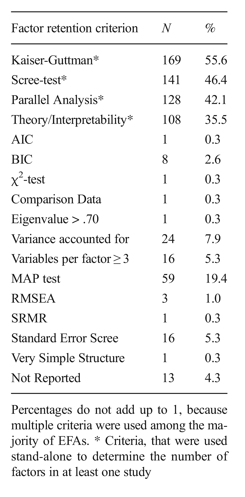

#  {.plain}
\center
```{r, echo = FALSE, out.width = "20%"}
knitr::include_graphics("3-Abbildungen/psd-3-otto.png")
```

\huge
Psychometrische Diagnostik
\vspace{3mm}

\large
MSc Psychologie

MSc Umweltpsychologie / Mensch-Technik-Interaktion

\vspace{2mm}
SoSe 2026

\vspace{1mm}
\normalsize
Prof. Dr. Dirk Ostwald


# {.plain}
\vfill
\center
\huge
\textcolor{black}{(3) Faktorenanalyse}
\vfill

#
\vfill
\setstretch{2.2}
\large
Einführung

Faktorenanalysemodelle

Parameterschätzung

Modellvergleichskriterien

Rotationsverfahren

Selbstkontrollfragen
\vfill

#
\vfill
\setstretch{2.2}
\large
**Einführung**

Faktorenanalysemodelle

Parameterschätzung

Modellvergleichskriterien

Rotationsverfahren

Selbstkontrollfragen
\vfill

# Einführung
\large
Motivation

\small
Faktorielle Validität des BDI-II nach @hautzinger2006

\footnotesize
"In der Untersuchung von @beck1996 legten *Scree-Tests* aus *explorativen Faktorenanalysen*
sowohl für die Patientenstichprobe als auch für die Studentenstichprobe die *Extraktion*
zweier Faktoren nahe. Nach parallel durchgeführten *Hauptachsenanalysen* mit anschließender
*obliquer (Promax-)Rotation* resultierte für die Patientenstichprobe ein Faktor, den
die Autoren als "somatisch-affektiven Faktor" bezeichneten, auf einem zweiten
Faktor *luden* v.a. kognitive Items des BDI II, er wurde demnach als "kognitiver Faktor"
bezeichnet. Die beiden obliquen Faktoren korrelierten miteinander zu r = 0.66.
In der Studentenstichprobe repräsentierte dagegen der erste Faktor die "kognitiv-affektive",
der zweite Faktor die "somatische" Dimension. Hier betrug die Korrelation der beiden
Faktoren r = 0.62. @beck1996 führen dazu an, dass das BDI-II zwei hoch korrelierende
Faktoren repräsentiert und es daher möglich ist, dass einzelne affektive Items
(wie "Traurigkeit" oder "Weinen") in Abhängigkeit der untersuchten Stichprobe
einmal auf dem einen, ein anderes Mal auf dem anderen Faktor substanzieller laden."

# Einführung
\vspace{2mm}
Psychologische Datenwissenschaft
\vspace{2mm}

```{r, echo = FALSE, out.width = "100%", fig.align = "center"}
knitr::include_graphics("3-Abbildungen/psd-3-modellbasierte-datenwissenschaft.pdf")
```

# Einführung
\vspace{2mm}
Psychologische Datenwissenschaft
\vspace{2mm}
```{r, echo = FALSE, out.width = "85%", fig.align = "center"}
knitr::include_graphics("3-Abbildungen/psd-3-psychologische-datenwissenschaft.pdf")
```

# Einführung
\setstretch{1.2}
\small
Latente Variablenmodelle mit psychologischer Historie
\vspace{-1mm}

\footnotesize
* Faktorenanalyse und Strukturgleichungsmodelle
* Erklärung von Kovarianzen (vieler) beobachteter Variablen durch (wenige) latente Variablen

\small
Klassische und aktuelle Anwendungsszenarien
\vspace{-1mm}

\footnotesize
* Analyse menschlicher Fähigkeiten (g-Faktor) und Persönlichkeitspsychologie (Big Five)
* Vielzahl von Phänomenen in der Soziologie, Politikwissenschaft, Biologie, Medizin, Sprachwissenschaft, ...

\small
Varianten im psychologischen Sprachgebrauch

\footnotesize
Explorative Faktorenanalyse (EFA)
\vspace{-1mm}

* Datengetriebenes, eher prinzipienfreies und intuitiv geleitetes Inspirationsverfahren
* Fokus auf der numerischen Behandlung von Stichprobenkovarianzmatrizen

\vspace{-2mm}
Konfirmative Faktorenanalyse (CFA)
\vspace{-1mm}

* Moderneres Verfahren mit expliziter probabilistischer Modellspezifikation
* Fokus auf probabilistischer Parameterschätzung und Modellvergleichskriterien

\vspace{-2mm}
Strukturgleichungsmodelle (SEM)
\vspace{-1mm}

* Generalisierte konfirmative Faktorenanalyse mit Faktoreninteraktion
* Linearer Spezialfall genereller probabilistischer Modelle

# Einführung
Historie
\small

Modellfreie explorative datenzentrische Periode (1900 - 1950)
\vspace{-1mm}

\footnotesize
* @pearson1901 beschreibt erste Anklänge der Faktorenanalyse
* @spearman1904 beginnt die Einfaktorenanalyse im Rahmen der Intelligenzforschung
* @hotelling1933 entwickelt die eng verwandte Hauptkomponentenanalyse
* @thurstone1947 beginnt die Mehrfaktorenanalyse im Bereich der Psychometrie

\small
Modellbasierte konfirmative inferenzzentrische Periode (1950 - heute)
\vspace{-1mm}

\footnotesize
* @lawley1940 schlägt die ML-Schätzung basierend auf @fisher1922 und @wishart1928 vor.
* @lawley1962 machen den modellbasierten Charakter der Faktorenanalyse explizit.
* @joreskog1970 initiiert die Generalisierung zu Strukturgleichungsmodellen (vgl. @bollen1989)
* Weitere Generalisierungen (vgl. z.B. @mulaik2010 oder @bartholomew2011)

Software Periode (1970 - heute)
\vspace{-1mm}

* [\textcolor{blue}{lisrel}](https://ssicentral.com/index.php/products/lisrel/) (kommerziell, proprietär) nach @joreskog1970
* [\textcolor{blue}{mPlus}](https://www.statmodel.com/) (kommerziell, proprietär) nach @muthen1998
* [\textcolor{blue}{lavaan}](https://lavaan.ugent.be/) (gratis, quelloffen) nach @rosseel2012
* $\Rightarrow$ Faktorenanalyse jeweils als Spezialfall von Strukturgleichungsmodellen

# Einführung
Anwendungsbeispiel
\footnotesize

```{r, echo = F}
# Faktorenanalysemodelle
set.seed(0)
library(MASS)                                         # Multivariates Normalverteilungspaket
k     = 2                                             # Dimension des Faktorvektors
m     = 21                                            # Dimension des Datenvektors
n     = 266                                           # Beobachtungsanzahl
L     = matrix(c(1,1,                                 # Traurigkeit
                 1,0,                                 # Pessimismus
                 1,0,                                 # Versagensgefühle
                 1,0,                                 # Verlust an Freude
                 0,1,                                 # Schuldgefühle
                 0,1,                                 # Bestrafungsgefühle
                 0,1,                                 # Selbstablehnung
                 0,1,                                 # Selbstkritik
                 0,1,                                 # Suizidgedanken
                 1,1,                                 # Weinen
                 1,0,                                 # Unruhe
                 1,0,                                 # Interessenverlust
                 1,0,                                 # Entschlusslosigkeit
                 0,1,                                 # Wertlosigkeit
                 1,0,                                 # Energieverlust
                 1,0,                                 # Schlaf
                 1,0,                                 # Reizbarkeit
                 1,0,                                 # Appetitveränderung
                 1,0,                                 # Konzentrationsschwierigkeiten
                 1,0,                                 # Ermüdung
                 1,0),                                # Verlust an sexuellem Interesse
                 nrow  = m,                           # Zeilenanzahl
                 byrow = TRUE)                        # Matrixdimensionalität
Psi     = .1*diag(m)                                  # Fehlerkovarianmatrix
mu      = 2                                           # Offset
Y       = matrix(rep(NaN,m*n), nrow = m)              # Simulierte beobachtete Datenmatrix
for(i in 1:n){                                        # Simulationsiterationen
  x      = mvrnorm(1,rep(0,k), diag(k))               # Realisierung des Faktorvektors
  eps    = mvrnorm(1,rep(0,m), Psi)                   # Realisierung des Fehlervektors
  Y[,i]  = mu + L %*% x + eps}                        # Realisierung des Datenvektors
Y[Y<0]   = 0                                          # Zensierung
Y[Y>5]   = 5                                          # Zensierung
Y        = round(Y, digits = 0)                       # Rundung
items    = c( "Traurigkeit",                          # Itemlabel
              "Pessimismus",
              "Versagensgefühle",
              "VerlustAnFreude",
              "Schuldgefühle",
              "Bestrafungsgefühle",
              "Selbstablehnung",
              "Selbstkritik",
              "Suizidgedanken",
              "Weinen",
              "Unruhe",
              "Interessenverlust",
              "Entschlusslosigkeit",
              "Wertlosigkeit",
              "Energieverlust",
              "Schlaf",
              "Reizbarkeit",
              "Appetitveränderung",
              "Konzentrationsschwierigkeiten",
              "Ermüdung",
              "VerlustSexuellenInteresses")
rownames(Y)   = items
colnames(Y)   = 1:ncol(Y)
write.csv(data.frame(t(Y)), "./3-Daten/3-fa-keller.csv", row.names = F)
```

```{r, echo = F}
# Faktorenanalysemodelle
set.seed(0)
library(MASS)                                         # Multivariates Normalverteilungspaket
k     = 2                                             # Dimension des Faktorvektors
m     = 9                                             # Dimension des Datenvektors
n     = 266                                           # Beobachtungsanzahl
L     = matrix(c(1,1,                                 # Traurigkeit
                 1,0,                                 # Pessimismus
                 1,0,                                 # Versagensgefühle
                 1,0,                                 # Verlust an Freude
                 0,1,                                 # Schuldgefühle
                 0,1,                                 # Bestrafungsgefühle
                 0,1,                                 # Selbstablehnung
                 0,1,                                 # Selbstkritik
                 0,1),                                # Suizidgedanken
                 nrow  = m,                           # Zeilenanzahl
                 byrow = TRUE)                        # Matrixdimensionalität
Psi     = .1*diag(m)                                  # Beobachtungsrauschenkovarianmatrix
mu      = 2                                           # Offset
Y       = matrix(rep(NaN,m*n), nrow = m)              # Simulierte beobachtete Datenmatrix
for(i in 1:n){                                        # Simulationsiterationen
  x      = mvrnorm(1,rep(0,k), diag(k))               # Realisierung des Faktorvektors
  eps    = mvrnorm(1,rep(0,m), Psi)                   # Realisierung des Fehlervektors
  Y[,i]  = mu + L %*% x + eps}                        # Realisierung des Datenvektors
Y[Y<0]   = 0                                          # Zensierung
Y[Y>5]   = 5                                          # Zensierung
Y        = round(Y, digits = 0)                       # Rundung
items    = c( "Traurigkeit",                          # Itemlabel
              "Pessimismus",
              "Versagensgefühle",
              "VerlustAnFreude",
              "Schuldgefühle",
              "Bestrafungsgefühle",
              "Selbstablehnung",
              "Selbstkritik",
              "Suizidgedanken")
rownames(Y)   = items
colnames(Y)   = 1:ncol(Y)
write.csv(data.frame(t(Y)), "./3-Daten/3-fa-keller-small.csv", row.names = F)
```


Simulierter Datensatz basierend auf @keller2008

* Patient:innen 1 - 12 von n = 266 depressiven Patient:innen

\vspace{-2mm}
\tiny
\setstretch{1}
```{r, echo = F, message = F}
knitr::kable(Y[,1:12], digits = 2, "pipe")
```

# Einführung
Anwendungsbeispiel
\footnotesize

Simulierter Datensatz basierend auf @keller2008

* Gesamter Datensatz (n = 266)

```{r, eval = F, echo = F}
# Beobachteter Datensatz (n = 301)
library(plot.matrix)
library(RColorBrewer)
library(latex2exp)
pdf(
file         = "3-Abbildungen/psd-3-bdi-Y.pdf",
width        = 18,
height       = 8)
par(
family       = "sans",
mfcol        = c(1,1),
pty          = "m",
bty          = "l",
lwd          = 1,
las          = 1,
mgp          = c(3,1,0),
xaxs         = "i",
yaxs         = "i",
font.main    = 1,
cex          = 1.2,
cex.main     = 1.5,
mar          = c(2,14,3,4))
plot(
Y,
border       = NA,
breaks       = seq(0,5,len = 6),
col          = rev(brewer.pal(n = 5, name = "RdBu")),
key          = list(side     = 4,
                    font     = 1,
                    cex.axis = 1),
fmt.key      = "%.2f",
polygon.key  = NULL,
axis.key     = NULL,
spacing.key  = c(3,2,2),
cex          = 1,
xlab         = "Realisierungen",
ylab         = "",
main         = TeX("$Y \\in R^{21 x 266}$"))
dev.off()
```

```{r, echo = FALSE, out.width = "100%", fig.align = "center"}
knitr::include_graphics("3-Abbildungen/psd-3-bdi-Y.pdf")
```

# Einführung
\footnotesize
\begin{definition}[Kovarianzmatrix eines Zufallsvektors]\label{def:kovarianzmatrix-eines-zufallsvektors}
$\xi$ sei ein $n$-dimensionaler Zufallsvektor. Dann ist die \textit{Kovarianzmatrix} von
$\xi$ definiert als die $n \times n$ Matrix
\begin{equation}
\mathbb{C}(\xi) := \mathbb{E}\left((\xi - \mathbb{E}(\xi))(\xi - \mathbb{E}(\xi))^T \right).
\end{equation}
\end{definition}

Bemerkungen

* Die Kovarianzmatrix eines Zufallsvektors ist die symmetrische Matrix der Kovarianzen seiner Komponenten.
* Insbesondere gilt (vgl. \thmref{thm:eigenschaften-der-kovarianzmatrix})
\begin{equation}
\mathbb{C}(\xi) = \left(\mathbb{C}(\xi_i,\xi_j)\right)_{1 \le i,j \le m}.
\end{equation}
* Die Diagonalelemente von $\mathbb{C}(\xi)$ sind die Varianzen der Komponenten von $\xi$, da
\begin{equation}
\mathbb{V}(\xi_i) = \mathbb{C}(\xi_i,\xi_i) \mbox{ für } i = 1,...m.
\end{equation}


# Einführung
\footnotesize

\begin{definition}[Korrelationsmatrix eines Zufallsvektors]\label{def:korrelationsmatrix-eines-zufallsvektors}
$\xi$ sei ein $n$-dimensionaler Zufallsvektor. Dann ist die \textit{Korrelationsmatrix} von $\xi$ definiert als die $n \times n$ Matrix
\begin{equation}
\mathbb{R}(\xi)
:= \left(\rho_{ij} \right)_{1 \le i,j\le n}
 = \left(\frac{\mathbb{C}(\xi_i,\xi_j)}{\sqrt{\mathbb{V}(\xi_i)}\sqrt{\mathbb{V}(\xi_j)}}\right)_{1 \le i,j\le n}.
\end{equation}
\end{definition}

Bemerkungen

* Die Korrelationsmatrix ist in der Kovarianzmatrix implizit.
* Es gilt, dass $\rho_{ij} \in [-1,1]$ für $1 \le i,j \le n$ und $\rho_{ii} = 1$ für  $1 \le i \le n$.

# Einführung
\footnotesize
\begin{definition}[Stichprobenkovarianzmatrix und -korrelationsmatrix]\label{def:stichprobenkovarianzmatrix-und-stichprobenkorrelationsmatrix}
$y_1,...,y_n$ sei eine Menge von $m$-dimensionalen Zufallsvektoren, genannt \textit{Stichprobe},
und es sei
\begin{equation}
\bar{y} := \frac{1}{n} \sum_{i=1}^n y_i.
\end{equation}
das Stichprobenmittel der $y_1,...,y_n$. Dann ist die
\textit{Stichprobenkovarianzmatrix} der $y_1,...,y_n$ definiert als die $m \times m$ Matrix
\begin{equation}
C := \frac{1}{n-1}\sum_{i=1}^n (y_i - \bar{y})(y_i - \bar{y})^T .
\end{equation}
und die \textit{Stichprobenkorrelationsmatrix} der $y_1,...,y_n$ ist definiert
als die $m \times m$ Matrix
\begin{equation}
R := \left(\frac{(C )_{ij}}{\sqrt{ (C )_{ii}}\sqrt{ (C )_{jj}}}\right)_{1 \le i,j \le m}.
\end{equation}
\end{definition}

Bemerkungen

* Haben unabhängige $y_1,...,y_n$ die identische Kovarianzmatrix $\mathbb{C}(y)$, so dient $C$ als Schätzer von $\mathbb{C}(y)$
* Haben unabhängige $y_1,...,y_n$ die identische Korrelationsmatrix $\mathbb{R}(y)$, so dient $R$ als Schätzer von $\mathbb{R}(y)$
* Für eine konzise Berechnung von $C$ und $R$, siehe \thmref{thm:datenmatrix-und-stichprobenstatistiken}

# Einführung
\vspace{3mm}
Anwendungsbeispiel
\footnotesize

Simulierter Datensatz basierend auf @keller2008

* Berechnung von Stichprobenkovarianzmatrix und Stichprobenkorrelationsmatrix

\vspace{2mm}

```{r, echo = TRUE, eval = F}
Y         = t(read.csv("3-Daten/3-fa-keller.csv"))              # Dateneinlesen
n         = ncol(Y)                                             # Anzahl Datenpunkte
I_n       = diag(n)                                             # Einheitsmatrix I_n
J_n       = matrix(rep(1,n^2), nrow = n)                        # 1_{nn}
C         = (1/(n-1))*(Y %*% (I_n-(1/n)*J_n) %*% t(Y))          # Stichprobenkovarianzmatrix
D         = diag(1/sqrt(diag(C)))                               # Kov-Korr-Transformationsmatrix
R         = D %*% C %*% D                                       # Stichprobenkorrelationsmatrix
```

# Einführung
\vspace{3mm}
Anwendungsbeispiel
\footnotesize

Simulierter Datensatz basierend auf @keller2008
\vspace{-4mm}

```{r, eval = F, echo = F}
library(latex2exp)
library(plot.matrix)
library(RColorBrewer)
pdf(
file        = "3-Abbildungen/psd-3-bdi-C.pdf",
width       = 15,
height      = 15)
par(
family      = "sans",
mfcol       = c(1,1),
pty         = "s",
bty         = "l",
lwd         = 1,
las         = 2,
mgp         = c(3,1,0),
xaxs        = "i",
yaxs        = "i",
font.main   = 1,
cex         = 1,
cex.main    = 3,
mar         = c(15,15,10,15))
plot(
C,
breaks      = seq(-1,2,len = 11),
col         = rev(brewer.pal(n = 11, name = "RdBu")),
digits      = 1,
key         = NULL,
cex         = 1,
polygon.key = NULL,
axis.key    = NULL,
xlab        = "",
ylab        = "",
main        = TeX("Stichprobenkovarianzmatrix"))
dev.off()
```

```{r, echo = FALSE, out.width = "70%", fig.align = "center"}
knitr::include_graphics("3-Abbildungen/psd-3-bdi-C.pdf")
```

# Einführung
\vspace{3mm}
Anwendungsbeispiel
\footnotesize

Simulierter Datensatz basierend auf @keller2008
\vspace{-4mm}

```{r, eval = F, echo = F}
# Stichprobenkorrelationsmatrix
library(plot.matrix)
library(RColorBrewer)
rownames(R) = row.names(C)
colnames(R) = row.names(C)
pdf(
file        = "3-Abbildungen/psd-3-bdi-R.pdf",
width       = 15,
height      = 15)
par(
family      = "sans",
mfcol       = c(1,1),
pty         = "s",
bty         = "l",
lwd         = 1,
las         = 2,
mgp         = c(3,1,0),
xaxs        = "i",
yaxs        = "i",
font.main   = 1,
cex         = 1,
cex.main    = 3,
mar         = c(15,15,10,15))
plot(
R,
breaks      = seq(-.5,1.1,len = 11),
col         = rev(brewer.pal(n = 11, name = "RdBu")),
digits      = 1,
key         = NULL,
cex         = 1,
polygon.key = NULL,
axis.key    = NULL,
xlab        = "",
ylab        = "",
main        = TeX("Stichprobenkorrelationsmatrix"))
dev.off()
```

```{r, echo = FALSE, out.width = "70%", fig.align = "center"}
knitr::include_graphics("3-Abbildungen/psd-3-bdi-R.pdf")
```

#
\vfill
\setstretch{2.2}
\large
Einführung

**Faktorenanalysemodelle**

Parameterschätzung

Modellvergleichskriterien

Rotationsverfahren

Selbstkontrollfragen
\vfill

# Faktorenanalysemodelle

\footnotesize
\begin{definition}[Faktorenanalysemodelle in struktureller Form]\label{def:Faktorenanalysemodelle-in-struktureller-form}
\justifying
Es sei
\begin{equation}
y = Lx + \eps
\end{equation}\label{eq:fam}
wobei für $m > k$

\begin{itemize}
\item $y$ ein $m$-dimensionaler beobachtbarer Zufallsvektor ist, der \textit{Daten} genannt wird,
\item $L = (l_{ij})\in \mathbb{R}^{m \times k}$ eine Matrix ist, die \textit{Faktorladungsmatrix} genannt wird,
\item $x$ ein $k$-dimensionaler nicht-beobachtbarer Zufallsvektor ist, dessen Komponenten \textit{Faktoren} genannt werden und für den gilt, dass
\begin{equation}
\mathbb{E}(x)=0_k \mbox{ und }\mathbb{C}(x) = I_k,
\end{equation}
\item $\eps$ ein $m$-dimensionaler nicht-beobachtbarer und von $x$ unabhängiger Zufallsvektor ist,
der \textit{Beobachtungsfehler} genannt wird und für den gilt, dass
\begin{equation}
\mathbb{E}(\eps) = 0_m
\mbox{ und }
\mathbb{C}(\eps) = \mbox{diag}\left(\psi_1,..., \psi_m\right) =: \Psi \mbox{ mit } \psi_i > 0 \mbox{ für } i = 1,...,m.
\end{equation}
\end{itemize}
Dann heißt \eqref{eq:fam} \textit{Faktorenanalysemodell in struktureller Form}. Gilt darüber hinaus, dass
\begin{itemize}
\item $x  \sim N(0_k,\Phi)$  mit  $\Phi \in \mathbb{R}^{k \times k}$ p.d. und
\item $\eps \sim N(0_m, \Psi)$ mit $\Psi := \mbox{diag}\left(\psi_1,...,\psi_m\right)$ für $\psi_i > 0$ und $i = 1,...,m$,
\end{itemize}
dann heißt \eqref{eq:fam} \textit{Normalverteilungsmodell der Faktorenanalyse in struktureller Form}.
\end{definition}

# Faktorenanalysemodelle
\footnotesize
Bemerkungen

* Die Komponenten von $y$ modellieren $m$ *Itemscores* eines psychologischen Tests einer Testperson.

* Die Komponenten von $x$ werden manchmal *gemeinsame Faktoren (common factors)* genannt.

* Die Komponenten von $\eps$ werden manchmal *spezifische Faktoren (unique factors)* genannt.

* $l_{ij}$ wird die *Faktorladung des $j$ten Faktors auf die $i$te Datenkomponente* genannt.

* Der Eintrag $l_{ij}$ von $L$ entspricht dem Wert $y_i$ für $x = e_j$ ($j$ter kanonischer Basisvektor).

* Wir schreiben das Faktorenanalysemodell meist in der Kurzform
\begin{equation}
y = Lx + \eps \mbox{ mit } x \sim (0_k,I_k) \mbox{ und } \eps \sim (0_m,\Psi).
\end{equation}

* $\zeta \sim (\mu,\Sigma)$ soll ausdrücken, dass $\mathbb{E}(\zeta)=\mu$ und $\mathbb{C}(\zeta)=\Sigma$.

# Faktorenanalysemodelle
\footnotesize
\begin{theorem}[Faktorenanalysemodelle in Verteilungsform]
\justifying
\normalfont
Gegeben sei das Faktorenanalysemodell in struktureller Form. Dann kann das Faktorenanalysemodell äquivalent geschrieben werden als
\begin{equation}
\mathbb{P}(x,y) = \mathbb{P}(x)\mathbb{P}(y|x) \mbox{ mit } x \sim (0_k,I_k) \mbox{ und } y\,|\,x \sim (Lx,\Psi)
\end{equation}
und das Normalverteilungsmodell der Faktorenanalyse kann äquivalent in der Wahrscheinlichkeitsdichteform
\begin{equation}
p(x,y) = p(x)p(y|x) \mbox{ mit } p(x) = N(0_k,\Phi) \mbox{ und } p(y|x) =  N(Lx,\Psi).
\end{equation}
geschrieben werden.
\end{theorem}

Bemerkungen

* In Verteilungsform ist das Modell analog zum vereinfachten Modell der klassischen Testtheorie
* Die Bedingtheit der Verteilung von $y$ auf $x$ erschließt sich aus datengenerativer Sicht

(1) Es wird ein $k$-dimensionaler  Wert von $x$ anhand von $\mathbb{P}(x)$ realisiert
(2) $x$ wird durch $L$ transformiert und bildet als $m$-dimensionaler Wert $Lx$ den Erwartungswert von $\mathbb{P}(y|x)$.
(3) Es wird ein $m$-dimensionaler Wert von $\eps$ realisiert
(4) Die $m$-dimensionalen Werte von $Lx$ und $\eps$ werden zu einem Wert von $y$ addiert.

# Faktorenanalysemodelle

\footnotesize
Bemerkungen

* Im datenanalytischen Kontext betrachtet man die vorliegenden $m$ Itemscores einer
Testperson $i = 1,...,n$, die einen psychologischen Fragebogen oder Test bearbeitet hat,
als Realisierung eines Testperson-spezifischen und anhand der Verteilung des Faktorenanalysemodells
verteilten Zufallsvektors $y_i$.

* Gleichzeitig unterstellt man (analog zur Annahme eines wahren Werts der klassischen Testtheorie),
dass dieser Zufallsvektorrealisierung eine Realisierung des nicht-beobachtbaren
Zufallsvektors $x_i$, also der Testperson-spezifischen Faktorwerte, entspricht.

* Weiterhin nimmt man an, dass die Realisierungen von beobachtbaren Zufallsvektoren
$y_1,...,y_n$ und ihren entsprechenden nicht-beobachtbaren Zufallsvektoren $x_1,...,x_n$
über Testpersonen unabhängig und identisch nach einem zugrundeliegenden Testpersonen-übergreifenden
Faktorenanalysemodell verteilt sind.

* Entscheidend ist, dass man bei entsprechendem Vorliegen einer Datenmatrix
$Y \in \mathbb{R}^{m \times n}$, unterstellt, dass (analog zum wahren Wert der klassischen Testtheorie)
zu jedem Spalteneintrag ein "virtueller", nicht-beobachteter, Testpersonen-spezifischer,
Faktorenvektorwert korrespondiert.

# Faktorenanalysemodelle

\footnotesize
Bemerkungen

* Für $k := 2$ Faktoren, $m := 4$ Testitems und $n := 10$ Testpersonen z.B.

\begin{center}
\begin{tabular}{c|cccccccccc}
            & $i = 1$  & $i = 2$  & $i = 3$ & $i = 4$ & $i = 5$ & $i = 6$ & $i = 7$ &  $i = 8$ & $i = 9$ & $i = 10$ \\\hline
$x_{i_1}$   &  2       &  5       &  1      &  0      &  4      &  3      &  2      &  1       &  5       &  0      \\
$x_{i_2}$   &  4       &  0       &  2      &  5      &  3      &  4      &  1      &  2       &  0       &  5      \\
$y_{i_1}$   &  1       &  3       &  2      &  5      &  0      &  4      &  2      &  5       &  3       &  1      \\
$y_{i_2}$   &  0       &  2       &  5      &  3      &  4      &  1      &  5      &  0       &  2       &  3      \\
$y_{i_3}$   &  3       &  1       &  4      &  2      &  5      &  0      &  4      &  1       &  3       &  2      \\
$y_{i_4}$   &  5       &  4       &  0      &  3      &  1      &  2      &  0      &  4       &  5       &  3      \\
\end{tabular}
\end{center}


* Inferenz bezüglich Testpersonen-spezifischer Faktorwerte, also die Parameterschätzer-basierte
Angabe der wahrscheinlichsten Werte des Testpersonen-spezifischen Faktorvektors,
wird im Kontext der Faktorenanalyse als *Evaluation von Factorscores* bezeichnet,

* Die Evaluation von Factorscores steht in der Anwendung allerdings meist nicht im Vordergrund.

* Das Obige zusammenfassend ergeben sich die Datensatzmodelle der Faktorenanalyse

# Faktorenanalysemodelle
\footnotesize
\begin{definition}[Datensatzmodelle der Faktorenanalyse]
\justifying
Es sei $\mathbb{P}(x,y)$ das Faktorenanalysemodell in Verteilungsform. Dann hat das entsprechende Datensatzmodell für $n$ Testpersonen die Form
\begin{equation}
\mathbb{P}(x_1,y_1,...,x_n,y_n) = \prod_{i=1}^n \mathbb{P}(x_i,y_i) \mbox{ mit } \mathbb{P}(x_i,y_i) = \mathbb{P}(x_j,y_j) \mbox{ für } 1 \le i,j \le n
\end{equation}
oder in Kurzform
\begin{equation}
(x_1,y_1), ..., (x_n,y_n) \sim \mathbb{P}(x,y)
\end{equation}
Sei weiterhin $p(x,y)$ das Normalverteilungsmodell der Faktorenanalyse in Verteilungsform. Dann hat das entsprechende Datensatzmodell für $n$ Testpersonen die Form
\begin{equation}
p(x_1,y_1,...,x_n,y_n) = \prod_{i=1}^n p(x_i,y_i) \mbox{ mit } p(x_i,y_i) = p(x_j,y_j) \mbox{ für } 1 \le i,j \le n
\end{equation}
Die entsprechende spaltenweise Konkatenation der Daten,
\begin{equation}
Y = \left(y_1,...,y_n\right)
\end{equation}
nennen wir einen \textit{Datensatz}.
\end{definition}

Bemerkungen

* Die Formulierung ist analog zu einer vektorisierten Form des Modells multipler Testmessungen.
* $p(x_1,y_1,...,x_n,y_n)$ ist die multivariate Normalverteilung eines $n(m+k)$-dimensionalen Zufallsvektors.

# Faktorenanalysemodelle
\small
Beispiel (1) Spearmans g-Faktor Modell

\footnotesize
Grundlage von Spearmans Intelligenzmodell ist die Korrelationsstruktur von
Leistungswerten in $m = 6$ Themenbereichen (Classics, French, English, Mathematics,
Pitch discrimination, Musical talent) in einer Stichprobe von ungefähr 30 Kindern
im Alter von 9 und 13 Jahren (@yanai2007).

@spearman1904 erklärt die entsprechenden Leistungswerte $y_i$ mithilfe eines Faktorenanalysemodells der Form
\begin{equation}
\begin{pmatrix}
y_1 \\
y_2 \\
y_3 \\
y_4 \\
y_5 \\
y_6 \\
\end{pmatrix}
=
\begin{pmatrix}
l_1 \\
l_2 \\
l_3 \\
l_4 \\
l_5 \\
l_6 \\
\end{pmatrix}
x +
\begin{pmatrix}
\eps_1 \\
\eps_2 \\
\eps_3 \\
\eps_4 \\
\eps_5 \\
\eps_6 \\
\end{pmatrix}
\Leftrightarrow
y_i = l_ix + \eps_i \mbox{ für } i = 1,...,6.
\end{equation}
Dabei bezeichnet die latente Zufallsvariable $x$ den *Allgemeinen Faktor der Intelligenz*
und wird traditionell als *g-Faktor* bezeichnet. Für die Faktorladungen $l_i, i = 1,...,6$
fordert @spearman1904 $|l_i| < 1$. Die Komponenten $\eps_i$ werden im Kontext von @spearman1904
als (Themenbereichs-)*spezifische Faktoren* bezeichnet.

Entsprechend wird auch oft von *Spearmans Zweifaktorenmodell* gesprochen, wobei
es im Sinne der modernen Faktorenanalyse allerdings nur einen Faktor und einen
Vektor von Zufallsfehlern in diesem Modell gibt.

# Faktorenanalysemodelle
\small

Beispiel (2) Thurstones Multifaktorenmodell

\footnotesize

@thurstone1947 schlägt mit dem Multifaktorenmodell ein generelles Modell von $k$
Faktoren vor, um die Kovarianzstruktur eines $m$-dimensionalen Zufallsvektors,
der $m$ Leistungstestwerte einer Gruppe von Testpersonen modelliert, zu erklären.
Dabei soll $k < m$ gelten.

In struktureller Form hat dieses Modell die Form
\begin{equation}
y_i = l_{i1}x_1 + l_{i2}x_2 + \cdots + l_{ik}x_k + \eps_i \mbox{ für } i = 1,...,m
\end{equation}
und entspricht damit der allgemeinen Form eines Faktorenanalysemodells, wobei hier
die Faktoren $x_1,...,x_k$ als *gemeinsame Faktoren (common factors)* und die Zufallsfehler
$\eps_1,...,\eps_m$ als *spezifische Faktoren (unique factors)* bezeichnet werden.

In @thurstone1936 beispielsweise wird versucht zu zeigen, dass zur Erklärung der
beobachteten Kovarianzstruktur von Leistungstestdaten von 240 Testpersonen die sieben Faktoren
*Memory*, *Word fluency*, *Verbal relation*, *Number*, *Perceptual Speed*, *Visualization*
und *Reasoning*, benötigt werden.

# Faktorenanalysemodelle
\small

Beispiel (3) Das Modell paralleler Testmessungen

\footnotesize
$y_1,...,y_m$ seien die beobachtbaren Itemwerte eines psychologischen Tests und
sei das Modell paralleler Testmessungen für den wahren Wert $\tau$ in der Form
\begin{equation}
y_i = \tau + \eps_i \mbox{ für } i = 1,...,m
\end{equation}
mit Messfehler $\eps_i$.

Dann entspricht dieses Modell dem Faktorenanalysemodell
\begin{equation}
\begin{pmatrix}
y_1     \\
y_2     \\
\vdots  \\
y_m
\end{pmatrix}
=
\begin{pmatrix}
1       \\
1       \\
\vdots   \\
1
\end{pmatrix}
\tau +
\begin{pmatrix}
\eps_1 \\
\eps_2 \\
\vdots \\
\eps_m
\end{pmatrix}
\end{equation}
Insbesondere entspricht der Faktor $x$ hier also dem wahren Wert $\tau$ und die
Faktorladungsmatrix hat die als bekannt vorausgesetzte Form $L := 1_m$.


# Faktorenanalysemodelle
\footnotesize
\begin{theorem}[Marginale Datenkovarianzmatrix des Faktorenanalysemodells]\label{thm:marginale-datenkovarianzmatrix-des-faktorenanalysemodells}
\justifying
\normalfont
Gegeben sei ein Faktorenanalysemodell
\begin{equation}
y = Lx + \eps \mbox{ mit } x \sim (0_k,I_k) \mbox{ und } \eps \sim (0_m,\Psi).
\end{equation}
Dann gilt für die marginale Kovarianzmatrix des Datenvektors
\begin{equation}
\mathbb{C}(y) = LL^T + \Psi.
\end{equation}
\end{theorem}

\underline{Beweis}

Mit \thmref{thm:eigenschaften-der-kovarianzmatrix} gilt aufgrund der
Unabhängigkeit von $x$ und $\eps$
\begin{equation}
\mathbb{C}(y) = L\mathbb{C}(x)L^T + \mathbb{C}(\eps) =  LI_kL^T + \Psi = LL^T + \Psi.
\end{equation}

$\hfill\Box$

Bemerkungen

* Das Theorem ist die zentrale Eigenschaft des Faktorenanalysemodells
* Im Normalverteilungsmodell gilt mit dem [\textcolor{blue}{Theorem zu marginalen Normalverteilungen}](https://www.ipsy.ovgu.de/ipsy_media/Methodenlehre+I/Sommersemester+2025/Allgemeines+Lineares+Modell/04_Normalverteilungen.pdf) entsprechend
\begin{equation}
\mathbb{C}(y) = L\Phi L^T + \Psi.
\end{equation}

# Faktorenanalysemodelle
\footnotesize
\begin{theorem}[Varianzzerlegung der faktoranalytischen Datenkomponenten]
\justifying
\normalfont
Gegeben sei ein Faktorenanalysemodell
\begin{equation}
y = Lx + \eps \mbox{ mit } x \sim (0_k,I_k) \mbox{ und } \eps \sim (0_m,\Psi).
\end{equation}
Dann ist für $i = 1,...,m$ die Varianz der $i$ten Komponente von $y$ gegeben durch
\begin{equation}
\mathbb{V}(y_i) = \sum_{j=1}^k l_{ij}^2 + \psi_i.
\end{equation}
\end{theorem}

Bemerkungen

* Es gilt bekanntlich $\mathbb{V}(y_i) = \mathbb{C}(y_i,y_i)$.

# Faktorenanalysemodelle
\footnotesize
\underline{Beweis}

Mit \thmref{thm:marginale-datenkovarianzmatrix-des-faktorenanalysemodells} gilt
\begin{align}
\begin{split}
\mathbb{C}(y)
& = LL^T + \Psi
\\
& =
\begin{pmatrix}
l_{11} & \cdots & l_{1k} \\
l_{21} & \cdots & l_{2k} \\
\vdots & \ddots & \vdots \\
l_{m1} & \cdots & l_{mk} \\
\end{pmatrix}
\begin{pmatrix}
l_{11} & \cdots & l_{m1} \\
l_{12} & \cdots & l_{m2} \\
\vdots & \ddots & \vdots \\
l_{1k} & \cdots & l_{mk} \\
\end{pmatrix}
+
\begin{pmatrix}
\psi_1        & 0          & \cdots &          0 \\
0             & \psi_2     & \cdots &          0 \\
\vdots        & \vdots     & \ddots & \vdots     \\
0             & \cdots     & \cdots & \psi_m \\
\end{pmatrix}
\\
& =
\begin{pmatrix}
\sum_{j=1}^k l_{1j}l_{1j}  & \sum_{j=1}^k l_{1j}l_{2j} & \cdots & \sum_{j=1}^k l_{1j}l_{mj} \\
\sum_{j=1}^k l_{2j}l_{1j}  & \sum_{j=1}^k l_{2j}l_{2j} & \cdots & \sum_{j=1}^k l_{2j}l_{mj} \\
\vdots                     & \cdots                    & \ddots & \vdots                    \\
\sum_{j=1}^k l_{mj}l_{1j}  & \sum_{j=1}^k l_{mj}l_{2j} & \cdots & \sum_{j=1}^k l_{mj}l_{mj} \\
\end{pmatrix} +
\begin{pmatrix}
\psi_1        & 0          & \cdots &  0 \\
0             & \psi_2     & \cdots & 0 \\
\vdots        & \vdots     & \ddots & \vdots     \\
0             & \cdots     & \cdots & \psi_m \\
\end{pmatrix}
\\
& =
\begin{pmatrix}
\sum_{j=1}^k l_{1j}^2 + \psi_1  & \sum_{j=1}^k l_{1j}l_{2j}       & \cdots & \sum_{j=1}^k l_{1j}l_{mj}       \\
\sum_{j=1}^k l_{2j}l_{1j}       & \sum_{j=1}^k l_{2j}^2 + \psi_2  & \cdots & \sum_{j=1}^k l_{2j}l_{mj}       \\
\vdots                          & \cdots                          & \ddots  & \vdots                         \\
\sum_{j=1}^k l_{mj}l_{1j}       & \sum_{j=1}^k l_{mj}l_{2j}       & \cdots  & \sum_{j=1}^k l_{mj}^2 + \psi_m \\
\end{pmatrix}.
\end{split}
\end{align}
Für den $i$ten Diagonaleintrag von $\mathbb{C}(y)$ aber gilt dann bekanntlich $\mathbb{C}(y_i,y_i) = \mathbb{V}(y_i)$.


# Faktorenanalysemodelle
\footnotesize

\begin{definition}[Kommunalität und Spezifität]
Gegeben sei ein Faktorenanalysemodell
\begin{equation}
y = Lx + \eps \mbox{ mit } x \sim (0_k,I_k) \mbox{ und } \eps \sim (0_m,\Psi).
\end{equation}
Dann werden in
\begin{equation}
\mathbb{V}(y_i) = \sum_{j=1}^k l_{ij}^2 + \psi_i
\end{equation}
\begin{itemize}
\item $h_i^2 := \sum_{j=1}^k l_{ij}^2$ die \textit{Kommunalität von $y_i$} und
\item $\psi_i$ die \textit{Spezifität von $y_i$}
\end{itemize}
genannt.
\end{definition}

Bemerkungen

* Die Kommunalität von $y_i$ ist der durch die Faktorladungen erklärte Varianzanteil von $y_i$
* Die Spezifität von $y_i$ ist der nicht durch die Faktorladungen erklärte Varianzanteil von $y_i$
* Die Spezifität ist also für jede Datenkomponente *spezifisch*.
* Für jede Datenkomponente eines Faktorenanalysemodells gilt
\begin{equation}
\mbox{ Varianz } = \mbox{ Kommunalität } + \mbox{ Spezifität}.
\end{equation}

# Faktorenanalysemodelle
\footnotesize
\begin{definition}[Gesamtvarianz]
Gegeben sei ein Faktorenanalysemodell
\begin{equation}
y = Lx + \eps \mbox{ mit } x \sim (0_k,I_k) \mbox{ und } \eps \sim (0_m,\Psi).
\end{equation}
Dann wird
\begin{equation}
\mathbb{G} := \sum_{i=1}^m \mathbb{V}(y_i) = \sum_{i=1}^m \sum_{j=1}^k l_{ij}^2 + \sum_{i=1}^m \psi_i
\end{equation}
die \textit{Gesamtvarianz von $y$} genannt.
\end{definition}

Bemerkungen

* Die Gesamtvarianz des Datenvektors ist definiert als die Summe der Varianzen der Datenkomponenten
* Die Gesamtvarianz entspricht damit der *Spur (trace)* der marginalen Datenkovarianzmatrix.
* Für die Gesamtvarianz gilt mnemonisch also
\begin{equation}
\mbox{ Gesamtvarianz } = \mbox{ Summe der Kommunalitäten } + \mbox{ Summe der Spezifitäten. }
\end{equation}

# Faktorenanalysemodelle
\footnotesize
\begin{definition}[Orthogonale Matrix]
Eine Matrix $Q \in \mathbb{R}^{m \times m}$ heißt \textit{orthogonal}, wenn
\begin{equation}
Q^TQ = I_m.
\end{equation}
\end{definition}
Bemerkung

* Die Spalten einer orthogonalen Matrix sind also paarweise orthogonal, es gilt für
\begin{equation}
Q = \begin{pmatrix} q_1 & \cdots & q_m \end{pmatrix} \mbox{ mit } q_i \in \mathbb{R}^m \mbox{ für } 1 \le i \le m,
\end{equation}
dass
\begin{equation}
q_i^Tq_j = 0 \mbox{ für } i \neq j \mbox{ und }  q_i^Tq_j = 1 \mbox{ für } i = j \mbox{ mit } 1 \le i,j \le m.
\end{equation}
* Die Spalten einer orthogonalen $m \times m$ Matrix sind also $m$ orthonormale Vektoren.

# Faktorenanalysemodelle
\vspace{1mm}
\setstretch{1.3}
\footnotesize
\begin{theorem}[Eigenschaften orthogonaler Matrizen]
\justifying
\normalfont
$Q \in \mathbb{R}^{m \times m}$ sei eine orthogonale Matrix. Dann gelten:
\begin{itemize}
\item[(1)] (Inverse) Die Inverse von $Q$ ist $Q^T$, es gilt
\begin{equation}
Q^{-1} = Q^T.
\end{equation}
\item[(2)](Transposition) Die Zeilen von $Q$ sind orthonormal, es gilt
\begin{equation}
QQ^T = I_m.
\end{equation}
\item[(3)](Determinante) Es gilt
\begin{equation}
|Q| = 1 \mbox{ oder } |Q| = -1.
\end{equation}
\end{itemize}
\end{theorem}
\vspace{-2mm}
\underline{Beweis}

\noindent(1) Unter der Annahme, dass $Q^{-1}$ existiert, gilt
\begin{equation}
Q^TQ = I_m \Leftrightarrow Q^TQQ^{-1} = I_mQ^{-1} \Leftrightarrow  Q^{-1} = Q^T.
\end{equation}
\noindent(2) Mit Eigenschaft (1) gilt
\begin{equation}
QQ^T = QQ^{-1} = I_m.
\end{equation}
\noindent(3) Mit dem Multiplikationssatz und der Transpositionseigenschaft von Determinanten gilt
\begin{equation}
|Q|^2 = |Q||Q| = |Q||Q^T| = |QQ^T| = |I_m| =  1.
\end{equation}
Aus $|Q|^2 = 1$ folgt dann aber, dass $|Q|=1$ oder $|Q|=-1$ sein muss. $\hfill\Box$


# Faktorenanalysemodelle
\footnotesize
\begin{definition}[Orthogonale Transformation eines Faktorenanalysemodells]
Gegeben sei ein Faktorenanalysemodell
\begin{equation}
y = Lx + \eps \mbox{ mit } x \sim (0_k,I_k) \mbox{ und } \eps \sim (0_m,\Psi)
\end{equation}
und es sei $Q \in \mathbb{R}^{k \times k}$ eine orthogonale Matrix. Dann nennen wir
\begin{equation}
\tilde{y} = \tilde{L}\tilde{x} + \eps \mbox{ mit } \tilde{L} := LQ \mbox{ und } \tilde{x} := Q^Tx
\end{equation}
eine \textit{orthogonale Transformation des Faktorenanalysemodells}.
\end{definition}

Bemerkungen

* Die orthogonale Transformation eines Faktorenanalysemodells ist Grundlage seiner Nichtidentifizierbarkeit.
* Die orthogonale Transformation eines Faktorenanalysemodells ist Grundlage der "explorativen Faktorenanalyse".
* Die explorative Faktorenanalyse nutzt orthogonale Transformationen zur Interpretationsmaximierung.


# Faktorenanalysemodelle
\footnotesize
\begin{theorem}[Nichtidentifizierbarkeit und Kovarianzinvarianz]\label{thm:nichtidentifizierbarkeit-und-kovarianzinvarianz}
\justifying
\normalfont
Gegeben sei ein Faktorenanalysemodell
\begin{equation}
y = Lx + \eps \mbox{ mit } x \sim (0_k,I_k) \mbox{ und } \eps \sim (0_m,\Psi)
\end{equation}
sowie eine seiner orthogonalen Transformationen
\begin{equation}
\tilde{y} = \tilde{L}\tilde{x} + \eps \mbox{ mit } \tilde{L} := LQ \mbox{ und } \tilde{x} := Q^Tx
\end{equation}
für eine orthogonale Matrix $Q \in \mathbb{R}^{k \times k}$. Dann gelten
\begin{equation}
y = \tilde{y} \mbox{ und } \mathbb{C}(\tilde{y}) = \mathbb{C}(y)
\end{equation}
\end{theorem}
\underline{Beweis}

Es gilt zum einen
\begin{equation}
\tilde{y} = \tilde{L}\tilde{x} + \eps = LQQ^Tx + \eps = LI_k x + \eps = Lx + \eps = y.
\end{equation}
Es gilt zum anderen
\begin{equation}
\mathbb{C}(\tilde{y}) = LQ(LQ)^T + \Psi = LQQ^TL^T + \Psi = LI_kL^T + \Psi = LL^T + \Psi = \mathbb{C}(y).
\end{equation}
$\hfill\Box$


# Faktorenanalysemodelle
\footnotesize

Bemerkungen

* Orthogonale Transformationen lassen Datenvektor und Kovarianzmatrix unberührt.

* Aus
\begin{equation}
y =  Lx + \eps = \tilde{L}\tilde{x} + \eps
\end{equation}
folgt unmittelbar, dass für einen festen Wert von $y$ weder $L$ noch $x$ eindeutig bestimmt sind.

* Verschiedene Faktorladungsmatrizen und Faktorwerte können also die gleichen Daten erklären.

* Aus  einer gegebenen Stichprobenkovarianzmatrix kann nicht eindeutig auf $L$ und $x$ geschlossen werden.

* Aus
\begin{equation}
\mathbb{C}({y}) =  LL^T + \Psi = \tilde{L}\tilde{L}^T + \Psi
\end{equation}
folgt aber auch, dass sich Gesamtvarianz und  Kommunalitäten bei orthogonaler Transformation nicht ändern.

* Fundamental ist die Nichtidentifizierbarkeit des Faktorenanalysemodells dadurch bedingt,
dass nach Modellannahme weder die Faktorladungsmatrix, noch die Werte der Faktoren, noch die Beobachtungsfehler
bekannt sind und Daten daher durch das Zusammenspiel dreier unbekannter Entitäten generiert werden.


# Faktorenanalysemodelle
\footnotesize
\begin{definition}[Identifizierbares Normalverteilungsmodell der Faktorenanalyse]
\justifying
Gegeben sei ein Normalverteilungsmodell der Faktorenanalyse
\begin{equation}
y = Lx + \eps \mbox{ mit } x \sim N(0_k,\Phi) \mbox{ und } \eps \sim N(0_m,\Psi).
\end{equation}
Weiterhin sei der \textit{Parametervektor} dieses Modells definiert als die
spaltenweise Konkatenation der Parametermatrizen $L,\Phi,\Psi$, also
\begin{equation}
\theta := \mbox{vec}(L,\Phi,\Psi),
\end{equation}
so dass die marginale Datenkovarianz geschrieben werden kann als
\begin{equation}
\Sigma_\theta := L\Phi L^T + \Psi.
\end{equation}
Dann heißen das Normalverteilungsmodell der Faktorenanalyse und der Parametervektor $\theta$
\textit{identifizierbar}, wenn für alle $\theta_1,\theta_2 \in \Theta$ gilt, dass
\begin{equation}
\Sigma_{\theta_1} = \Sigma_{\theta_2} \Rightarrow \theta_1 = \theta_2.
\end{equation}
Wenn für $\theta_1 \neq \theta_2$ gilt, dass $\Sigma_{\theta_1} = \Sigma_{\theta_2}$,
so heißen das Modell und $\theta$ \textit{nicht identifizierbar}.
\end{definition}

Bemerkungen

* Normalverteilungsmodelle können durch zusätzliche Parameterannahmen identifizierbar gemacht werden.
* Entscheidend ist die Anzahl der Parameter und der beobachteten Statistiken (Kovarianzen).


# Faktorenanalysemodelle
\footnotesize
\begin{theorem}[Anzahl unikaler skalarer Parameter und Statistiken]
\justifying
\normalfont
Gegeben sei ein Normalverteilungsmodell der Faktorenanalyse
\begin{equation}
y = Lx + \eps \mbox{ mit } x \sim N(0_k,\Phi) \mbox{ und } \eps \sim N(0_m,\Psi).
\end{equation}
Dann gilt für die Anzahl an unikalen skalaren
Parametern des Modells
\begin{equation}
n_\theta = mk + \frac{k(k+1)}{2} + m
\end{equation}
Weiterhin sei $C$ sei die Stichprobenkovarianzmatrix eines Datensatzes von $n$
unabhängigen Beobachtungen von $y$. Dann gilt für die Anzahl an unikalen
skalaren Stichprobenstatistiken des Normalverteilungsmodells der Faktorenanalyse
\begin{equation}
n_c = \frac{m(m+1)}{2}.
\end{equation}
\end{theorem}

Bemerkungen

* $n_\theta$ ist die Dimension des unikalen Parametervektors $\theta \in \mathbb{R}^{n_\theta}$.
* $n_c$ ist die Anzahl der unikalen skalaren Einträge der Stichprobenkovarianzmatrix $C$.
* Das Verhältnis von $n_\theta$ und $n_c$ ist die Grundlage der \textit{Ordnungsbedingung} zur Identifizierbarkeit.


# Faktorenanalysemodelle
\footnotesize

\underline{Beweis}

Die Anzahl der Einträge der Faktorladungsmatrix $L \in \mathbb{R}^{m \times k}$ ist $mk$.

Die Anzahl der Einträge einer symmetrischen Matrix $S \in \mathbb{R}^{k \times k}$ ist $k^2$.
Aufgrund der Symmetrie von $S$ sind dabei allerdings nur die $k$ Einträge der Hauptdiagonale
und die Einträge oberhalb (oder unterhalb) der Hauptdiagonalen unikal. Die Anzahl der
Einträge oberhalb (oder unterhalb) der Hauptdiagonalen ist die Hälfte aller $k^2-k$ nicht-diagonalen
Einträge von $S$, also $(k^2 - k)/2$. Zusammen mit den Einträgen auf der Hauptdiagonalen ergibt
sich damit für die Anzahl unikaler Einträge einer symmetrischen Matrix
\begin{equation}
\frac{k^2 - k}{2} + k = \frac{k^2 - k}{2} + \frac{2k}{2}  = \frac{k^2 + k}{2} = \frac{k(k + 1)}{2}.
\end{equation}
Als Kovarianzmatrix ist $\Phi \in \mathbb{R}^{k \times k}$ symmetrisch und hat damit $\frac{k(k + 1)}{2}$ unikale Einträge.
Die Anzahl der von Null verschiedenen Einträge von $\Psi \in \mathbb{R}^{m \times m}$ ist $m$.

Für die Anzahl an unikalen skalaren Parametern des Normalverteilungsmodells der Faktorenanalyse
ergibt sich also zusammenfassend
\begin{equation}
n_\theta = mk + \frac{k(k+1)}{2} + m.
\end{equation}
Die Stichprobenkovarianzmatrix $C\in \mathbb{R}^{m \times m}$ eines Datensatzes ist symmetrisch. Mit
obigen Überlegungen zu den unikalen Einträgen einer symmetrischen Matrix ergibt sich also direkt
\begin{equation}
n_c = \frac{m(m+1)}{2}.
\end{equation}

# Faktorenanalysemodelle
\footnotesize

\begin{definition}[Ordnungsbedingung]
Gegeben sei ein Normalverteilungsmodell der Faktorenanalyse
\begin{equation}
y = Lx + \eps \mbox{ mit } x \sim N(0_k,\Phi) \mbox{ und } \eps \sim N(0_m,\Psi)
\end{equation}
Dann sagt man, dass das Modell der \textit{Ordnungsbedingung} genügt, wenn für die
Anzahl $n_\theta$ der unikalen skalaren Parameter und für die Anzahl $n_c$ der
unikalen skalaren Statistiken gilt, dass
\begin{equation}
n_\theta \le n_c.
\end{equation}
\end{definition}

Bemerkungen

* Softwarelösungen implementieren die Ordnungsbedingung meist standardmäßig (vgl. @rosseel2021).


#
\vfill
\setstretch{2.2}
\large
Einführung

Faktorenanalysemodelle

**Parameterschätzung**

Modellvergleichskriterien

Rotationsverfahren

Selbstkontrollfragen
\vfill


# Parameterschätzung
\vspace{2mm}
Überblick
\footnotesize

* Die Parameter des Faktorenanalysemodells sind $L$ und $\Psi$ (und $\Phi$)
* Die Schätzung dieser Parameter geht von einer vordefinierten Anzahl $k$ von Faktoren aus
* In der psychologischen Literatur wird die Parameterschätzung auch als *Faktorenextraktion* bezeichnet
* Es sind mindestens drei verschiedene Verfahren im Einsatz, da sie mit Toolboxen leicht zu verwenden sind
* Zur Popularität verschiedener Schätzverfahren siehe @fabrigar1999 und @goretzko2021

\small
Hauptkomponentenschätzung
\vspace{-1mm}
\footnotesize

* Basaler Ansatz zur Schätzung von $L$ und $\Psi$ nach @hotelling1933 und @thurstone1935
* Die Zielsetzung einer *Hauptkomponentenanalyse* ist i.d.R. nicht die Schätzung von $L$ und $\Psi$
* `fa()` mit `fm = "pc"` im `psych` R Paket

\small
Iterierte Hauptachsenfaktorisierung
\vspace{-1mm}
\footnotesize

* Iterativer, basaler Ansatz zur Schätzung von $L$ und $\Psi$ nach @horst1941 und @horst1965
* Weitere Bezeichnungen sind *Principal factor analysis* und *Principal axis analysis* (Hauptachsenanalyse)
* `fa()` mit `fm = "pa"` im `psych` R Paket

\small
Maximum-Likelihood-Schätzung
\vspace{-1mm}
\footnotesize

* Probabilistischer Modellansatz nach @lawley1940 und @lawley1971
* Numerische Maximierung der Log-Likelihood-Funktion des Faktorenanalysen-Normalverteilungsmodells
* `fa()` mit `fm = "ml"` im `psych` R Paket

# Parameterschätzung

\footnotesize
\begin{theorem}[Orthonormalzerlegung einer symmetrischen Matrix]
\normalfont
$S \in \mathbb{R}^{m \times m}$ sei eine symmetrische Matrix mit $m$ verschiedenen Eigenwerten.
Dann kann $S$ geschrieben werden als
\begin{equation}
S = Q \Lambda Q^T,
\end{equation}
wobei $Q \in \mathbb{R}^{m \times m}$ eine orthogonale Matrix ist und
$\Lambda \in \mathbb{R}^{m\times m}$ eine Diagonalmatrix ist.
\end{theorem}

Bemerkungen

* Die Orthonormalzerlegung der Stichprobenkovarianzmatrix ist für die Parameterschätzung grundlegend.
* Die Spalten von $Q$ heißen *Eigenvektoren* von $S$, die Diagonaleinträge von $\Lambda$ sind die *Eigenwerte* von $S$.
* Die Matrizen $Q$ und $\Lambda$ können mithilfe einer *Eigenanalyse* von $S$ bestimmt werden (`eig(S)` in R).
* Die Theorie der Eigenanalyse ist ein weites Feld, wir geben einige Erläuterungen im Anhang.
* Die Eigenwerte und ihre zugehörigen Eigenvektoren sind absteigend sortiert.
* Für einen Beweis, siehe \thmref{thm:orthonormalzerlegung-einer-symmetrischen-matrix}

# Parameterschätzung
\vspace{2mm}
Beispiel einer Orthonormalzerlegung

\footnotesize
Es sei
\begin{equation}
S :=
\begin{pmatrix*}[r]
2 & 1 \\
1 & 2
\end{pmatrix*}.
\end{equation}
Dann gilt mit
\begin{equation}
Q :=
\begin{pmatrix*}[r]
\frac{1}{\sqrt{2}} & -\frac{1}{\sqrt{2}}\\
\frac{1}{\sqrt{2}} &  \frac{1}{\sqrt{2}}
\end{pmatrix*}
\mbox{ und }
\Lambda :=
\begin{pmatrix*}[r]
3 & 0 \\
0 & 1
\end{pmatrix*},
\end{equation}
dass
\begin{align*}
S
& =
Q\Lambda Q^T \\
& =
\begin{pmatrix*}[r]
\frac{1}{\sqrt{2}} & -\frac{1}{\sqrt{2}}\\
\frac{1}{\sqrt{2}} &  \frac{1}{\sqrt{2}}
\end{pmatrix*}
\begin{pmatrix*}[r]
3 & 0 \\
0 & 1
\end{pmatrix*}
\begin{pmatrix*}[r]
\frac{1}{\sqrt{2}} & -\frac{1}{\sqrt{2}}\\
\frac{1}{\sqrt{2}} &  \frac{1}{\sqrt{2}}
\end{pmatrix*}^T
\\
& =
\left(
\frac{1}{\sqrt{2}}
\begin{pmatrix*}[r]
1 & -1\\
1 &  1
\end{pmatrix*}
\begin{pmatrix*}[r]
3 & 0 \\
0 & 1
\end{pmatrix*}
\right)
\left(
\frac{1}{\sqrt{2}}
\begin{pmatrix*}[r]
 1 &  1 \\
-1 &  1
\end{pmatrix*}
\right)
\\
& =
\left(
\frac{1}{\sqrt{2}}
\begin{pmatrix*}[r]
3 & -1 \\
3 &  1
\end{pmatrix*}
\right)
\left(
\frac{1}{\sqrt{2}}
\begin{pmatrix*}[r]
 1 &  1 \\
-1 &  1
\end{pmatrix*}
\right)
\\
& =
\frac{1}{2}
\begin{pmatrix*}[r]
4 & 2 \\
2 & 4
\end{pmatrix*} \\
& =
\begin{pmatrix*}[r]
2 & 1 \\
1 & 2
\end{pmatrix*} \\
\end{align*}


# Parameterschätzung

Motivation der Hauptkomponentenschätzung

\footnotesize

* Ziel der Hauptkomponentenschätzung ist die Approximation der Stichprobenkovarianzmatrix in der Form
\begin{equation}
C \approx \hat{L}\hat{L}^T + \hat{\Psi}.
\end{equation}

* Die Hauptkomponentenschätzung vernachlässigt dabei zunächst $\hat{\Psi}$ und nutzt die Orthonormalzerlegung
\begin{equation}
C = Q\Lambda Q^T = Q\Lambda^{1/2}\Lambda^{1/2}Q^T = \left(Q\Lambda^{1/2}\right)\left(Q\Lambda^{1/2}\right)^T
\end{equation}


* Die Hauptkomponentenschätzung vernachlässigt dann die $k + 1,...,m$ Spalten von $Q$ und  die $k + 1,...,m$ Zeilen und Spalten von $\Lambda$ und setzt
\begin{equation}
\hat{L}\hat{L}^T = Q_k\Lambda_k^{1/2}\left(Q_k\Lambda_k^{1/2}\right)^T \mbox{ mit } \hat{L} \in \mathbb{R}^{m \times k}.
\end{equation}
* Für die Diagonalelemente $c_{ii}$, $\hat{h}_i^2$ und $\hat{\psi}_{i}$ von
$C, \hat{L}\hat{L}^T$ bzw. $\hat{\Psi}$ folgt dann, dass
\begin{equation}
c_{ii} = \sum_{j=1}^k \hat{l}_{ij}^2 + \hat{\psi}_i \Leftrightarrow \hat{\psi}_i = c_{ii} - \sum_{j=1}^k \hat{l}_{ij}^2,
\end{equation}
worauf sich die entsprechenden Spezifitätsschätzer bei Hauptkomponentenschätzung gründen.

# Parameterschätzung
\footnotesize
\begin{definition}[Hauptkomponentenschätzer $k$ter Ordnung von $L$ und $\Psi$]
\justifying
\normalfont
Gegeben sei ein Datensatz $Y \in \mathbb{R}^{m \times n}$ von $n$ unabhängigen Beobachtungen
eines Faktorenanalysemodells
\begin{equation}
y = Lx + \eps \mbox{ mit } x \sim (0_k,I_k) \mbox{ und } \eps \sim (0_m,\Psi).
\end{equation}
$C \in \mathbb{R}^{m \times m}$ sei die Stichprobenkovarianzmatrix von $Y$ und
\begin{equation}
C = Q\Lambda Q^T
\end{equation}
sei ihre Orthonormalzerlegung mit spaltenweise der Größe nach sortierten Eigenwerten
und zugehörigen Eigenvektoren. Dann sind die \textit{Hauptkomponentenschätzer $k$ter Ordnung von $L$ und $\Psi$}
definiert als
\begin{equation}
\hat{L} := Q_k\Lambda_k^{1/2} \in \mathbb{R}^{m\times k} \mbox{ und } \hat{\Psi} := \mbox{diag}\left(\hat{\psi}_1, ...,\hat{\psi}_m\right),
\end{equation}
wobei $Q_k \in \mathbb{R}^{m\times k}$ die Matrix bestehend aus den ersten $k$ Spalten von
$Q \in \mathbb{R}^{m \times m}$, $\Lambda_k \in \mathbb{R}^{k \times k}$ die Matrix
bestehend aus den ersten $k$ Zeilen und $k$ Spalten von $\Lambda \in \mathbb{R}^{m \times m}$ und für $i = 1,...,m$
\begin{equation}
\hat{\psi}_i := c_{ii} - \sum_{j = 1}^k \hat{l}_{ij}^2
\end{equation}
mit den Diagonaleinträgen $c_{ii}$ von $C$ bezeichnen.
\end{definition}
Bemerkungen

* Die Wahl der ersten $k$ Spalten von $Q$ und der ersten $k$ Zeilen und $k$ Spalten von $\Lambda$ impliziert $k$ Faktoren.

# Parameterschätzung
\footnotesize
\begin{definition}[Kommunalitäts-, Spezifitäts- und Gesamtvarianzschätzer]
Für einen Datensatz $Y \in \mathbb{R}^{m \times n}$ von $n$ unabhängigen Beobachtungen
und ein festes $k < m$ seien
\begin{itemize}
\item $\hat{L} = (\hat{l}_{ij})_{1 \le i \le m, 1 \le j \le k} \in \mathbb{R}^{m \times k}$ und
\item $\hat{\Psi} = \mbox{diag}(\hat{\psi}_1,...,\hat{\psi}_m) \in \mathbb{R}^{m \times m}$
\end{itemize}
die auf der Stichprobenkovarianzmatrix $C = (c_{ij})_{1\le i,j\le m}$ basierenden
Hauptkomponentenschätzer $k$ter Ordnung.

Dann ergeben sich für $i = 1,...,m$
\begin{itemize}
\item $\hat{h}_i^2 := \sum_{j=1}^k \hat{l}_{ij}^2$ als Schätzer von $h_i^2$ (\textit{Kommunalitätsschätzer}),
\item $\hat{\psi}_i$ als Schätzer von $\psi_i$ (\textit{Spezifitätsschätzer}),
\item $c_{ii}$ als Schätzer von $\mathbb{V}(y_i)$ (\textit{Itemvarianzschätzer}),
\item $G := \mbox{tr}(C)$ als Schätzer von $\mathbb{G}$ (\textit{Gesamtvarianzschätzer}).
\end{itemize}
\end{definition}

Bemerkungen

* Genauer handelt es sich um *Hauptkomponentenschätzer-$k$ter-Ordnung-basierte* Schätzer von $h_i^2$ und $\psi_i$.

# Parameterschätzung
Anwendungsbeispiel
\vspace{4mm}
\tiny
```{r, echo = T}
Y         = as.matrix(t(read.csv("3-Daten/3-fa-keller.csv"))) # Y \in \mathbb{R}^{m x n}
m         = nrow(Y)                                           # Datendimension
n         = ncol(Y)                                           # Datenpunktanzahl
k         = 2                                                 # Faktoranzahl
I_n       = diag(n)                                           # Einheitsmatrix I_n
J_n       = matrix(rep(1,n^2), nrow = n)                      # 1_{nn}
C         = (1/(n-1))*(Y %*% (I_n-(1/n)*J_n) %*% t(Y))        # Stichprobenkovarianzmatrix
EA        = eigen(C)                                          # Eigenanalyse von R
lambda_k  = EA$values[1:k]                                    # k größte Eigenwerte von R
Q_k       = EA$vectors[,1:k]                                  # k zugehörige Eigenvektoren von R
L_hat     = Q_k %*% diag(sqrt(lambda_k))                      # Faktorladungsmatrixschätzer
Psi_hat   = diag(diag(C) - diag(L_hat %*% t(L_hat)))          # Fehlerkovarianzmatrixschätzer
V_i_hat   = diag(C)                                           # Varianzschätzer
h2_i_hat  = rowSums(L_hat^2)                                  # Kommunalitätsschätzer
psi_i_hat = diag(Psi_hat)                                     # Spezifitätsschätzer
```
\normalsize

```{r, echo = F}
L_hat_hks       = L_hat
L_hat_hks[,1]   = -L_hat_hks[,1]
```

# Parameterschätzung
Anwendungsbeispiel

\footnotesize

```{r, echo = F, eval = F}
library(latex2exp)
library(plot.matrix)
library(RColorBrewer)
pdf(
file        = "3-Abbildungen/psd-3-bdi-L-hat-Psi-hat.pdf",
width       = 11,
height      = 7)
par(
family      = "sans",
pty         = "m",
bty         = "l",
lwd         = 1,
las         = 2,
mgp         = c(3,1,0),
xaxs        = "i",
yaxs        = "i",
font.main   = 1,
cex         = 1,
cex.main    = 2,
mar         = c(1,13,5,1))
items       = c(  "Traurigkeit",
                  "Pessimismus",
                  "Versagensgefühle",
                  "VerlustAnFreude",
                  "Schuldgefühle",
                  "Bestrafungsgefühle",
                  "Selbstablehnung",
                  "Selbstkritik",
                  "Suizidgedanken",
                  "Weinen",
                  "Unruhe",
                  "Interessenverlust",
                  "Entschlusslosigkeit",
                  "Wertlosigkeit",
                  "Energieverlust",
                  "Schlaf",
                  "Reizbarkeit",
                  "Appetitveränderung",
                  "Konzentrationsschwierigkeiten",
                  "Ermüdung",
                  "VerlustAnSexuellemInteresse")
layout(matrix(c(1, 2, 2), nrow = 1, byrow = TRUE))

# Faktorladungsmatrixschätzer
rownames(L_hat)  = items
plot(
L_hat,
breaks      = seq(-1.5,1.5,len = 11),
col         = rev(brewer.pal(n = 11, name = "RdBu")),
digits      = 1,
key         = NULL,
cex         = 1,
polygon.key = NULL,
axis.key    = NULL,
xlab        = "",
ylab        = "",
main        = TeX("\\hat{L}"))

# Spezifizitätsschätzer
rownames(Psi_hat)  = items
colnames(Psi_hat)  = items
plot(
Psi_hat,
breaks      = seq(-.1,.2,len = 11),
col         = rev(brewer.pal(n = 11, name = "RdBu")),
digits      = 1,
key         = NULL,
cex         = 1,
polygon.key = NULL,
axis.key    = NULL,
xlab        = "",
ylab        = "",
main        = TeX("\\hat{\\Psi}"))
dev.off()
```

```{r, echo = FALSE, out.width = "85%", fig.align = "center"}
knitr::include_graphics("3-Abbildungen/psd-3-bdi-L-hat-Psi-hat.pdf")
```

# Parameterschätzung
\setstretch{1.6}
Motivation der iterierten Hauptachsenfaktorisierung
\footnotesize

* Ziel der iterierten Hauptachsenfaktorisierung ist wie bei der Hauptkomponentenschätzung die Approximation
\begin{equation}
C \approx \hat{L}\hat{L}^T + \hat{\Psi}
\end{equation}
* Die Hauptkomponentenschätzung ignoriert $\hat{\Psi}$ zunächst vollständig
* Die Hauptkomponentenschätzung von $L$ basiert sowohl auf Kommunalitäten und Spezifitäten
* Für die Diagonalelemente $c_{ii}$ von $C$ gilt nach dem Faktorenanalysemodell aber
\begin{equation}
c_{ii} = \hat{\mathbb{V}}(y_i) = \sum_{j=1}^k \hat{l}_{ij}^2 + \hat{\psi}_i \mbox{ für } i = 1,...,m
\end{equation}
* Es wäre also wünschenswert, die Schätzung von $L$ nur auf Basis der Kommunalitäten vorzunehmen.
* Die iterierte Hauptachsenfaktorisierung nutzt eine initiale Schätzung von $\hat{\Psi}$ und approximiert dann iterativ
 \begin{equation}
C - \hat{\Psi} \approx \hat{L}\hat{L}^T
\end{equation}
* Die iterierte Hauptachsenfaktorisierung favorisiert die Parameterschätzung mit der Korrelationsmatrix

# Parameterschätzung
\footnotesize
\vspace{2mm}
\begin{definition}[Iterierte Hauptachsenfaktorisierung]
\justifying
Gegeben sei eine Stichprobenkorrelationsmatrix $R \in \mathbb{R}^{m \times m}$.
Dann hat der Algorithmus der iterierten Hauptachsenfaktorisierung nach
die folgende Form:

\vspace{2mm}
\underline{Initialisierung}
\begin{itemize}
\item[(S0)] Definiere $\eps_{\mbox{min}}$, $i_{\mbox{max}}$,
und setze $R^{(0)} := R$, $h^{(0)} := \sum_{j=1}^{m}R_{jj}^{(0)}$,
$\eps^{(1)} := h^{(0)}$ und $i := 1$
\end{itemize}

\vspace{2mm}
\underline{Iterationen}
\vspace{2mm}

Solange $\eps^{(i)} > \eps_{\mbox{min}}$ und $i \le i_{\mbox{max}}$

\begin{itemize}
\item[(S1)] Zerlege $R^{(i-1)} = Q^{(i)}\Lambda^{(i)}Q^{(i)^T}$ und setze $\hat{L}^{(i)} := Q_k^{(i)}\Lambda_{k}^{(i)^{1/2}}$
\item[(S2)] Setze $R^{(i)} := R^{(i-1)}$ und $R^{(i)}_{jj} := \left(\hat{L}^{(i)}\hat{L}^{(i)^T}\right)_{jj} \mbox{ für } j = 1, \dotsc ,m$
\item[(S3)] Setze $h^{(i)} := \sum_{j=1}^{m}R_{jj}^{(i)}$, $\eps^{(i+1)} := |h^{(i)} - h^{(i-1)}|$ und $i := i + 1$
\end{itemize}

\vspace{2mm}
\underline{Finalisierung}
\begin{itemize}
\item[(S4)] Setze $\hat{L} := \hat{L}^{(i)}D \mbox{ mit }
D := \mbox{diag}\left(\mbox{sgn}\left(\sum_{j=1}^m \hat{l}_{j1}^{(i)}\right), ..., \mbox{sgn}\left(\sum_{j=1}^m \hat{l}_{jk}^{(i)}\right)\right)$
\end{itemize}
\end{definition}
\vspace{-1mm}
Bemerkungen

* Der Algorithmus beschreibt die Implementation im `psych` Paket nach @revelle2024.

# Parameterschätzung
Anwendungsbeispiel
\vspace{3mm}

\tiny
```{r, echo = TRUE}
Y             = as.matrix(read.csv("3-Daten/3-fa-keller.csv"))          # Y \in \mathbb{R}^{m x n}
R             = cor(Y)                                                  # m x m Korrelationsmatrix
k             = 2                                                       # Faktorenzahl
eps_min       = 0.01                                                    # Konvergenzkriterium
i_max         = 25                                                      # Maximale Anzahl an IPAF Iterationen
i             = 0                                                       # Iterationszähler
R_i           = R                                                       # Initiale Korrelationsmatrix R^{(0)}
h_i           = sum(diag(R_i))                                          # Summe der Kommunalitätsschätzer
eps_i         = h_i                                                     # Fehlerinitialisierung
while(eps_i > eps_min && i <= i_max){                                   # Iterationen
    QLQ_i       = eigen(R_i)                                            # Eigenanalyse
    L_hat_i     = QLQ_i$vectors[,1:k] %*% diag(sqrt(QLQ_i$values[1:k])) # Hauptkomponentenschätzer k-ter Ordnung
    diag(R_i)   = diag(L_hat_i %*% t(L_hat_i) )                         # Kommunalitätsschätzer Update
    h_ii        = sum(diag(R_i))                                        # Kommunalitätschätzersummen Update
    eps_i       = abs(h_ii - h_i)                                       # Fehlerkonvergenkriterium
    h_i         = h_ii                                                  # Kommunalitätsschätzersummen Update
    i           = i + 1}                                                # Iterationszähler Update
D             = diag(sign(colSums(L_hat_i)))                            # Vorzeichenfinalisierung
L_hat         = L_hat_i %*% D                                           # IHAF Faktorladungsmatrixschätzer
```
\normalsize

```{r, echo = FALSE}
L_hat_ihaf = L_hat
```

```{r, echo = F}
L_hat_ml            = L_hat
rownames(L_hat_ml)  = NULL
colnames(L_hat_ml)  = NULL
```

# Parameterschätzung
Motivation der Maximum-Likelihood-Schätzung
\footnotesize
\setstretch{1.6}

* Hauptkomponenten- und Hauptachsenfaktorisierungschätzer sind *adhoc* motiviert.

* Wünschenswert wären Schätzer mit guten und bekannten frequentistischen Eigenschaften.

* Als Normalverteilungsmodell besitzt das Faktorenanalysemodell eine Likelihood-Funktion.

* Maximum-Likelihood-Parameterschätzer ergeben sich durch Maximierung dieser Likelihood-Funktion.

* Die höhere Modellkomplexität gegenüber dem ALM bedingt numerische Herangehensweisen.

* Klassischerweise basiert die Maximum-Likelihood-Schätzung auf der *Diskrepanzfunktion*.

* @rosseel2021 gibt dazu einen Überblick, insbesondere bezüglich von Schätzverfahren in `lavaan`.

* Wir formulieren die Log-Likelihood-Funktion und die Diskrepanzfunktion des Faktorenanalysemodells.

* Wir zeigen die Äquivalenz von Log-Likelihood- und Diskrepanzfunktion-basierten Schätzern.

# Parameterschätzung
\footnotesize
\begin{theorem}[Maximum-Likelihood-Schätzung]
\justifying
\normalfont
Gegeben sei das Normalverteilungsmodell der Faktorenanalyse
\begin{equation}
y = Lx + \eps \mbox{ mit } x \sim N(0_k,\Phi) \mbox{ und } \eps \sim N(0_m,\Psi)
\end{equation}
mit Parametervektor
\begin{equation}
\theta := \mbox{vec}(L,\Phi,\Psi),
\end{equation}
und marginaler Datenkovarianzmatrix
\begin{equation}
\Sigma_\theta := L\Phi L^T + \Psi.
\end{equation}
Weiterhin sei $Y := (y_1,...,y_n) \in \mathbb{R}^{m \times n}$ ein zentrierter Datensatz von
$n$ unabhängigen Beobachtungen von $y$, $C$ seine Stichprobenkovarianzmatrix und
\begin{equation}
S := \frac{n-1}{n}C
\end{equation}
seine verzerrte Stichprobenkovarianzmatrix. Dann kann die Log-Likelihood-Funktion von
$Y$ geschrieben werden als
\begin{equation}
\ell_{Y} : \Theta \to \mathbb{R}, \theta \mapsto
\ell_{Y}(\theta) := - \frac{n}{2}\ln |\Sigma_\theta| - \frac{n}{2} \mbox{tr}\left(S\Sigma_\theta^{-1}\right) - \frac{nm}{2}\ln(2\pi)
\end{equation}
und eine Maximumstelle von $\ell_{Y}$, also ein Wert
\begin{equation}
\hat{\theta}_{\mbox{\tiny ML}} = \mbox{argmax}_{\theta \in \Theta} \ell_Y(\theta),
\end{equation}
heißt \textit{Maximum-Likelihood-Schätzer} für $\theta$.
\end{theorem}

# Parameterschätzung
\footnotesize
\underline{Beweis}

Mit der Definition der Log-Likelihood-Funktion als und der marginalen Datenverteilung
des Normalverteilungsmodells der Faktorenanalyse ergibt sich
\begin{align}\label{eq:cfa_llh}
\begin{split}
\ell_{Y}(\theta)
& = \ln \prod_{i=1}^n p_\theta(y_i)                                                                                                             \\
& = \prod_{i=1}^n \ln N\left(y_i; 0_m, L\Phi L^T +\Psi \right)                                                                                  \\
& = \ln \left(\prod_{i=1}^n (2\pi)^{-m/2} |\Sigma_\theta|^{-1/2}\exp\left(-\frac{1}{2}(y_i - 0_m)^T\Sigma_\theta^{-1}(y_i - 0_m))\right)\right) \\
& = -\frac{mn}{2}\ln 2\pi - \frac{n}{2} \ln |\Sigma_\theta| - \frac{1}{2}\sum_{i=1}^n y_i^T\Sigma_\theta^{-1}y_i .
\end{split}
\end{align}
Um die Gleicheit des letzten Terms auf der rechten Seite mit dem letzten Term
in der postulierten Funktionsform zu zeigen, halten wir zunächst fest,
dass mit elementaren Eigenschaften der Matrixspur gilt, dass
\begin{equation}
\mbox{tr}\left(\sum_{i=1}^n y_i^T \Sigma_\theta^{-1} y_i \right)
= \sum_{i=1}^n \mbox{tr}\left(y_i^T \Sigma_\theta^{-1} y_i \right)
= \sum_{i=1}^n \mbox{tr}\left(\Sigma_\theta^{-1} y_i y_i^T\right)
= \mbox{tr}\left(\Sigma_\theta^{-1} \sum_{i=1}^n  y_i y_i^T \right).
\end{equation}

# Parameterschätzung
\footnotesize
\underline{Beweis (fortgeführt)}

Weiterhin gilt mit dem Binomischen Lehrsatz
\begin{align}
\begin{split}
\sum_{i=1}^n y_i^T\Sigma_\theta^{-1}y_i
& = \sum_{i=1}^n (y_i-\bar{y}+\bar{y})^T\Sigma_\theta^{-1}(y_i-\bar{y}+\bar{y}) \\
& = \sum_{i=1}^n (y_i-\bar{y})^T\Sigma_\theta^{-1} (y_i-\bar{y}) +
    \sum_{i=1}^n \bar{y}^T\Sigma_\theta^{-1}\bar{y} +
     2\sum_{i=1}^n (y_i-\bar{y})^T\Sigma_\theta^{-1}\bar{y} \\
& = \sum_{i=1}^n (y_i-\bar{y})^T\Sigma_\theta^{-1} (y_i-\bar{y}) +
    \sum_{i=1}^n \bar{y}^T\Sigma_\theta^{-1}\bar{y} +
    2\left(\sum_{i=1}^n \left(y_i-\frac{1}{n}\sum_{i=1}^n y_i\right)^T\right)\Sigma_\theta^{-1} \bar{y} \\
& = \sum_{i=1}^n (y_i-\bar{y})^T\Sigma_\theta^{-1} (y_i-\bar{y}) +
    \sum_{i=1}^n \bar{y}^T\Sigma_\theta^{-1}\bar{y} +
    2\left(\sum_{i=1}^n y_i^T -\frac{n}{n}\sum_{i=1}^n y_i^T\right)\Sigma_\theta^{-1} \bar{y} \\
& = \sum_{i=1}^n (y_i-\bar{y})^T\Sigma_\theta^{-1} (y_i-\bar{y}) +
    \sum_{i=1}^n \bar{y}^T\Sigma_\theta^{-1}\bar{y} +
    2\left(0_m^T\Sigma_\theta^{-1} \bar{y}\right) \\
& = \sum_{i=1}^n (y_i-\bar{y})^T\Sigma_\theta^{-1} (y_i-\bar{y}) +
    \sum_{i=1}^n \bar{y}^T\Sigma_\theta^{-1}\bar{y}
\end{split}
\end{align}

# Parameterschätzung
\footnotesize
\underline{Beweis (fortgeführt)}

Also folgt mit obiger Eigenschaft der Matrixspur, der Zentrierung des Datensatzes
$\bar{y} = 0_m$ und der Definition von $S$
\begin{align}
\begin{split}
\sum_{i=1}^n y_i^T\Sigma_\theta^{-1}y_i
& = \sum_{i=1}^n (y_i-\bar{y})^T\Sigma_\theta^{-1} (y_i-\bar{y}) + \sum_{i=1}^n \bar{y}^T\Sigma_\theta^{-1}\bar{y}                      \\
& = \sum_{i=1}^n y_i^T\Sigma_\theta^{-1} y_i                                                                                            \\
& = \mbox{tr}\left(\sum_{i=1}^n y_i^T\Sigma_\theta^{-1} y_i\right)                                                                      \\
& = \mbox{tr}\left(\Sigma_\theta^{-1} \sum_{i=1}^n  y_i y_i^T \right)                                                                   \\
& = \mbox{tr}\left(\Sigma_\theta^{-1} n S\right)                                                                                        \\
& = n\,\mbox{tr}\left(S\Sigma_\theta^{-1}\right)
\end{split}
\end{align}
Substitution in $\ell_Y(\theta)$ von oben ergibt dann die postulierte
funktionale Form der Log-Likelihood Funktion.

$\hfill\Box$

# Parameterschätzung
\footnotesize

\begin{definition}[Diskrepanzfunktion der Faktorenanalyse]
Gegeben sei das Normalverteilungsmodell der Faktorenanalyse
\begin{equation}
y = Lx + \eps \mbox{ mit } x \sim N(0_k,\Phi) \mbox{ und } \eps \sim N(0_m,\Psi)
\end{equation}
mit Parametervektor
\begin{equation}
\theta := \mbox{vec}(L,\Phi,\Psi),
\end{equation}
und marginaler Datenkovarianzmatrix
\begin{equation}
\Sigma_\theta := L\Phi L^T + \Psi.
\end{equation}
Weiterhin sei für einen Datensatz $Y \in \mathbb{R}^{m \times n}$ von $n$ unabhängigen
Beobachtungen von $y$ $S$ die verzerrte Stichprobenkovarianzmatrix von $Y$.
Dann heißt die Funktion
\begin{equation}
F_Y : \Theta \to \mathbb{R}, \theta \mapsto F_{Y}(\theta) := \ln |\Sigma_\theta| + \mbox{tr}\left(S\Sigma_\theta^{-1}\right) - \ln |S| - m
\end{equation}
die \textit{Diskrepanzfunktion der Faktorenanalyse}. Weiterhin heißt ein Wert $\hat{\theta} \in \Theta$ mit
\begin{equation}
\hat{\theta} = \mbox{argmin}_{\theta \in \Theta} F_Y(\theta),
\end{equation}
also eine Minimumstelle von $F_{Y}$, ein \textit{Diskrepanzfunktionsbasierter Faktorenanalyseparameterschätzer}.
\end{definition}

# Parameterschätzung

\footnotesize
Bemerkungen
\setstretch{1.6}

* @rosseel2025 geben folgende intuitive Interpretation der Diskrepanzfunktion:

* Wenn $\Sigma_\theta = S$, dann gilt
\begin{align}
\begin{split}
F_{Y}(\theta)
& = \ln |\Sigma_\theta| + \mbox{tr}\left(S\Sigma_\theta^{-1}\right) - \ln |S| - m \\
& = \ln |\Sigma_\theta| + \mbox{tr}\left(\Sigma_\theta\Sigma_\theta^{-1}\right) - \ln |\Sigma_\theta| - m \\
& = \mbox{tr}\left(I_m\right) - m \\
& = m - m \\
& = 0
\end{split}
\end{align}

* Ein $\theta$ für das $F_{Y}(\theta)$ minimal wird approximiert via $\Sigma_\theta$ also $S$ bestmöglich.

* Die Minimierung von $F_{Y}(\theta)$ ist intuitiv analog zur OLS Minimierung im ALM.

* $F_{Y}(\theta)$ und OLS Minimierung sind äquivalent zur Likelihood-Maximierung.


# Parameterschätzung
\footnotesize

\begin{theorem}[Diskrepanzfunktionsbasierte und Maximum-Likelihood-Schätzer]
\justifying
\normalfont
Jede Minimumstelle der Diskrepanzfunktion des Normalverteilungsmodells der
Faktorenanalyse maximiert die Log-Likelihood-Funktion des Normalverteilungsmodells
der Faktorenanalyse.
\end{theorem}

Bemerkungen

* Minimierung der Diskrepanzfunktion und Maximierung der Likelihoodfunktion liefern die gleichen Schätzer.
* Diskrepanzfunktionsminimierung ist in der Faktorenanalyse etwas populärer als Likelihood-Maximierung.
* Letztlich geht dies auf die Verwendung des $\chi^2$-Kriteriums in @lawley1962 zurück
* Ziel war aber immer die Maximum-Likelihood-Schätzung (vgl. @lawley1940, @joreskog1967).


# Parameterschätzung
\footnotesize

\underline{Beweis}

Wir halten zunächst fest, dass mit den von $\theta$ unabhängigen Konstanten
\begin{equation}
a := \frac{n}{2} \mbox{ und } b := - \frac{n}{2}\ln |S| - \frac{n}{2}m - \frac{nm}{2}\ln(2\pi)
\end{equation}
gilt, dass
\begin{align}
\begin{split}
a\left(-F_Y(\theta)\right) + b
& = -  \frac{n}{2}\left(\ln |\Sigma_\theta| +
       \mbox{tr}\left(S\Sigma_\theta^{-1}\right) -
       \ln |S| -
       m\right) -
       \frac{n}{2}\ln |S| -
       \frac{n}{2}m -
       \frac{nm}{2}\ln(2\pi) \\
& =  - \frac{n}{2}\ln |\Sigma_\theta| -
       \frac{n}{2}\mbox{tr}\left(S\Sigma_\theta^{-1}\right) +
       \frac{n}{2} \ln |S| +
       \frac{n}{2}m -
       \frac{n}{2}\ln |S| -
       \frac{n}{2}m -
       \frac{nm}{2}\ln(2\pi) \\
& =  - \frac{n}{2}\ln |\Sigma_\theta| -
       \frac{n}{2}\mbox{tr}\left(S\Sigma_\theta^{-1}\right) -
       \frac{nm}{2}\ln(2\pi) \\
& = \ell_Y(\theta).
\end{split}
\end{align}
Die Log-Likelihood-Funktion ist also eine linear-affine und damit insbesondere
monotone Transformation von $F_Y$. Da monotone Transformationen Extremstellen unverändert
lassen und ein negatives Vorzeichen eine Minimumstelle in eine Maximumstelle transformiert,
ergibt sich das Theorem direkt.

$\hfill\Box$


```{r, echo = FALSE, warning = FALSE}
library(psych)                                                      # psych Paket
Y       = as.matrix(read.csv("3-Daten/3-fa-keller.csv"))              # Y \in \mathbb{R}^{m x n}
M       = fa(r = Y, nfactors = 2, rotate = "none", fm = "ml")       # Faktorenanalysemodelle und -schätzung
L_hat   = M$loadings[,1:2]                                          # Faktorladungsmatrixschätzer
```

```{r, echo = F}
L_hat_ml            = L_hat
rownames(L_hat_ml)  = NULL
colnames(L_hat_ml)  = NULL
```

# Parameterschätzung
Vergleich der Faktorladungsmatrixschätzer im Anwendungsbeispiel
\vspace{-2mm}
```{r, echo = F, eval = F}
library(latex2exp)
library(plot.matrix)
library(RColorBrewer)
pdf(
file        = "3-Abbildungen/psd-3-l-hat-hks-ihaf-ml.pdf",
width       = 20,
height      = 10)
par(
family      = "sans",
pty         = "m",
bty         = "l",
lwd         = 1,
las         = 1,
mgp         = c(3,1,0),
mfcol       = c(1,3),
xaxs        = "i",
yaxs        = "i",
font.main   = 1,
cex         = 1,
cex.main    = 2,
mar         = c(4,10,4,8))

plot(
L_hat_hks,
breaks      = seq(-1.5,1.5,len = 10),
col         = rev(brewer.pal(n = 10, name = "RdBu")),
digits      = 2,
key         = NULL,
cex         = 1,
polygon.key = NULL,
axis.key    = NULL,
xlab        = "",
ylab        = "",
main        = "Hauptkomponentenschätzung")

plot(
L_hat_ihaf,
breaks      = seq(-1.5,1.5,len = 10),
col         = rev(brewer.pal(n = 10, name = "RdBu")),
digits      = 2,
key         = NULL,
cex         = 1,
polygon.key = NULL,
axis.key    = NULL,
xlab        = "",
ylab        = "",
main        = "Hauptachsenfaktorisierung")


plot(
L_hat_ml,
breaks      = seq(-1.5,1.5,len = 10),
col         = rev(brewer.pal(n = 10, name = "RdBu")),
digits      = 2,
key         = NULL,
cex         = 1,
polygon.key = NULL,
axis.key    = NULL,
xlab        = "",
ylab        = "",
main        = "Maximum-Likelihood-Schätzung")
dev.off()
```


\vspace{2mm}
```{r, echo = FALSE, out.width = "100%", fig.align = "center"}
knitr::include_graphics("3-Abbildungen/psd-3-l-hat-hks-ihaf-ml.pdf")
```

\footnotesize
Die Durchführung einer Maximum-Likelihood-Schätzung betrachten wir im Kontext des $\chi^2$-Tests genauer.


# Parameterschätzung
Datenanalyseansätze in der angewandten Faktorenanalyseliteratur

\small
Explorativer Ansatz ("Exploratorische Faktorenanalyse")
\footnotesize

* Annahme eines normalverteilungsfreien Faktorenanalysemodells
* Hauptkomponentenschätzung bzw. Hauptachsenfaktorisierung
* Verteilungsfreie Faktorenanzahlwahl durch z.B. Scree-Test oder Kaiser-Guttman Kriterium
* Faktorenrotation zur besseren Zuordnung von Items zu Faktoren (siehe Rotationsverfahren)
* Verbale Interpretation der faktorbasierten Itemcluster (vgl. @groh2025)

\small
Konfirmatorischer Ansatz ("Konfirmatorische Faktorenanalyse")
\footnotesize

* Annahme des Normalverteilungsmodells der Faktorenanalyse
* Nach Möglichkeit Sicherstellung der Modellidentifizierbarkeit
* Maximum-Likelihood-Schätzung bzw. Diskrepanzfunktionsminimierung
* Parameterinferenz und Modellvergleiche zur Identifikation einer plausiblen Datenerklärung
* Enge Verbindung zur Strukturgleichungsmodellierung (vgl. @rosseel2025, @bollen1989)

Bemerkungen

* In der Anwendung wird allerdings auch oft bunt gemischt und recht wild möglichst viele Maße berichtet.
* Es ist dann meist nicht ganz klar, warum dieses oder jenes nun genau gemacht wurde.
* Typische Beispiele in diesem Sinne sind @keller2008 oder @stefana2025.

#
\vfill
\setstretch{2.2}
\large
Einführung

Faktorenanalysemodelle

Parameterschätzung

**Modellvergleichskriterien**

Rotationsverfahren

Selbstkontrollfragen
\vfill

# Modellvergleichskriterien

Überblick
\footnotesize

Die zentrale Frage in der Datenmodellierung mit einem Faktorenanalysemodell
ist, wie viele Faktoren zur Modellierung eines Datensatzes herangezogen werden
sollen, welches $k$ also gewählt werden soll.

Prinzipiell sind hier wie immer in der Datenmodellierung zwei Herangehensweisen möglich.

* Man hat keine theoretischen Ideen und hofft, die Daten selbst geben einem die
Antwort und liefern ihre Theorie induktiv mit. Man hofft auf annahmenfreie Kriterien
(die es nicht gibt), die einem das sinnvollste Modell verraten und lässt sich bestenfalls
von den so gewonnenen Datenmustern zu einer Theorie inspirieren. Dies entspricht dem,
was Psycholog:innen unter dem Begriff der "exploratorischen Faktorenanalyse" fassen.

* Eine theoretische Betrachtung des Forschungsgegenstandes motiviert deduktiv
ein bestimmtes Modell, also eine bestimmte Faktoranzahl. Man nutzt den
Modellierungsrahmen dann, um dieses Modell vor dem Hintergrund observierter Daten
zu evaluieren und mit anderen möglichen theoriebasierten Datenerklärungen zu vergleichen. Ist man
in seinen Annahmen dabei sehr explizit, ist dies ist ein sinnvoller intersubjektiver
Zugang. Dies entspricht dem, was Psycholog:innen unter dem Begriff der "konfirmatorische
Faktorenanalyse" fassen.

In der Praxis der psychologischen Faktorenanalyse sind eine Reihe von Kriterien
zur Wahl der Faktorenanzahl populär, weil sie in gängigen Black-Box-Softwarelösungen
implementiert sind.

# Modellvergleichskriterien
\vspace{2mm}
Populäre Kriterien zur Wahl der Faktorenanzahl in der Anwendungsliteratur

```{r, echo = FALSE, out.width = "22%", fig.align = "center"}

```

\flushright
\footnotesize
Aus @goretzko2021, siehe auch @fabrigar1999

\flushleft
\footnotesize
Wir betrachten in der Folge davon

* den *Scree-Test* vor dem Hintergrund einer Stichprobenvarianzzerlegung,
* das sehr heuristische *Kaiser-Guttman-Kriterium*,
* den *$\chi^2$-Test* im Sinne eines Log-Likelihood-Ratio-basierten Modellvergleichs.


# Modellvergleichskriterien | Scree-Test
\footnotesize
\begin{definition}[Stichprobenvarianzzerlegung der Faktorenanalyse]
\justifying
$Y \in \mathbb{R}^{m \times n}$ sei ein Datensatz von $n$ unabhängigen Beobachtungen
eines Faktorenanalysemodells, $C \in \mathbb{R}^{m \times m}$ sei seine  Stichprobenkovarianzmatrix
und $\hat{L}\in \mathbb{R}^{m \times k}$  und $\hat{\Psi}\in \mathbb{R}^{m \times m}$
seien die Hauptkomponentenschätzer $k$ter Ordnung. Dann werden die Summe der
Diagonalemente von $C$ als \textit{Gesamtstichprobenvarianz}, die Summe der
Diagonalelemente von $\hat{L}\hat{L}^T$ als \textit{faktorbasierte Stichprobenvarianz}
und die Summe der Diagonalelemente von $\hat{\Psi}$ als \textit{fehlerbasierte Stichprobenvarianz}
bezeichnet.
\end{definition}

Bemerkungen

* Der Scree-Test basiert auf der Varianzzerlegung
\begin{equation}
\mbox{Gesamtstichprobenvarianz = Faktorbasierte Stichprobenvarianz + Fehlerbasierte Stichprobenvarianz}
\end{equation}
* Der Scree-"Test" ist ein von @cattell1966 vorgeschlagenes grafisches Verfahren.
* Im Kern geht es dem Scree-Test um Modellakkuratheits- und Modellkomplexitätsabwägung.
* Ziel ist es, möglichst viel Gesamtstichprobenvarianz mit möglichst wenigen Faktoren zu erklären.
* Für die weitere Ausarbeitung zu nicht-grafischen Verfahren vgl. @raiche2013.
* *Scree* heißt auf Deutsch Schutthalde, die Wahl des Begriffes wird im Folgenden klar.

# Modellvergleichskriterien | Scree-Test
\center
Scree (Skriða, Talus, Schutthalde)
\vspace{2mm}

```{r, echo = FALSE, out.width = "40%", fig.align = "center"}
knitr::include_graphics("3-Abbildungen/psd-3-schutthalde.png")
```
\footnotesize
$\copyright$ Kevin Lenz

# Modellvergleichskriterien | Scree-Test
\footnotesize

\begin{theorem}[Stichprobenvarianzzerlegung der Faktorenanalyse]
\justifying
\normalfont
Basierend auf $n$ unabhängigen Beobachtungen eines Faktorenanalysemodells seien
\begin{itemize}
\item $C = (c_{ij})_{1 \le i,j \le m} \in \mathbb{R}^{m \times m}$ die Stichprobenkovarianzmatrix,
\item $\hat{L} = (\hat{l}_{ij})_{1 \le i \le m, 1 \le j \le k} \in \mathbb{R}^{m \times k}$ der Hauptkomponentenschätzer $k$ter Ordnung von $L$,
\item $\hat{\Psi} = \mbox{diag}(\hat{\psi}_i,..., \hat{\psi}_m) \in \mathbb{R}^{m \times m}$ der Hauptkomponentenschätzer $k$ter Ordnung von $\Psi$,
\end{itemize}
sowie
\begin{itemize}
\item $G := \sum_{i=1}^m c_{ii}$ die Gesamtstichprobenvarianz,
\item $F := \sum_{i=1}^m \sum_{j=1}^k \hat{l}_{ij}^2$ die faktorbasierte Stichprobenvarianz,
\item $R := \sum_{i=1}^m \hat{\psi}_i$ die fehlerbasierte Stichprobenvarianz.
\end{itemize}
Dann gilt
\begin{equation}
G = F + R.
\end{equation}
Außerdem gilt mit den Eigenwerten $\lambda_1,...,\lambda_k$ von $C$, dass
\begin{equation}
F = \sum_{j=1}^k \lambda_j \mbox{, wobei } \lambda_j = \sum_{i=1}^m \hat{l}_{ij}^2
\end{equation}
für $j = 1,...,k$ der Anteil des $j$ten Faktors an $F$ ist.
\end{theorem}

# Modellvergleichskriterien | Scree-Test
\footnotesize
\underline{Beweis}

Wir erinnern zunächst daran, dass die Diagonalelemente von $\hat{L}\hat{L}^T$ durch
\begin{equation}
\sum_{j=1}^k \hat{l}_{ij}^2
\end{equation}
gegeben sind, wovon man sich durch Betrachtung der Einträge von $\hat{L}\hat{L}^T$ überzeugt:
\begin{align}
\begin{split}
\hat{L}\hat{L}^T
& =
\begin{pmatrix}
\hat{l}_{11} & \cdots & \hat{l}_{1k} \\
\hat{l}_{21} & \cdots & \hat{l}_{2k} \\
\vdots & \ddots & \vdots \\
\hat{l}_{m1} & \cdots & \hat{l}_{mk} \\
\end{pmatrix}
\begin{pmatrix}
\hat{l}_{11} & \cdots & \hat{l}_{m1} \\
\hat{l}_{12} & \cdots & \hat{l}_{m2} \\
\vdots & \ddots & \vdots \\
\hat{l}_{1k} & \cdots & \hat{l}_{mk} \\
\end{pmatrix} \\
& =
\begin{pmatrix}
\sum_{j=1}^k \hat{l}_{1j}^2             & \sum_{j=1}^k \hat{l}_{1j}\hat{l}_{2j}     & \cdots    & \sum_{j=1}^k \hat{l}_{1j}\hat{l}_{mj}     \\
\sum_{j=1}^k \hat{l}_{2j}\hat{l}_{1j}   & \sum_{j=1}^k \hat{l}_{2j}^2               & \cdots    & \sum_{j=1}^k \hat{l}_{2j}\hat{l}_{mj}     \\
\vdots                                  & \cdots                                    &  \ddots   & \vdots                                    \\
\sum_{j=1}^k \hat{l}_{mj}\hat{l}_{1j}   & \sum_{j=1}^k \hat{l}_{mj}\hat{l}_{2j}     & \cdots    & \sum_{j=1}^k \hat{l}_{mj}^2               \\
\end{pmatrix}
\end{split}
\end{align}

# Modellvergleichskriterien | Scree-Test
\footnotesize
\underline{Beweis (fortgeführt)}

Die Identität von $G$ und $F + R$ folgt dann direkt aus der Identität der Diagonalelemente
von $C$, $\hat{L}\hat{L}^T$ und $\hat{\Psi}$, die im Rahmen der Hauptkomponentenschätzung
mithilfe von
\begin{equation}
\hat{\psi}_i := c_{ii} - \sum_{j = 1}^k \hat{l}_{ij}^2 \mbox{ für } i = 1,...,m
\end{equation}
konstruiert wird. Um als nächstes
\begin{equation}
F = \sum_{j=1}^k \lambda_j
\end{equation}
zu zeigen halten zunächst fest, dass mit der Definition des Hauptkomponentenschätzer $\hat{L}$
die Summe der quadrierten Einträge in der $j$ten Spalte von $\hat{L}$ gleich der
Summe der quadrierten Einträge in der $j$ten Spalte von $Q_k\Lambda_k^{1/2}$ ist.

# Modellvergleichskriterien | Scree-Test
\footnotesize
\underline{Beweis (fortgeführt)}

Dies mag man sich zum Beispiel für $m = 5$ und $k = 2$ verdeutlichen:
\begin{align}
\begin{split}
\hat{L} = Q_k\Lambda_k^{1/2} \Leftrightarrow
\begin{pmatrix}
\hat{l}_{11} & \hat{l}_{12} \\
\hat{l}_{21} & \hat{l}_{22} \\
\hat{l}_{31} & \hat{l}_{32} \\
\hat{l}_{41} & \hat{l}_{42} \\
\hat{l}_{51} & \hat{l}_{52} \\
\end{pmatrix}
& =
\begin{pmatrix}
q_{11} & q_{12} \\
q_{21} & q_{22} \\
q_{31} & q_{32} \\
q_{41} & q_{42} \\
q_{51} & q_{52} \\
\end{pmatrix}
\begin{pmatrix}
\sqrt{\lambda_{1}} & 0                  \\
0                  & \sqrt{\lambda_{2}} \\
\end{pmatrix} =
\begin{pmatrix}
\sqrt{\lambda_{1}}q_{11} & \sqrt{\lambda_{2}}q_{12} \\
\sqrt{\lambda_{1}}q_{21} & \sqrt{\lambda_{2}}q_{22} \\
\sqrt{\lambda_{1}}q_{31} & \sqrt{\lambda_{2}}q_{32} \\
\sqrt{\lambda_{1}}q_{41} & \sqrt{\lambda_{2}}q_{42} \\
\sqrt{\lambda_{1}}q_{51} & \sqrt{\lambda_{2}}q_{52} \\
\end{pmatrix}
\end{split}
\end{align}
Weiterhin halten wir fest, dass, wenn $q_j$ für $j = 1,..,k$ die $j$te Spalte
von $Q_k$ bezeichnet aufgrund der Orthonormalität von $Q$ folgt, dass
\begin{equation}
q_j^Tq_j = \sum_{i = 1}^m q_{ij}^2 = 1.
\end{equation}
Dann ergibt sich für die Summe der Diagonalelemente von $\hat{L}\hat{L}^T$ aber
\begin{equation}
F
= \sum_{i=1}^m \sum_{j=1}^k \hat{l}_{ij}^2
= \sum_{j=1}^k \sum_{i=1}^m \hat{l}_{ij}^2
= \sum_{j=1}^k \sum_{i=1}^m \left(\sqrt{\lambda}_jq_{ij}\right)^2
= \sum_{j=1}^k \lambda_j\sum_{i=1}^m q_{ij}^2
= \sum_{j=1}^k \lambda_j
\end{equation}
Die Tatsache, dass der $j$te Eigenwert $\lambda_j$ von $C$ dabei der Anteil der durch
den $j$ten Faktor erklärten Gesamtstichprobenvarianz ist ergibt sich dabei durch
die Einsicht, dass der Beitrag des $j$ten Faktors in der $j$ten Spalte von
$\hat{L}$ enkodiert ist und obige Gleichungskette impliziert, dass
\begin{equation}
\sum_{i=1}^m \hat{l}_{ij}^2 = \lambda_j \mbox{ für } j = 1,...,k.
\end{equation}

$\hfill\Box$

# Modellvergleichskriterien | Scree-Test
Anwendungsbeispiel
\vspace{2mm}
\tiny

```{r, echo = T}
YT        = read.csv("3-Daten/3-fa-keller.csv")                   # Y^T \in \mathbb{R}^{n x m}
Y         = as.matrix(t(YT))                                    # Y \in \mathbb{R}^{m x n}
m         = nrow(Y)                                             # Datendimension
n         = ncol(Y)                                             # Datenpunktanzahl
k         = 2                                                   # Faktoranzahl
I_n       = diag(n)                                             # Einheitsmatrix I_n
J_n       = matrix(rep(1,n^2), nrow = n)                        # 1_{nn}
C         = (1/(n-1))*(Y %*% (I_n-(1/n)*J_n) %*% t(Y))          # Stichprobenkovarianzmatrix
EA        = eigen(C)                                            # Eigenanalyse von R
lambda_k  = EA$values[1:k]                                      # k größte Eigenwerte von R
Q_k       = EA$vectors[,1:k]                                    # k zugehörige Eigenvektoren von R
L_hat     = Q_k %*% diag(sqrt(lambda_k))                        # Faktorladungsmatrixschätzer
Psi_hat   = diag(diag(C) - diag(L_hat %*% t(L_hat)))            # Fehlerkovarianzmatrixschätzer
GG        = sum(diag(C))                                        # Gesamtstichprobenvarianz
FF        = sum(diag(L_hat %*% t(L_hat)))                       # Faktorenbasierte Stichprobenvarianz
RR        = sum(diag(Psi_hat))                                  # Fehlerbasierte  Stichprobenvarianz
FF_lambda = sum(lambda_k)                                       # Summe der Eigenwerte \lambda_1,...,\lambda_k
```

```{r, echo = F}
cat("G   ="  , round(GG,2),
    "\nF   =", round(FF,2),
    "\nR   =", round(RR,2),
    "\nF+B =", round(FF + RR,2),
    "\n")
```
```{r, echo = F}
cat("Faktorbasierte Stichprobenvarianz F        ="  , round(FF,2),
    "\nSumme der Eigenwerte lambda_1,...,lambda_k =", round(FF_lambda,2))
```

# Modellvergleichskriterien | Scree-Test
Anwendungsbeispiel
\footnotesize
\tiny
\vspace{2mm}

```{r, echo = T, eval = T}
# FA mit Hauptkomponentenschätzung für k = 5
YT        = read.csv("3-Daten/3-fa-keller.csv")                       # Y^T \in \mathbb{R}^{n x m}
Y         = as.matrix(t(YT))                                        # Y   \in \mathbb{R}^{m x n}
m         = nrow(Y)                                                 # Datendimension
n         = ncol(Y)                                                 # Datenpunktanzahl
k         = 5                                                       # Faktoranzahl
I_n       = diag(n)                                                 # Einheitsmatrix I_n
J_n       = matrix(rep(1,n^2), nrow = n)                            # 1_{nn}
C         = (1/(n-1))*(Y %*% (I_n-(1/n)*J_n) %*% t(Y))              # Stichprobenkovarianzmatrix
EA        = eigen(C)                                                # Eigenanalyse von C
lambda_k  = EA$values[1:k]                                          # k größte Eigenwerte von C
Q_k       = EA$vectors[,1:k]                                        # k zugehörige Eigenvektoren von C
L_hat     = Q_k %*% diag(sqrt(lambda_k))                            # Faktorladungsmatrixschätzer
Psi_hat   = diag(diag(C) - diag(L_hat %*% t(L_hat)))                # Fehlerkovarianzmatrixschätzer
G         = sum(diag(C))                                            # Gesamtstichprobenvarianz
```

```{r, eval = F, echo = F}
print(cumsum(lambda_k)/GG)
library(latex2exp)
pdf(
file        = "3-Abbildungen/psd-3-scree.pdf",
width       = 10,
height      = 4)
par(
family      = "sans",
mfcol       = c(1,3),
pty         = "s",
bty         = "l",
lwd         = 1,
las         = 1,
mgp         = c(3,1,0),
xaxs        = "i",
yaxs        = "i",
font.main   = 1,
cex         = 1,
cex.main    = 1.3,
xpd         = TRUE,
mar         = c(5,4,3,2))
plot(
1:k,
lambda_k,
type        = "b",
ylim        = c(-.5,17),
xlim        = c(.5,5.5),
ylab        = "",
xlab        = "j",
main        = TeX("$\\lambda_j$"))
plot(
1:k,
lambda_k/GG,
type        = "b",
ylim        = c(-.01,.6),
xlim        = c(.5,5.5),
ylab        = "",
xlab        = "j",
main        = TeX("$\\lambda_j/G$"))
plot(
1:k,
cumsum(lambda_k)/GG,
type        = "b",
ylim        = c(.0,1),
xlim        = c(.5,5.5),
ylab        = "",
xlab        = "k",
main        = TeX("$\\sum_{j=1}^k \\lambda_j/G$"),
xpd         = TRUE)
dev.off()
```

# Modellvergleichskriterien | Scree-Test
\vspace{3mm}
Anwendungsbeispiel
\footnotesize
\vspace{-1mm}

* Man visualisiert $\lambda_1,...\lambda_k$ als eigentlichen *Scree-Plot*.
* Man betrachtet $\lambda_1/G,...,\lambda_k/G$ als relative Maße mit Bezug zur Gesamtstichprobenvarianz.
* Man betrachtet $\sum_{i=1}^j\lambda_i/G$ für $j = 1,...,k$ als Maß der kumulativ erklärten Gesamtstichprobenvarianz.

\vspace{-3mm}
```{r, echo = FALSE, out.width = "80%", fig.align = "center"}
knitr::include_graphics("3-Abbildungen/psd-3-scree.pdf")
```
\vspace{-2mm}

Im Sinne des Scree-Tests liest man hier ab:
\vspace{-2mm}

* Mit $k = 1$ können 56 % der Gesamtstichprobenvarianz erklärt werden.
* Mit $k = 2$ können 87 % der Gesamtstichprobenvarianz erklärt werden.
* Mit $k = 3$ können 88 % der Gesamtstichprobenvarianz erklärt werden können.

Im Sinne des Scree-Test schließt man hier:
\vspace{-2mm}

* Der relative Mehrwert durch Hinzunahme des dritten Faktors ist mit 1% gering.
* Im Sinne der Modellparsimonität scheint die Wahl von $k = 2$ Faktoren sinnvoll.


# Modellvergleichskriterien | Kaiser-Guttman-Kriterium
Kaiser-Guttman-Kriterium

\setstretch{1.8}
\footnotesize
Das heuristische Kaiser-Guttman-Kriterium besagt:

\center
"Wähle auf Grundlage $Z$-transfomierter Daten alle Faktoren mit Eigenwert $>1$".

\flushleft
Dieses Vorgehen kann wie folgt begründet werden

* $Z$-Transformation der Daten resultiert in $\hat{\mathbb{V}}(y_i) = 1 = c_{ii}$ für $i = 1,...,m$.
* Für die Gesamtstichprobenvarianz gilt dann $G = \sum_{i=1}^m c_{ii} = \sum_{i=1}^m 1 = m$.
* Eigenvektoren mit $\lambda_i > 1$  erklären dann mehr als die durchschnittliche Varianz pro Item

@kaiser1960 hat mit obigem Kriterium die Arbeit von @guttman1954 zusammengefasst.

Die Invalidität des Kriteriums wird z.B. in @zwick1986 und @cliff1988 diskutiert

@braeken2017 haben die Theorie zu einem empirischen Kaiser-Kriterium erweitert.

# Modellvergleichskriterien | Kaiser-Guttman-Kriterium

\vspace{2mm}
Anwendungsbeispiel
\footnotesize
\vspace{2mm}
\tiny
```{r, echo = T, eval = T}
YT        = read.csv("3-Daten/3-fa-keller.csv")           # Y^T \in \mathbb{R}^{n x m}
Y         = as.matrix(t(scale(YT)))                       # Z-transfomierte Y in \mathbb{R}^{m x n}
m         = nrow(Y)                                       # Datendimension
n         = ncol(Y)                                       # Datenpunktanzahl
k         = 5                                             # Faktoranzahl
I_n       = diag(n)                                       # Einheitsmatrix I_n
J_n       = matrix(rep(1,n^2), nrow = n)                  # 1_{nn}
C         = (1/(n-1))*(Y %*% (I_n-(1/n)*J_n) %*% t(Y))    # Stichprobenkovarianzmatrix
EA        = eigen(C)                                      # Eigenanalyse von C
Lambda    = EA$values                                     # Eigenwerte von C
```

# Modellvergleichskriterien | Kaiser-Guttman-Kriterium
\vspace{2mm}
Anwendungsbeispiel
\footnotesize
```{r, eval = F}
library(latex2exp)
pdf(
file        = "3-Abbildungen/psd-3-kaiser-guttman.pdf",
width       = 4.5,
height      = 4.5)
par(
family      = "sans",
mfcol       = c(1,1),
pty         = "s",
bty         = "l",
lwd         = 1,
las         = 1,
mgp         = c(3,1,0),
xaxs        = "i",
yaxs        = "i",
font.main   = 1,
cex         = 1,
cex.main    = 1.5,
mar         = c(5,4,4,3))
plot(
1:m,
Lambda,
type        = "b",
ylim        = c(-.5,13),
xlim        = c(.5,21.5),
ylab        = "",
xlab        = "j",
main        = TeX("$\\lambda_j$"))
abline(
1,
0,
lty  = 2)
dev.off()
```

* Man visualisiert $\lambda_1,...\lambda_m$.


```{r, echo = FALSE, out.width = "40%", fig.align = "center"}
knitr::include_graphics("3-Abbildungen/psd-3-kaiser-guttman.pdf")
```
Im Sinne des Kaiser-Guttmann-Kriteriums liest man hier ab:
\vspace{-2mm}

* Es gilt $\lambda_1 > 1, \lambda_2 > 1$ und $\lambda_j < 1$ für $j = 3,...,m$.

Im Sinne des Kaiser-Guttmann-Kriteriums schließt man hier also:
\vspace{-2mm}

* Man wählt $k = 2$ Faktoren.
* Im vorliegenden Fall entspricht dies dem Ergebnis des Scree-Tests.

# Modellvergleichskriterien | $\chi^2$-Test
Motivation des $\chi^2$-Tests
\footnotesize

* $Y := (y_1,...,y_n)$ sei ein Datensatz von $n$ unabhängigen Beobachtungen von
$m$-dimensionalen Zufallsvektoren mit $\bar{y} = 0_m$ und $\mbox{vec}(A,B,...)$
sei die konkatenierte Vektorisierung der unikalen Werte der Matrizen $A,B,...$
sowie $\mbox{vec}^{-1}(A,B,...)$ ihre Umkehrung. Grundlage des sogenannten $\chi^2$-Tests
der Faktorenanalyse ist dann der Vergleich folgender zwei Modelle M1 und M2.
* Ein Normalverteilungsmodell der Faktorenanalyse, das die Ordnungsrelation
erfüllt und identifizierbar ist,
\begin{equation}
y \sim N(0,\Sigma_\theta) \mbox{ mit } \Sigma_\theta = L\Phi L^T+\Psi, \theta = \mbox{vec}(L,\Phi,\Psi) \in \Theta, \Theta\subset\mathbb{R}^p \mbox{ und } p \le m(m+1)/2.
\tag{M1}
\end{equation}
* Ein multivariates Normalverteilungsmodell mit beliebigem Kovarianzmatrixparameter (M2),
\begin{equation}
y \sim N(0,\Sigma_\gamma) \mbox{ mit } \Sigma_\gamma = \mbox{vec}^{-1}(\gamma), \gamma \in \Gamma \mbox{ und } \Gamma \subset \mathbb{R}^{m(m+1)/2}.
\tag{M2}
\end{equation}
* Das dem $\chi^2$-Test zugrundeliegende Kriterium für diesen Modellvergleich
ist das Log-Likelihood-Ratio-Kriterium
\begin{equation}
\Lambda_Y := \ln\left(\frac{\max_{\theta \in \Theta} \prod_{i=1}^n N(y_i;0_m,\Sigma_\theta)}{\max_{\gamma \in \Gamma}\prod_{i=1}^n N(y_i;0_m,\Sigma_\gamma)}\right)
\end{equation}
$\Lambda_Y \in \mathbb{R}$ setzt also die maximierten Wahrscheinlichkeitsdichten
von $Y$ unter (M1) und (M2) ins Verhältnis. Weil (M1) in (M2) restringiert ist,
gilt $\Lambda_Y \le 0$. Werte von $\Lambda_Y$ nahe Null bedeuten, dass $Y$ unter
(M1) eine ähnlich große Wahrscheinlichkeitsdichte besitzt wie unter (M2).
Dies wird allgemein als Evidenz dafür verstanden, dass die Restriktionen von (M1)
mit $Y$ vereinbar sind. Dabei ist $\Lambda_Y$ letztlich die zentrale Motivation
für die funktionale Form der Diskrepanzfunktion (vgl. @lawley1940). Das Vorgehen
ist hier also ähnlich dem eines varianzanalytischen $F$-Tests.

# Modellvergleichskriterien | $\chi^2$-Test
\vspace{1mm}
\footnotesize
\begin{theorem}[Log-Likelihood-Ratio-Kriterium und Diskrepanzfunktion]
\justifying
\normalfont
Für einen Datensatz $Y := (y_1,...,y_n)$ mit $\bar{y} = 0_m$
von $n$ unabhängigen Beobachtungen des Zufallsvektors $y$ des Normalverteilungsmodells
der Faktorenanalyse sei das \textit{Log-Likelihood-Ratio-Kriterium} gegeben durch
\begin{equation}
\Lambda_Y := \ln \left(\frac{\max_{\theta \in \Theta} \prod_{i=1}^n N(y_i;0_m,\Sigma_\theta)}{\max_{\gamma \in \Gamma}\prod_{i=1}^n N(y_i;0_m,\Sigma_\gamma)}\right),
\end{equation}
wobei
\begin{equation}
\Sigma_\theta = L\Phi L^T+\Psi, \theta = \mbox{uvec}(L,\Phi,\Psi) \in \Theta, \Theta\subset\mathbb{R}^p \mbox{ und } p \le m(m+1)/2
\end{equation}
und
\begin{equation}
\Sigma_\gamma = \mbox{uvec}^{-1}(\gamma), \gamma \in \Gamma \mbox{ und } \Gamma \subset \mathbb{R}^{m(m+1)/2}
\end{equation}
seien. Weiterhin sei für die verzerrte Stichprobenkovarianzmatrix $S$ von $Y$
\begin{equation}
F_{Y}(\theta) := \ln |\Sigma_\theta| + \mbox{tr}\left(S\Sigma_\theta^{-1}\right) - \ln|S| -m
\end{equation}
die Diskrepanzfunktion der CFA und $\hat{\theta}$ eine Minimumstelle von $F_{Y}$. Dann gilt
\begin{equation}
-2\Lambda_Y = n F_Y(\hat{\theta})
\end{equation}
\end{theorem}
\vspace{-1mm}
Bemerkungen
\vspace{-1mm}

* Das Theorem geht u.a. zurück auf @lawley1943, @rippe1953,  @joreskog1967
* Das Log-Likelihood-Kriterium ist umgekehrt proportional zur Diskrepanzfunktion an einer Minimumstelle $\hat{\theta}$.
* Verwendet man die unverzerrte Stichprobenkovarianzmatrix für $S$, so ergibt sich $-2\Lambda_Y = (n-1)F_Y(\hat{\theta}).$

# Modellvergleichskriterien | $\chi^2$-Test
\footnotesize
\underline{Beweis}

Wir halten zunächst fest, dass
\begin{equation}
\max_{\theta \in \Theta} \prod_{i=1}^n N(y_i;0_m,\Sigma_\theta) = \prod_{i=1}^n N\left(y_i;0_m,\Sigma_{\hat{\theta}}\right)
\end{equation}
weil eine Minimumstelle $\hat{\theta}$ von $F_Y$ wie oben gesehen die Log-Likelihood-Funktion und damit auch
die Likelihood-Funktion des Normalverteilungsmodells der Faktorenanalyse maximiert. Weiterhin halten wir
fest, dass
\begin{equation}
\max_{\gamma \in \Gamma}\prod_{i=1}^n N(y_i;0_m,\Sigma_\gamma) = \prod_{i=1}^n N(y_i;0_m,S)
\end{equation}
weil die verzerrte Stichprobenkovarianz der Maximum-Likelihood-Schätzer des Kovarianzmatrixparameters
einer multivariaten Normalverteilung ist. Die Logarithmuseigenschaften ergeben dann
\begin{align}
\begin{split}
\Lambda_Y
= \ln \left(\frac{\prod_{i=1}^n N\left(y_i;0_m,\Sigma_{\hat{\theta}}\right)}{\prod_{i=1}^n N(y_i;0_m,S)}\right)
= \sum_{i=1}^n \ln N\left(y_i;0_m,\Sigma_{\hat{\theta}}\right) - \sum_{i=1}^n \ln N(y_i;0_m,S)
\end{split}
\end{align}

# Modellvergleichskriterien | $\chi^2$-Test
\footnotesize
\underline{Beweis (fortgeführt)}

Substitution der funktionalen Form der Log-Likelihood-Funktion des
Normalverteilungsmodells der Faktorenanalyse und der funktionalen Form der
 WDF der multivariaten Normalverteilung ergibt dann
\begin{align}
\begin{split}
\Lambda_Y
= & \sum_{i=1}^n \ln N\left(y_i;0_m,\Sigma_{\hat{\theta}}\right) - \sum_{i=1}^n \ln N(y_i;0_m,S) \\
= & - \frac{mn}{2}\ln(2\pi)
    - \frac{n}{2} \ln |\Sigma_{\hat{\theta}}|
    - \frac{n}{2} \mbox{tr}\left(S\Sigma_{\hat{\theta}}^{-1}\right)
    - \frac{n}{2}\bar{y}^T\Sigma_{\hat{\theta}}^{-1}\bar{y} \\
  & + \frac{mn}{2}\ln(2\pi)
    + \frac{n}{2} \ln |S|
    + \frac{n}{2} \mbox{tr}\left(SS^{-1}\right)
    + \frac{n}{2}\bar{y}^TS^{-1}\bar{y} \\
= & - \frac{n}{2} \ln |\Sigma_{\hat{\theta}}|
    - \frac{n}{2} \mbox{tr}\left(S\Sigma_{\hat{\theta}}^{-1}\right)
    - \frac{n}{2}0_m^T\Sigma_{\hat{\theta}}^{-1}0_m \\
  & + \frac{n}{2} \ln |S|
    + \frac{n}{2} \mbox{tr}\left(SS^{-1}\right)
    + \frac{n}{2}0_m^TS^{-1}0_m \\
= & - \frac{n}{2} \ln |\Sigma_{\hat{\theta}}| - \frac{n}{2} \mbox{tr}\left(S\Sigma_{\hat{\theta}}^{-1}\right) + \frac{n}{2} \ln |S| + \frac{mn}{2} \\
\end{split}
\end{align}
Multiplikation mit $-2$ ergibt schließlich
\begin{equation}
-2\Lambda_Y = n \ln|\Sigma_{\hat{\theta}}| + n\,\mbox{tr}\left(S\Sigma_{\hat{\theta}}^{-1}\right) - n \ln |S| - mn = nF_{Y}(\hat{\theta}).
\end{equation}
$\hfill\Box$

# Modellvergleichskriterien | $\chi^2$-Test
\footnotesize

\begin{theorem}[$\Chi^2$-Statistik]
\justifying
\normalfont
Gegeben sei das Normalverteilungsmodell der Faktorenanalyse. Dann gilt für
die $\Chi^2$-Statistik
\begin{equation}
\Chi^2 := n F_Y(\hat{\theta})
\end{equation}
bei Gültigkeit des restringierten Modells
\begin{equation}
y \sim N(0,\Sigma_\theta) \mbox{ mit } \Sigma_\theta = L\Phi L^T+\Psi
\mbox{ und } \theta \in \mathbb{R}^{n_\theta}
\end{equation}
dass
\begin{equation}
\Chi^2 \sim \chi^2\left(\frac{m(m+1)}{2} - n_\theta \right) \mbox{ für } n \to \infty
\end{equation}
wobei $n_\theta$ die Anzahl an unikalen skalaren Parametern des Modells bezeichnet.
\end{theorem}

Bemerkungen

* Wir verzichten auf einen Beweis dieses auf @joreskog1967 zurückgehenden Theorems.
* @joreskog1967 begründet die asymptotische Verteilung von $\Chi^2$ mit @wilks1938.
* @wilks1938 zeigt, dass die asymptotische $\chi^2$-Verteilung allen Log-Likelihood-Ratio-Kriterien gemein ist.
* Wir validieren die asymptotische Verteilung für $n = 266$ untenstehend in einem Anwendungsbeispiel.

# Modellvergleichskriterien | $\chi^2$-Test
\footnotesize

Interpretation von $\Chi^2 = nF_Y(\hat{\theta})$

* Hohe Werte von $F_Y(\hat{\theta})$ bzw. $\Chi^2$ sprechen für eine hohe *Diskrepanz* von $\Sigma_{\theta}$ und $S$
* Geringe Werte von $F_Y(\hat{\theta})$ bzw. $\Chi^2$ sprechen für eine hohe *Ähnlichkeit* von $\Sigma_{\theta}$ und $S$

Es gilt für den $\chi^2$-Test der Faktorenanalyse also:

$\Rightarrow$ Geringer $\Chi^2$-Wert mit hohem assoziierten P-Wert (p > 0.05)

* Der beobachtete $\Chi^2$-Wert ist unter dem Modell nicht ungewöhnlich groß.
* Die Modell-Datenkovarianzmatrix ist mit der Stichprobenkovarianzmatrix vereinbar.
* Das Modell weist nach dem  $\chi^2$-Test eine *akzeptable Passung* auf.
* Das Modell wird *nicht* verworfen.

$\Rightarrow$ Hoher $\Chi^2$ Wert mit niedrigem assoziierten P-Wert (p < 0.05)

* Der beobachtete $\Chi^2$-Wert ist zu groß, um allein durch Stichprobenfehler erklärbar zu sein.
* Das Modell reproduziert die Stichprobenkovarianzstruktur nicht ausreichend.
* Das Modell weist nach dem  $\chi^2$-Test *keine* akzeptable Passung auf.
* Das Modell wird verworfen.


# Modellvergleichskriterien | $\chi^2$-Test
Anwendungsbeispiel

\footnotesize
Als Beispiel für die Durchführung eines $\chi^2$-Test folgen wir @rosseel2025.
Wir fokussieren dabei auf die ersten 9 Items des BDI-II, da für mehr als 9 Items
`lavaan` Methoden nutzt, die über das hier Gesagte hinausgehen. Es gelte also
$m = 9$ und $C \in \mathbb{R}^{9 \times 9}$. Die obigen Scree-Test- und
Kaiser-Guttman-Kriterium-Analysen legen für den (gesamten) BDI-II zwei Faktoren,
also $k = 2$, nahe. Ein naives Faktorenanalyse-Normalverteilungsmodell für
diesen Datensatz hat also die Form

\begin{equation}
y = Lx + \eps \Leftrightarrow
\begin{pmatrix}
y_1
\\
y_2
\\
y_3
\\
y_4
\\
y_5
\\
y_6
\\
y_7
\\
y_8
\\
y_9
\\
\end{pmatrix}
=
\begin{pmatrix}
l_{11} & l_{12} \\
l_{21} & l_{22} \\
l_{31} & l_{32} \\
l_{41} & l_{42} \\
l_{51} & l_{52} \\
l_{61} & l_{62} \\
l_{71} & l_{72} \\
l_{81} & l_{82} \\
l_{91} & l_{92} \\
\end{pmatrix}
\begin{pmatrix}
x_1
\\
x_2
\end{pmatrix}
+
\begin{pmatrix}
\eps_1
\\
\eps_2
\\
\eps_3
\\
\eps_4
\\
\eps_5
\\
\eps_6
\\
\eps_7
\\
\eps_8
\\
\eps_9
\\
\end{pmatrix}
\end{equation}
mit
\begin{equation}
x \sim N(0_2,\Phi) \mbox{ und } \eps \sim N(0_9,\Psi)
\end{equation}
und
\begin{equation}
\Phi
:=
\begin{pmatrix}
\phi_{11} & \phi_{12} \\
\phi_{12} & \phi_{22} \\
\end{pmatrix}
\mbox{ und }
\Psi
:=
\mbox{diag}\left(\psi_1,\psi_2,\psi_3,\psi_4,\psi_5,\psi_6,\psi_7,\psi_8, \psi_9\right).
\end{equation}

# Modellvergleichskriterien | $\chi^2$-Test
\vspace{1mm}
Anwendungsbeispiel
\footnotesize

Für die Anzahl unikaler skalarer Statistiken bei $m = 9$ gilt, dass $n_c = 9(9+1)/2=45$.

Ein mögliches restringiertes Modell für die ersten 9 Items des BDI-II ist
\begin{equation}
y = Lx + \eps \Leftrightarrow
\begin{pmatrix}
y_1
\\
y_2
\\
y_3
\\
y_4
\\
y_5
\\
y_6
\\
y_7
\\
y_8
\\
y_9
\\
\end{pmatrix}
=
\begin{pmatrix}
1      & 1       \\
l_{21} & 0       \\
l_{31} & 0       \\
l_{41} & 0       \\
0      & l_{52}  \\
0      & l_{62}  \\
0      & l_{72}  \\
0      & l_{82}  \\
0      & l_{92}  \\
\end{pmatrix}
\begin{pmatrix}
x_1
\\
x_2
\end{pmatrix}
+
\begin{pmatrix}
\eps_1
\\
\eps_2
\\
\eps_3
\\
\eps_4
\\
\eps_5
\\
\eps_6
\\
\eps_7
\\
\eps_8
\\
\eps_9
\\
\end{pmatrix}
\end{equation}
mit
\begin{equation}
x \sim N(0_2,\Phi) \mbox{ und } \eps \sim N(0_9,\Psi)
\end{equation}
und
\begin{equation}
\Phi
:=
\begin{pmatrix}
\phi_{11} & \phi_{12}  \\
\phi_{21} & \phi_{22}  \\
\end{pmatrix}
\mbox{ und }
\Psi
:=
\mbox{diag}\left(\psi_1,\psi_2,\psi_3,\psi_4,\psi_5,\psi_6,\psi_7,\psi_8, \psi_9\right).
\end{equation}
Für die Anzahl der als unbekannt vorausgesetzten Parameter in diesem Modell ergibt sich also
\begin{equation}
n_\theta = 8 + 3 + 9 = 20 < 45 = n_c
\end{equation}
und die Ordnungsbedingung ist erfüllt.


# Modellvergleichskriterien | $\chi^2$-Test
Anwendungsbeispiel
\footnotesize

Um die Parameter des betrachteten Modells nach dem ML-Ansatzes durch Minimierung der Diskrepanzfunktion
\begin{equation}
F_Y : \Theta \to \mathbb{R}, \theta \mapsto F_{Y}(\theta) := n \ln |\Sigma_\theta| + n\mbox{tr}\left(S\Sigma_\theta^{-1}\right) - n\ln |S| - nm
\end{equation}
zu schätzen, bestimmen wir zunächst $n,m$ und den ML-Schätzer $S$ seiner Kovarianzmatrix.
\vspace{2mm}
\tiny
```{r, echo = T}
Y               = read.csv("3-Daten/3-fa-keller-small.csv") # Gesamter BDI-II Datensatz
colnames(Y)     = paste('I', 1:9, sep = "")                 # Vereinfachte Itemvariablennamen
m               = ncol(Y)                                   # Datendimension (9)
n               = nrow(Y)                                   # Stichprobenumfang (266)
S               = (n-1)/n*cov(Y)                            # ML (verzerrte) Stichprobenkovarianzmatrix
round(S,3)                                                  # Ausgabe der Stichprobenkovarianzmatrix
```


# Modellvergleichskriterien | $\chi^2$-Test
\vspace{2mm}
Anwendungsbeispiel
\footnotesize

Um $\Sigma_\theta$ als Funktion von $\theta$ darzustellen, definieren wir zwei **R** Funktionen
\vspace{1mm}
\tiny
\setstretch{.9}
```{r, echo = T}
mat = function(theta){

  # Diese Funktion wandelt einen Faktorenanalysemodellparameter \theta in
  # entsprechende Modellmatrizen L, \Phi und \Psi um.
  # ---------------------------------------------------------------------------
  # Faktorladungsmatrix
  L   = matrix(c(1         , 1,
                 theta[1]  , 0,
                 theta[2]  , 0,
                 theta[3]  , 0,
                 0         , theta[4],
                 0         , theta[5],
                 0         , theta[6],
                 0         , theta[7],
                 0         , theta[8]), nrow = 9, ncol = 2, byrow = TRUE)

  # Faktorkovarianzmatrix
  Phi = matrix(c(theta[9] , theta[10],
                 theta[10], theta[11]), nrow = 2, ncol = 2, byrow = TRUE)

  # Fehlerkovarianzmatrix
  Psi =  diag(theta[12:20])

  # Listenausggabe
  return(list(L= L, Phi = Phi, Psi = Psi))}

Sigma = function(theta){

  # Funktion zur Konstruktion der marginalen Kovarianzmatrix der Parameter für
  # das betrachtete Anwendungsbeispiel.
  # ---------------------------------------------------------------------------
  # Matrizenform des Parametevektors
  M       = mat(theta)

  # Marginale Datenkovarianzmatrix
  Sigma   = M$L %*% M$Phi %*% t(M$L) + M$Psi}
```


# Modellvergleichskriterien | $\chi^2$-Test
Anwendungsbeispiel

\footnotesize
Die Funktion `Sigma` liefert nun für beliebiges $\theta$ die entsprechende Matrix $\Sigma_\theta$
\vspace{3mm}

\tiny
```{r, echo = T}
theta_0     = c(1,1,1,1,1,1,1,1,                  # Startwert für \theta (L-Anteil)
                1,0,1,                            # Startwert für \theta (Phi-Anteil)
                0,.2,.2,.2,.2,.2,.2,.2,.2)        # Startwert für \theta (Psi-Anteil)
Sigma_0     = Sigma(theta_0)                      # Startwert für \Sigma_theta
round(Sigma_0,2)                                  # Ausgabe
```
\footnotesize
Für das gewählte $\theta$ sind $S$ und $\Sigma_\theta$ noch sehr unähnlich.


# Modellvergleichskriterien | $\chi^2$-Test
\vspace{2mm}
Anwendungsbeispiel

\vspace{1mm}
\footnotesize
Um $F_Y$ auszuwerten, definieren wir eine weitere **R** Funktion.
\vspace{2mm}
\tiny

```{r, echo = TRUE}
F_Y = function(theta){
  # Funktion zur Auswertung der Diskrepanzfunktion für das Faktorenanalyse-
  # Normalverteilungsmodell basierend auf einem gegebenen Wert des Parameter-
  # vektors und mit der ML-Stichprobenkovarianz als verfügbare globale Variable.
  # ---------------------------------------------------------------------------
  Sigma_theta = Sigma(theta)                            # \Sigma_\theta
  EA          = eigen(Sigma_theta)                      # PD Check
  if (any(EA$values) < 1e-4){                           # \lambda \approx 0
    return(1e9)}                                        # invalider F_Y Wert
  F_Y         = (log(det(Sigma_theta))                  # ln |\Sigma_\theta|
                 + sum(diag(S%*% solve(Sigma_theta)))   # tr(S\Sigma_theta^{-1})
                 - log(det(S))                          # ln |S|
                 - m)                                   # m
}
```

# Modellvergleichskriterien | $\chi^2$-Test
\vspace{2mm}
Anwendungsbeispiel
\footnotesize

Zur Minimierung von $F_Y$ bezüglich $\theta$ nutzen wir `nlminb` wie `lavaan`
\vspace{2mm}

\tiny
\setstretch{1.2}
```{r, echo = TRUE}
min   = nlminb(start = theta_0, objective = F_Y)          # nichtlineare numerische Optimierung
min                                                       # Ausgabe
```


# Modellvergleichskriterien | $\chi^2$-Test
\vspace{2mm}
Anwendungsbeispiel
\footnotesize

Umwandlung der Minimalstelle $\hat{\theta}$ in $\hat{L}, \hat{\Phi}$ und $\hat{\Psi}$ ergibt dann

\tiny
\setstretch{1}

```{r, echo = FALSE}
theta_hat = min$par         # \hat{\theta}
M_hat     = mat(theta_hat)  # Matrizenumwandlung
L_hat     = M_hat$L         # \hat{L}
Phi_hat   = M_hat$Phi       # \hat{Phi}
Psi_hat   = M_hat$Psi       # \hat{Psi}
```

```{r, echo = F}
cat("L_hat = \n")
print(round(L_hat,3))
cat("Phi_hat = \n")
print(round(Phi_hat,3))
cat("\n")
cat("Psi_hat = \n")
print(round(Psi_hat,3))
cat("\n")
```

# Modellvergleichskriterien | $\chi^2$-Test
\vspace{2mm}
Anwendungsbeispiel
\footnotesize

Äquivalent ist folgender Black-Box-Ansatz mit dem **R** Paket `lavaan` möglich, aber intransparent
\vspace{2mm}

\tiny
```{r, message = F, echo = T}
library(lavaan)                                             # Lavaan Paket
Y               = read.csv("3-Daten/3-fa-keller-small.csv") # Erste 9 BDi-II Items Datensatz
colnames(Y)     = paste('I', 1:9, sep = "")                 # Vereinfachte Itemvariablennamen
m               = ncol(Y)                                   # Datendimension
n               = nrow(Y)                                   # Stichprobenumfang
fam             = 'x_1 =~  I1 + I2 + I3 + I4
                   x_2 =~  I1 + I5 + I6 + I7 + I8 + I9'     # Spezifikation des restringierten Modells
fam             = cfa(fam, data = Y)                        # CFA Faktorenanalysemodelle und -schätzung
theta_hat_l     = lavInspect(fam, what = "est")             # Inspektion der geschätzten Parameter
L_hat_l         = theta_hat_l$lambda                        # Geschätzte Faktorladungsmatrix
Phi_hat_l       = theta_hat_l$psi                           # Geschätzte Faktorkovarianzmatrix
Psi_hat_l       = theta_hat_l$theta                         # Geschätzte Fehlerkovarianzmatrix
```

# Modellvergleichskriterien | $\chi^2$-Test
\vspace{2mm}
Anwendungsbeispiel
\footnotesize

Umwandlung der Minimalstelle $\hat{\theta}_l$ in $\hat{L}_l, \hat{\Phi}_l$ und $\hat{\Psi}_l$ ergibt dann

\tiny
\setstretch{1}

```{r, echo = F}
cat("L_hat_l = \n")
print(L_hat_l)
cat("\n")
cat("Phi_hat_l = \n")
print(Phi_hat_l)
cat("\n")
cat("Psi_hat_l = \n")
print(Psi_hat_l)
```


# Modellvergleichskriterien | $\chi^2$-Test
\vspace{2mm}
Anwendungsbeispiel
\footnotesize

Schließlich bestimmen wir basierend auf den erhaltenen Schätzern die $\Chi^2$-Statistik

\vspace{1mm}
\tiny
```{r, echo = TRUE}
# Eigene Schätzung
Sgm_hat      = Sigma(theta_hat)                   # Sigma_\hat{\theta}
Sgm_hat_i    = solve(Sgm_hat)                     # Sigma_\hat{\theta}^{-1}
F_Y_hat      = (log(det(Sgm_hat))                 # ln |Sigma_\hat{\theta}|
               + sum(diag(S%*%Sgm_hat_i))         # tr(S Sigma_\hat{\theta}^{-1} )
               - log(det(S))                      # ln |S|
               - m)                               # m
Chi_square  = n*F_Y_hat                           # Chi_square TestStatistik
df          = (m*(m+1))/2 - length(theta_0)       # Freiheitsgradparameter
p           = 1 - pchisq(Chi_square, df = df)     # p-Wert
```

\vspace{1mm}

\footnotesize
Wir erhalten
\vspace{1mm}

```{r}
cat(sprintf("%-22s %g\n", "Test statistic",       round(Chi_square,3)))
cat(sprintf("%-22s %g\n", "Degrees of freedom",   df))
cat(sprintf("%-22s %g\n", "P-value (Chi-square)", round(p,3)))
```

# Modellvergleichskriterien | $\chi^2$-Test
\vspace{2mm}
Anwendungsbeispiel
\footnotesize

Schließlich bestimmen wir basierend auf den erhaltenen Schätzern die $\Chi^2$-Statistik
\vspace{1mm}

```{r, echo = TRUE}
show(fam) # Ausgabe der Lavaan Ergebnisse
```

# Modellvergleichskriterien | $\chi^2$-Test
\vspace{2mm}
Anwendungsbeispiel
\footnotesize

Abschließend validieren wir im Anwendungsbeispiel die Verteilung der $\Chi^2$-Statistik
\vspace{1mm}
\tiny
\setstretch{.9}


```{r, echo = T, eval = F}
library(MASS)                                     # Multivariates Normalverteilungspaket
nsim          = 1000                              # Anzahl an Datensatzrealisierungen
k             = 2                                 # Dimension des Faktorvektors
m             = 9                                 # Dimension des Datenvektors
n             = 266                               # Beobachtungsanzahl
L             = L[1:9,]                           # W.a.u. Faktorladungsmatrix
Phi           = diag(k)                           # W.a.u. Faktorkovarianzmatrix
Psi           = .1*diag(m)                        # W.a.u. Fehlerkovarianmatrix
mu            = 2                                 # Offset
df            = (m*(m+1))/2 - length(theta_0)     # Freiheitsgradparameter
Chisq         = rep(NaN, nsim)                    # Chi-Square Array
for(s in 1:nsim){                                 # Simulationsiterationen
  Y           = matrix(rep(NaN,m*n), nrow = m)    # Simulierte beobachtete Datenmatrix
  for(i in 1:n){                                  # Simulationsiterationen
    x         = mvrnorm(1,rep(0,k), Phi)          # Faktorvektorrealisierung
    eps       = mvrnorm(1,rep(0,m), Psi)          # Fehlervektorrealisierung
    Y[,i]     = mu + L %*% x + eps}               # Realisierung des beobachtbaren Datenzufallsvektors
  Y[Y<0]      = 0                                 # Zensur
  Y[Y>5]      = 5                                 # Zensur
  Y           = round(Y, digits = 0)              # Rundung
  Y           = t(Y)                              # Standardformat n x m
  colnames(Y) = paste('I', 1:9, sep = "")         # Vereinfachte Itemvariablennamen
  S           = (n-1)/n*cov(Y)                    # ML (verzerrte) Stichprobenkovarianzmatrix
  min         = nlminb(start      = theta_0,      # Minimierungs Startwert
                      objective  = F_Y)           # Zielfunktion
  theta_hat   = min$par                           # Parameterschätzer
  Sgm_hat     = Sigma(theta_hat)                  # Sigma_\hat{\theta}
  Sgm_hat_i   = solve(Sgm_hat)                    # Sigma_\hat{\theta}^{-1}
  F_Y_hat     = (log(det(Sgm_hat))                # ln |Sigma_\hat{\theta}|
                 + sum(diag(S%*%Sgm_hat_i))       # tr(S Sigma_\hat{\theta}^{-1} )
                 - log(det(S))                    # ln |S|
                 - m)                             # m
  Chisq[s]    = n*F_Y_hat                         # Chi_square Teststatistik
}
```

# Modellvergleichskriterien | $\chi^2$-Test
\vspace{2mm}
Anwendungsbeispiel
\footnotesize

Verteilung von $X^2$ bei Gültigkeit des restringierten Modells

```{r, eval = F}
# figure setup
library(latex2exp)
pdf(file    = "3-Abbildungen/psd-3-chi-square.pdf", width = 6, height = 4)
par(
family      = "sans",
mfcol       = c(1,1),
pty         = "m",
bty         = "l",
lwd         = 1,
las         = 1,
mgp         = c(2,1,0),
xaxs        = "i",
yaxs        = "i",
font.main   = 1)

# Histogramm
Chisq[Chisq < 0] = 0
hist(
Chisq,
breaks   = 50,
col      = "gray90",
prob     = TRUE,
xlab     = TeX("$X^2$"),
ylab     = "",
ylim     = c(0,.1),
xlim     = c(1,70),
main     = TeX("$X^2 \\sim \\chi^2(p(p+1)/2 - u_c)$"))

# Analytische Verteilung
chisq     = seq(0,70,len=1e2)
lines(
chisq,
dchisq(chisq,df),
lwd      = 2,
col      = "darkorange")
dev.off()
```

```{r, echo = FALSE, out.width = "70%", fig.align = "center"}
knitr::include_graphics("3-Abbildungen/psd-3-chi-square.pdf")
```

* Es tritt eine leichte Verzerrung aufgrund der Datenzensierung auf. -->

# Modellvergleichskriterien | RMSEA

Rooted Mean Square Error of Approximation (RMSEA)


# Modellvergleichskriterien | RMSEA
\footnotesize
\begin{definition}[Approximationsfehler, Schätzfehler, Gesamtfehler]
\justifying

Gegeben sei ein Faktorenanalysemodell mit einer Menge $\{\Sigma_\theta \mid \theta \in \Theta\}$
von durch das Modell darstellbaren Kovarianzmatrizen sowie eine \textit{Diskrepanzfunktion}
\begin{equation}
d :
\mathbb{R}^{m \times m}_{>0}
\times
\mathbb{R}^{m \times m}_{>0}
\to
\mathbb{R}_{\geq 0},
(A,B)
\mapsto
d(A,B)
\mbox{ mit }
A = B
\Leftrightarrow
d(A,B) = 0.
\end{equation}
Weiterhin seien
\begin{itemize}
\item $\Sigma$ die wahre, aber unbekannte, Kovarianzmatrix,
\item $S$ die Stichprobenkovarianzmatrix,
\item $\theta_* \in \arg\min_{\theta \in \Theta} d(\Sigma_\theta,\Sigma)$
\item $\hat{\theta} \in \arg\min_{\theta \in \Theta} d(\Sigma_\theta,S)$
\end{itemize}
Dann werden
\begin{itemize}
\item $d(\Sigma_{\theta_*},\Sigma)$ als \textit{Approximationsfehler},
\item $d(\Sigma_{\hat{\theta}},\Sigma_{\theta_*})$ als \textit{Schätzfehler}, und
\item $d(\Sigma_{\hat{\theta}},\Sigma)$ als \textit{Gesamtfehler}
\end{itemize}
bezeichnet.
\end{definition}

# Modellvergleichskriterien | RMSEA
\footnotesize

Bemerkungen

* Ein Beispiel für eine häufig betrachtete Diskrepanzfunktion ist die Likelihood-basierte Diskrepanzfunction
\begin{equation}
d(A,B) :=  \ln |B| + \mbox{tr}\left(AB^{-1}\right) - \ln|A| - m
\end{equation}
des Normalverteilungsmodells der Faktorenanalyse.
* Da $\Sigma$ war, aber unbekannt ist, ist auch $Sigma_{\theta_*}$, nicht-zufällig, aber unbekannt.
* Der Approximationsfehler $d(\Sigma_{\theta_*},\Sigma)$ ist also eine unbekannte Konstante.

# Modellvergleichskriterien | RMSEA
\footnotesize

\begin{theorem}[Feste Alternative der $\chi^2$-Teststatistik]
\justifying
\normalfont
Gegeben sei das Normalverteilungsmodell der Faktorenanalyse mit restringiertem
Kovarianzmodell
\begin{equation}
\mathcal{M}_0
:=
\left\{
\Sigma_\theta = L\Phi L^T+\Psi
\,\middle|\,
\theta \in \Theta
\right\},
\end{equation}
sowie die Teststatistik
\begin{equation}
T_n := nF_Y(\hat\theta),
\qquad
df := \frac{m(m+1)}{2}-n_\theta.
\end{equation}
Eine \textit{feste Alternative} ist eine Populationskovarianzmatrix
\begin{equation}
\Sigma_0 \notin \mathcal{M}_0
\end{equation}
mit positiver Populationsdiskrepanz
\begin{equation}
F_0
:=
\min_{\theta \in \Theta}
F(\Sigma_0,\Sigma_\theta)
> 0.
\end{equation}
Dann gilt unter geeigneten Regularitätsbedingungen
\begin{equation}
\frac{T_n}{n}
\overset{p}{\to}
F_0,
\end{equation}
und damit
\begin{equation}
T_n \to \infty
\qquad
\mbox{in Wahrscheinlichkeit}.
\end{equation}
Insbesondere existiert unter festen Alternativen keine feste nichtzentrale
$\chi^2$-Grenzverteilung.
\end{theorem}

# Modellvergleichskriterien | RMSEA
\footnotesize

\begin{theorem}[Lokale Alternative der $\chi^2$-Teststatistik]
\justifying
\normalfont
Gegeben sei das Normalverteilungsmodell der Faktorenanalyse mit restringiertem
Kovarianzmodell
\begin{equation}
\mathcal{M}_0
:=
\left\{
\Sigma_\theta = L\Phi L^T+\Psi
\,\middle|\,
\theta \in \Theta
\right\},
\end{equation}
sowie die Teststatistik
\begin{equation}
T_n := nF_Y(\hat\theta),
\qquad
df := \frac{m(m+1)}{2}-n_\theta.
\end{equation}
Sei $\Sigma_{\theta_0} \in \mathcal{M}_0$ eine reguläre Modellkovarianzmatrix.
Eine \textit{lokale Alternative} ist eine Folge von Populationskovarianzmatrizen
\begin{equation}
\Sigma_n
=
\Sigma_{\theta_0}
+
\frac{\Delta}{\sqrt n},
\qquad
\Delta = \Delta^T,
\end{equation}
mit
\begin{equation}
\Sigma_n \notin \mathcal{M}_0
\quad
\mbox{für alle hinreichend großen } n,
\qquad
\Sigma_n \to \Sigma_{\theta_0}.
\end{equation}
Falls
\begin{equation}
\lambda
:=
\lim_{n\to\infty}
n
\min_{\theta \in \Theta}
F(\Sigma_n,\Sigma_\theta)
\end{equation}
existiert und endlich ist, gilt unter geeigneten Regularitätsbedingungen
\begin{equation}
T_n
\overset{d}{\to}
\chi^2_{df}(\lambda).
\end{equation}
\end{theorem}


# Modellvergleichskriterien | RMSEA
\footnotesize
\begin{definition}[Schätzer des Approximationsfehlers]
\justifying
\normalfont
Gegeben sei das Normalverteilungsmodell der Faktorenanalyse mit restringiertem
Kovarianzmodell
\begin{equation}
\mathcal{M}_0
:=
\left\{
\Sigma_\theta = L\Phi L^T+\Psi
\,\middle|\,
\theta \in \Theta
\right\},
\end{equation}
wobei $\theta \in \Theta \subseteq \mathbb{R}^{n_\theta}$ die unikalen skalaren
Modellparameter bezeichnet. Für $m$ manifeste Variablen seien die Freiheitsgrade
des Modells definiert als
\begin{equation}
df
:=
\frac{m(m+1)}{2}-n_\theta.
\end{equation}
Weiterhin sei
\begin{equation}
T_n := nF_Y(\hat\theta)
\end{equation}
die $\chi^2$-Teststatistik des Modells. Der Schätzer des
Populationsapproximationsfehlers
\begin{equation}
F_0
:=
\min_{\theta \in \Theta}
F(\Sigma_0,\Sigma_\theta)
\end{equation}
ist definiert als
\begin{equation}
\hat F_0
:=
\max\left(
F_Y(\hat\theta)-\frac{df}{n},0
\right).
\end{equation}
\end{definition}

# Modellvergleichskriterien | RMSEA
\footnotesize
\begin{theorem}[Momentbasierter asymptotischer Plug-in-Schätzer]
\justifying
\normalfont
Gegeben seien die Voraussetzungen der obigen Definition. Weiterhin gelte unter
lokaler Missspezifikation des restringierten Faktorenanalysemodells
\begin{equation}
T_n
=
nF_Y(\hat\theta)
\dot{\sim}
\chi^2_{df}(\lambda),
\end{equation}
wobei $\chi^2_{df}(\lambda)$ eine nichtzentrale Chi-Quadrat-Verteilung mit
$df$ Freiheitsgraden und Nichtzentralitätsparameter $\lambda$ bezeichnet.

Dann ist
\begin{equation}
\hat F_0
=
\max\left(
F_Y(\hat\theta)-\frac{df}{n},0
\right)
\end{equation}
ein momentbasierter asymptotischer Plug-in-Schätzer des
Populationsapproximationsfehlers
\begin{equation}
F_0
=
\min_{\theta \in \Theta}
F(\Sigma_0,\Sigma_\theta).
\end{equation}
\end{theorem}

# Modellvergleichskriterien | RMSEA
\footnotesize
\underline{Beweis}

Unter lokaler Missspezifikation gilt approximativ
\begin{equation}
T_n
=
nF_Y(\hat\theta)
\dot{\sim}
\chi^2_{df}(\lambda).
\end{equation}
Für eine nichtzentrale Chi-Quadrat-verteilte Zufallsvariable
\begin{equation}
X \sim \chi^2_{df}(\lambda)
\end{equation}
gilt
\begin{equation}
\mathbb{E}(X)
=
df+\lambda.
\end{equation}
Damit folgt approximativ
\begin{equation}
\mathbb{E}(T_n)
\approx
df+\lambda.
\end{equation}
Momentbasiertes Gleichsetzen des beobachteten Wertes $T_n$ mit seinem
approximativen Erwartungswert liefert
\begin{equation}
T_n
\approx
df+\lambda.
\end{equation}
Daraus ergibt sich der Momentenschätzer
\begin{equation}
\hat\lambda
=
T_n-df.
\end{equation}
Da der Nichtzentralitätsparameter nicht negativ ist, wird dieser Schätzer bei
null abgeschnitten:
\begin{equation}
\hat\lambda
=
\max(T_n-df,0).
\end{equation}

# Modellvergleichskriterien | RMSEA
\footnotesize
\underline{Beweis}

Unter der lokalen Alternative gilt weiterhin
\begin{equation}
\lambda
\approx
nF_0.
\end{equation}
Ein Plug-in-Schätzer für $F_0$ ist daher
\begin{equation}
\hat F_0
=
\frac{\hat\lambda}{n}.
\end{equation}
Einsetzen von $T_n=nF_Y(\hat\theta)$ ergibt
\begin{equation}
\hat F_0
=
\frac{\max(T_n-df,0)}{n}
=
\max\left(
\frac{T_n}{n}-\frac{df}{n},0
\right)
=
\max\left(
F_Y(\hat\theta)-\frac{df}{n},0
\right).
\end{equation}
Damit ist $\hat F_0$ ein momentbasierter asymptotischer Plug-in-Schätzer des
Populationsapproximationsfehlers.
\end{proof}

# Modellvergleichskriterien | RMSEA
\vspace{2mm}
Anwendungsbeispiel
\footnotesize

Äquivalent ist folgender Black-Box-Ansatz mit dem **R** Paket `lavaan` möglich, aber intransparent
\vspace{2mm}

\tiny
```{r, message = F, echo = T}
library(lavaan)                                             # Lavaan Paket
Y               = read.csv("3-Daten/3-fa-keller-small.csv") # Erste 9 BDi-II Items Datensatz
colnames(Y)     = paste('I', 1:9, sep = "")                 # Vereinfachte Itemvariablennamen
m               = ncol(Y)                                   # Datendimension
n               = nrow(Y)                                   # Stichprobenumfang
fam             = 'x_1 =~  I1 + I2 + I3 + I4
                   x_2 =~  I1 + I5 + I6 + I7 + I8 + I9'     # Spezifikation des restringierten Modells
fam             = cfa(fam, data = Y)                        # CFA Faktorenanalysemodelle und -schätzung
```

```{r, echo = FALSE}
# Ausgabe der Lavaan Ergebnisse
rmsea =
fitMeasures(
fam,
c("rmsea", "rmsea.ci.lower", "rmsea.ci.upper", "rmsea.pvalue", "rmsea.notclose.pvalue"))

# Ausgabe der RMSEA Ergebnisse
cat(
"Root Mean Square Error of Approximation:\n\n",
sprintf("  RMSEA                                          %0.3f\n", rmsea["rmsea"]),
sprintf("  90 Percent confidence interval - lower         %0.3f\n", rmsea["rmsea.ci.lower"]),
sprintf("  90 Percent confidence interval - upper         %0.3f\n", rmsea["rmsea.ci.upper"]),
sprintf("  P-value H_0: RMSEA <= 0.050                    %0.3f\n", rmsea["rmsea.pvalue"]),
sprintf("  P-value H_0: RMSEA >= 0.080                    %0.3f\n", rmsea["rmsea.notclose.pvalue"]),
sep = "")
```

<!-- #
\vfill
\setstretch{2.2}
\large
Einführung

Faktorenanalysemodelle

Parameterschätzung

Modellvergleichskriterien

**Rotationsverfahren**

Selbstkontrollfragen
\vfill


# Rotationsverfahren
Überblick
\footnotesize

\small
Mechanistisch-deduktiver Wissenschaftsansatz
\footnotesize
\vspace{-1mm}

* Sinnvollerweise überlegt man sich die Bedeutung eines Modells bei seiner Formulierung.
* Modellparameterschätzer entsprechen dann per se bedeutungsvollen Datenzusammenfassungen.
* Evaluationsansätze erlauben es dann, die Modellplausibilität im Vergleich zu anderen Modellen zu beurteilen.
* Im Kontext der Faktorenanalyse entspricht dies dem "konfirmatorischen" Ansatz.

\small
Semiformal-induktiver Wissenschaftsansatz
\footnotesize
\vspace{-1mm}

* Man hofft darauf, dass empirische Daten einem die Theorie ihrer Generation selbst mitteilen.
* Informell ist dies natürlich auch die Grundlage des mechanistisch-deduktiven Ansatzes.
* Semiformal wird daraus ein Vorgehen zum Finden einer Rotationsverfahrensinspiration.
* Im Kontext der Faktorenanalyse entspricht dies dem "exploratorischen" Ansatz.

\small
Faktorenrotation als semiformaler-induktiver Ansatz der Faktorenanalyse
\footnotesize
\vspace{-1mm}

* *Faktorenrotation* bezeichnet verschiedene Verfahren zur Modifikation von Faktorladungsmatrixschätzern.
* Ziel ist es, bei fester Faktorenanzahl einen "interpretierbaren" Faktorladungsmatrixschätzer zu erhalten.
* "Interpretierbar" meint hier die einfache Identifikation faktorspezifischer Itemcluster.
* Um die Ziele der Faktorenrotation zu erreichen, könnte man auch einfach eine Clusteranalyse durchführen.


# Rotationsverfahren
Motivation

\footnotesize
* Grundlegendes Problem des (normalverteilungsfreien) Faktorenanalysemodells
\begin{equation}
y = Lx + \eps
\end{equation}
ist die Nichtidentifizierbarkeit von Faktorladungsmatrix $L$ und Faktorvektor $x$.

* Nach \thmref{thm:nichtidentifizierbarkeit-und-kovarianzinvarianz} gilt für
\begin{equation}
\tilde{y} = \tilde{L}\tilde{x} + \eps \mbox{ mit } \tilde{L} := LQ \mbox{ und } \tilde{x} := Q^Tx
\end{equation}
mit einer beliebigen orthogonale Matrix $Q \in \mathbb{R}^{k \times k}$, dass
\begin{equation}
y = \tilde{y} \mbox{ und } \mathbb{C}(\tilde{y}) = \mathbb{C}(y).
\end{equation}

* Sowohl $Lx$ als auch $\tilde{L}\tilde{x}$ können also zur Erklärung von $y$ genutzt werden.

* Hat man einen Schätzer $\hat{L}$ vorliegen, so ist also auch jedes $\hat{L}Q$ ein möglicher Schätzer.

* Es stellt sich also die Frage, welche Form ein "guter" Faktorladungsmatrixschätzer haben soll.

* @thurstone1947 beantwortet diese Frage im Sinne einer "Einfachstruktur" (simple structure).

# Rotationsverfahren
\vspace{2mm}
Einfachstruktur nach @thurstone1947 (S.335)
\vspace{2mm}
```{r, echo = FALSE, out.width = "65%", fig.align = "center"}
knitr::include_graphics("3-Abbildungen/psd-3-thurstone-simple-structure.png")
```


# Rotationsverfahren
\vspace{1mm}
Moderne Interpretation der Einfachstruktur nach @thurstone1947
\vspace{-1mm}
\footnotesize

* Per Datenkomponente sind Faktorladungen gewünscht, die eine möglichst eindeutige Faktorzuordnung erlauben.
* Statt z.B. untenstehendem $\hat{L}$ wäre also eine geschätzte Faktorladungsmatrix wie $\hat{L}^*$ gewünscht:
\begin{equation}
\hat{L}
=
\begin{pmatrix*}[r]
3.81 &  0.16 \\
2.54 &  1.35 \\
3.89 &  0.11 \\
0.53 & -1.22 \\
1.66 & -2.32
\end{pmatrix*}
\quad \Rightarrow\quad
\hat{L}^*
=
\begin{pmatrix}
1.00 & 0.00 \\
1.00 & 0.00 \\
1.00 & 0.00 \\
0.00 & 1.00 \\
0.00 & 1.00
\end{pmatrix}
\end{equation}
* Erste Mathematisierungsversuche finden sich bei @carroll1953, @kaiser1958, @crawford1970.
* Heutzutage nennt man Matrizen mit vielen Nullen und einigen wenigen Einsen *sparse matrices*.
* @rohe2023 schreiben entsprechend *"Varimax estimates a sparse basis"*
* Eindeutige Zuordnungen von Items zu Faktoren induzieren dann Cluster von Items.
* Die Items eines Clusters laden jeweils hoch auf einen Faktor.
* Durch Inspektion der Clusteritems hofft man auf Inspiration zu einer inhaltlichen Faktorinterpretation.
* Man hätte also auch einfach eine Clusteranalyse durchführen können.
* Es werden keine Faktoren rotiert, sondern, wenn überhaupt, werden Koordinatensysteme "rotiert".
* Es geht um das Muster der Projektionen der itemspezifischen Faktorladungen auf (nicht) orthogonale Basen.
\vspace{-2mm}

Faktorenrotationsansätze sind ein weites Feld. Wir fokussieren im Folgenden auf
\vspace{-2mm}

(1) den Begriff einer Vektorraumorthonormalbasis am Beispiel von $\mathbb{R}^2$,
(2) den Begriff der Orthonormalbasisprojektion,
(3) Orthomaxverfahren ("orthogonale Rotationen") zur Auswahl einer Einfachstruktur.

# Rotationsverfahren
\vspace{2mm}
Intuition zu "Orthogonalen und Obliquen Rotationen"

```{r, eval = FALSE}
set.seed(3)
library(latex2exp)
pdf(
file      = "3-Abbildungen/psd-3-orthogonale-und-oblique-rotationen.pdf",
width     = 11,
height    = 4)
par(
family    = "sans",
mfcol     = c(1,3),
pty       = "s",
bty       = "l",
lwd       = 1,
las       = 1,
mgp       = c(1,1,1),
xaxs      = "i",
yaxs      = "i",
font.main = 1,
cex       = 1,
cex.main  = 1,
mar       = c(3,3,2,2))

# Faktorladungsmatrix mit Einfachstruktur bezüglich der Standardbasis des R^2
m_1       = 4
m_2       = 4
m         = m_1 + m_2
L         =
matrix(c(
rep(c(1,0),m_1),
rep(c(0,1),m_2)),
ncol      = 2,
byrow     = TRUE) +
matrix(rnorm(2*m,0,.12), m, 2)
Bs        = list()
Bs[[1]]   = diag(2)
Bs[[2]]   = matrix(c(cos(pi/4), -sin(pi/4), sin(pi/4), cos(pi/4)), nrow = 2)
Bs[[3]]   = matrix(c(1,0.6,0.4,1), 2)
tlab      = c('Einfachstruktur', '"Orthogonale Rotation"', '"Oblique Rotation"')
for(i in 1:length(Bs)){

  L         =
  matrix(c(
  rep(c(1,0),m_1),
  rep(c(0,1),m_2)),
  ncol      = 2,
  byrow     = TRUE) +
  matrix(rnorm(2*m,0,.12), m, 2)


  # Basis
  B         = Bs[[i]]
  title     = tlab[i]

  # Faktorladungsmatrix
  print(round(L %*% B,2))

  # Ladungsmatrixvisualisierung
  plot(
  (L %*% B)[,1],
  (L %*% B)[,2],
  main      = title,
  xlab      = TeX("$\\hat{l}_{i1}$"),
  ylab      = TeX("$\\hat{l}_{i2}$"),
  pch       = 21,
  col       = "white",
  bg        = "black",
  cex       = 1.2,
  xlim      = c(-1.5, 1.5),
  ylim      = c(-1.5, 1.5),
  asp       = 1 ,
  axes      = FALSE)
  grid()
  axis(
  1,
  pos       = 0,
  cex.axis  = 0.7,
  tcl       = -0.25)
  axis(
  2,
  pos       = 0,
  cex.axis  = 0.7,
  tcl       = -0.25)

  # Basisvektoren
  arrows(
  x0        = 0,
  y0        = 0,
  x1        = B[1,1],
  y1        = B[1,2],
  lw        = 2,
  angle     = 30,
  length    = .1,
  col       = "gray")
  arrows(
  x0        = 0,
  y0        = 0,
  x1        = B[2,1],
  y1        = B[2,2],
  lw        = 2,
  angle     = 30,
  length    = .1,
  col       = "gray")
}
dev.off()
```

\tiny
\begin{equation*}
\hat{L} =
\begin{pmatrix*}[r]
0.89 & -0.06\\
0.92 & -0.09\\
1.15 & 0.14\\
1.02 & 0.12\\
-0.07 & 0.99\\
-0.11 & 0.86\\
-0.02 & 1.11\\
-0.20 & 1.10
\end{pmatrix*}
\quad\quad\quad\quad\quad\quad\quad\quad\quad\quad
\hat{L} =
\begin{pmatrix*}[r]
0.70 & 0.84\\
0.80 & 0.74\\
0.53 & 0.82\\
0.83 & 0.70\\
-0.63 & 0.85\\
-0.51 & 0.52\\
-0.78 & 0.61\\
-0.74 & 0.87
\end{pmatrix*}
\quad\quad\quad\quad\quad\quad\quad\quad\quad\quad
\hat{L} =
\begin{pmatrix*}[r]
0.87 & 0.25\\
0.99 & 0.52\\
1.15 & 0.54\\
0.85 & 0.27\\
0.67 & 1.08\\
0.46 & 1.03\\
0.45 & 0.96\\
0.57 & 1.02
\end{pmatrix*}
\end{equation*}
\vspace{-1mm}
```{r, echo = FALSE, out.width = "100%", fig.align = "center"}
knitr::include_graphics("3-Abbildungen/psd-3-orthogonale-und-oblique-rotationen.pdf")
```

# Rotationsverfahren
\footnotesize
\vspace{2mm}
\begin{theorem}[Orthonormalbasis]
\justifying
\normalfont
Eine Menge $B = \{b_1,\dots,b_k\}$ von $k$ Vektoren in $\mathbb{R}^k$ heißt
\textit{Orthonormalbasis von $\mathbb{R}^k$}, wenn mit dem Skalarprodukt
\begin{equation}
\langle x,y \rangle := x^Ty
\end{equation}
für $x,y \in \mathbb{R}^k$ folgende, zum Teil äquivalente, Bedingungen gelten:
\begin{itemize}
\item[(1)] Die Vektoren $b_1,\dots,b_k \in \mathbb{R}^k$ bilden eine Basis von $\mathbb{R}^k$,
das heißt, sie sind linear unabhängig und jeder Vektor $x\in\mathbb{R}^k$ lässt
sich als Linearkombination $x = \sum_{i=1}^k c_ib_i$ mit eindeutigen Koordinaten $c_1,...,c_k \in \mathbb{R}$ schreiben.
\item[(2)] Die Vektoren $b_1,\dots,b_k\in \mathbb{R}^k$ sind orthonormal, das heißt
$\langle b_i, b_j \rangle =
\begin{cases}
0 & i \neq j \\
1 & i = j
\end{cases}
\mbox{ für }
1 \le i,j \le k$.
\item[(3)] Die Koordinaten $c_1,...,c_k \in \mathbb{R}$ eines $x \in \mathbb{R}^k$ bezüglich $B$ ergeben sich durch die Orthogonalprojektionen
\begin{equation}
c_i = \langle x, b_i \rangle = x^Tb_i \mbox{ für } i = 1,..,k,
\end{equation}
es gilt also
\begin{equation}
x
= \sum_{i=1}^k c_ib_i
= \sum_{i=1}^k \langle x, b_i \rangle b_i
= \sum_{i=1}^k \left(x^Tb_i \right) b_i
\end{equation}
\end{itemize}
\end{theorem}
Bemerkungen
\vspace{-1mm}

* Bei Bedarf wird empfohlen, sich der [\textcolor{darkblue}{Einführung der Vektorrechnung}](https://youtu.be/vhQqZgZzdao?si=qFesQnvxTfQ57GwN) zu vergewissern.
* Siehe dazu auch [\textcolor{darkblue}{Probabilistische Datenwissenschaft für die Psychologie}, Kapitel 8](https://dirk-ostwald.github.io/_part_1/108-Vektoren.html)

# Rotationsverfahren
\small
\vspace{2mm}
Beispiel (1)
\setstretch{1.2}

\footnotesize
Ein Beispiel für eine Orthonormalbasis von $\mathbb{R}^2$ ist die *Standardbasis*
\begin{equation}
\mbox{B}_1
:= \{b_1,b_2\}
:= \left\{ \begin{pmatrix} 1 \\ 0 \end{pmatrix}, \begin{pmatrix} 0 \\ 1 \end{pmatrix} \right\}
\end{equation}
Offenbar gelten
\begin{equation}
b_1^Tb_1
=
\begin{pmatrix*}[r] 1 & 0 \end{pmatrix*}
\begin{pmatrix*}[r] 1\\ 0 \end{pmatrix*}
= 1 + 0
= 1, \quad
b_2^Tb_2
= \begin{pmatrix*}[r] 0 &  1 \end{pmatrix*}
  \begin{pmatrix*}[r] 0 \\ 1 \end{pmatrix*}
= 0 + 1
= 1
\end{equation}
und
\begin{equation}
b_1^Tb_2
= \begin{pmatrix*}[r] 1 &  0 \end{pmatrix*}
 \begin{pmatrix*}[r]  0 \\ 1 \end{pmatrix*}
= 0 + 0
= 0.
\end{equation}
Sei nun beispielsweise
\begin{equation}
x := \begin{pmatrix} \frac{1}{3} \\ \frac{2}{3} \end{pmatrix} \in \mathbb{R}^2.
\end{equation}
Die Koordinaten $c_1$ und $c_2$ von $x$ bezüglich $\mbox{B}_1$ ergeben sich durch die Orthogonalprojektionen
\begin{equation}
c_1 = x^Tb_1 = \begin{pmatrix} \frac{1}{3} & \frac{2}{3} \end{pmatrix} \begin{pmatrix} 1 \\ 0 \end{pmatrix} = \frac{1}{3}
\mbox{ und }
c_2 = x^Tb_2 = \begin{pmatrix} \frac{1}{3} & \frac{2}{3} \end{pmatrix} \begin{pmatrix} 0 \\ 1 \end{pmatrix} = \frac{2}{3}
\end{equation}
Offenbar lässt sich $x \in \mathbb{R}^2$ also schreiben als
\begin{equation*}
x
= \sum_{i=1}^2 c_i b_i
= c_1b_1 + c_2b_2
= \frac{1}{3} \begin{pmatrix} 1 \\ 0 \end{pmatrix} +  \frac{2}{3} \begin{pmatrix} 0 \\ 1 \end{pmatrix}
= \begin{pmatrix} \frac{1}{3} \\ 0 \end{pmatrix} +   \begin{pmatrix} 0 \\ \frac{2}{3} \end{pmatrix}
= \begin{pmatrix} \frac{1}{3} \\ \frac{2}{3} \end{pmatrix}
\end{equation*}


# Rotationsverfahren
\small
\vspace{2mm}
Beispiel (2)
\setstretch{1.2}

\footnotesize
Ein weiteres Beispiel für eine Orthonormalbasis von $\mathbb{R}^2$ ist
\begin{equation}
\mbox{B}_2 :=
\{b_1,b_2\} :=
\left\{
\begin{pmatrix*}[r] \frac{1}{\sqrt{2}} \\ \frac{1}{\sqrt{2}} \end{pmatrix*},
\begin{pmatrix*}[r] -\frac{1}{\sqrt{2}} \\ \frac{1}{\sqrt{2}}\end{pmatrix*}
\right\}.
\end{equation}
Auch hier gelten
\begin{equation}
b_1^Tb_1
=
\begin{pmatrix*}[r] \frac{1}{\sqrt{2}} & \frac{1}{\sqrt{2}} \end{pmatrix*}
\begin{pmatrix*}[r] \frac{1}{\sqrt{2}} \\ \frac{1}{\sqrt{2}} \end{pmatrix*}
= \frac{1}{2} + \frac{1}{2}
= 1, \quad
b_2^Tb_2
= \begin{pmatrix*}[r] -\frac{1}{\sqrt{2}} & \frac{1}{\sqrt{2}} \end{pmatrix*}
  \begin{pmatrix*}[r] -\frac{1}{\sqrt{2}} \\ \frac{1}{\sqrt{2}} \end{pmatrix*}
= \frac{1}{2} + \frac{1}{2}
= 1
\end{equation}
und
\begin{equation}
b_1^Tb_2
= \begin{pmatrix*}[r] -\frac{1}{\sqrt{2}} & \frac{1}{\sqrt{2}} \end{pmatrix*}
 \begin{pmatrix*}[r] \frac{1}{\sqrt{2}} \\ \frac{1}{\sqrt{2}} \end{pmatrix*}
= -\frac{1}{2} + \frac{1}{2}
= 0.
\end{equation}
Sei nun wiederrum
\begin{equation}
x := \begin{pmatrix} \frac{1}{3} \\ \frac{2}{3} \end{pmatrix} \in \mathbb{R}^2.
\end{equation}
Die Koordinaten $c_1$ und $c_2$ von $x$ bezüglich $\mbox{B}_2$ ergeben sich durch die Orthogonalprojektionen
\begin{equation}
c_1
= x^Tb_1
= \begin{pmatrix} \frac{1}{3} & \frac{2}{3} \end{pmatrix} \begin{pmatrix*}[r] \frac{1}{\sqrt{2}} \\ \frac{1}{\sqrt{2}} \end{pmatrix*}
= \frac{1}{\sqrt{2}} \approx 0.70
\mbox{ und }
c_2
= x^Tb_2
= \begin{pmatrix} \frac{1}{3} & \frac{2}{3} \end{pmatrix} \begin{pmatrix*}[r] -\frac{1}{\sqrt{2}} \\ \frac{1}{\sqrt{2}} \end{pmatrix*}
= \frac{1}{3\sqrt{2}} \approx 0.23
\end{equation}
Offenbar lässt sich $x \in \mathbb{R}^2$ also auch schreiben als
\begin{equation*}
x
= \sum_{i=1}^2 c_i b_i
= c_1b_1 + c_2b_2
= \frac{1}{\sqrt{2}}  \begin{pmatrix*}[r] \frac{1}{\sqrt{2}} \\ \frac{1}{\sqrt{2}} \end{pmatrix*} +
  \frac{1}{3\sqrt{2}} \begin{pmatrix*}[r] -\frac{1}{\sqrt{2}} \\ \frac{1}{\sqrt{2}} \end{pmatrix*}
=  \begin{pmatrix*}[r]  \frac{1}{2} \\ \frac{1}{2} \end{pmatrix*} +
   \begin{pmatrix*}[r] -\frac{1}{6} \\ \frac{1}{6} \end{pmatrix*}
= \begin{pmatrix} \frac{3}{6} - \frac{1}{6} \\ \frac{3}{6} + \frac{1}{6} \end{pmatrix}
= \begin{pmatrix} \frac{2}{6} \\ \frac{4}{6} \end{pmatrix}
= \begin{pmatrix} \frac{1}{3} \\ \frac{2}{3} \end{pmatrix}
\end{equation*}

# Rotationsverfahren
\vspace{2mm}
Visualisierung von Beispiel (1) und Beispiel (2)

```{r, echo = FALSE, out.width = "95%", fig.align = "center"}
knitr::include_graphics("3-Abbildungen/psd-3-orthonormalbasenprojektion.pdf")
```


# Rotationsverfahren

Motivation und technische Umsetzung von Orthomaxverfahren

\small
Grundidee
\footnotesize

* Grundidee ist es, eine Faktorraumbasis zu identifizieren, für die $\hat{L}$ eine Einfachstruktur hat.
* Dazu interpretiert man zunächst die Zeilen von $\hat{L}$ als (transponierte) Vektoren in $\mathbb{R}^k$.
* Man betrachtet also die Faktorladungen jedes Items als Koordinaten bezüglich der Standardbasis von $\mathbb{R}^k$.
* Man möchte einen alternativen Koordinatensatz erhalten, so dass das entsprechende $\hat{L}^*$ Einfachstruktur hat.
* Dazu probiert man verschiedene Orthonormalbasen aus und inspiziert die sich ergebenden Formen von $\hat{L}^*$.
* Wenn ein solches $\hat{L}^*$ die bestmögliche Einfachstruktur hat, stoppt man die Orthonormalbasensuche.

\small
Technische Umsetzung
\footnotesize

* Sei $\hat{l}_j^T \in \mathbb{R}^{1\times k}$ eine Zeile von $\hat{L}$, also $\hat{l}_j \in \mathbb{R}^{k}$ mit Einträgen als Koordinaten bezüglich der Standardbasis
* Sei $M \in \mathbb{R}^{k \times k}$ nun eine Matrix, deren Spalten $m_1,...,m_k$ eine Orthonormalbasis von $\mathbb{R}^k$ bilden.
* Nach Definition ist $M$ dann eine Orthogonalmatrix, es gilt also $M^TM = I_k$.
* Weiterhin ergeben sich die Koordinaten $c_1,...,c_k$ von $\hat{l}_j$ bezüglich der von $M$ repräsentierten Basis als
\begin{equation}
\hat{l}_j^{*^T}
= \begin{pmatrix} c_1 & \cdots & c_k \end{pmatrix}
= \begin{pmatrix} \hat{l}_j^T m_1 & \cdots &  \hat{l}_j^Tm_k \end{pmatrix}
= \hat{l}_j^T \begin{pmatrix} m_1 & \cdots & m_k \end{pmatrix}
= \hat{l}_j^T M
\end{equation}
* Für alle Zeilen von $\hat{L}$ simultan, also alle itemspezifischen Faktorladungen ergibt sich $\hat{L}^* = \hat{L}M$.
* Man sucht also ein $M \in \mathbb{R}^{k\times k}$ mit $M^TM = I_k$, so dass $\hat{L}^*$ für festes $\hat{L}$ Einfachstruktur hat.
* Man misst den Grad der Einfachstruktur von $\hat{L}^*$ als Funktion von $M$ dabei mit einer *Orthomaxzielfunktion*

# Rotationsverfahren
\footnotesize
\begin{definition}[Orthomaxverfahren]
\justifying
Es sei $\hat{L} \in \mathbb{R}^{m \times k}$ ein Faktorladungsmatrixschätzer und
$\phi$ eine Funktion, die für eine $M \in \mathbb{R}^{k \times k}$ den Grad der
Einfachstruktur von $\hat{L}M$ misst. Dann entspricht das \textit{Orthomaxverfahren}
dem restringierten nichtlinearen Optimierungsproblem
\begin{equation}
\mbox{max}\, \phi(M) \mbox { unter der Nebenbedingung } M^TM = I_k.
\end{equation}
\end{definition}

Bemerkungen

* Die Nebenbedingung $M^TM = I_k$ stellt sicher, dass $M$ eine Orthonormalbasis repräsentiert.
* Es gibt verschiedene Zielfunktionen, die den Einfachstrukturgrad von $\hat{L}M$ mehr oder weniger gut messen.
* Wir listen diese Zielfunktionen im Folgenden, betrachten aber nur die Varimaxvariante genauer.

# Rotationsverfahren
\footnotesize
\begin{definition}[Orthomaxzielfunktion]
Für einen Faktorladungsmatrixschätzer $\hat{L} \in \mathbb{R}^{m \times k}$ und
eine Matrix $M \in \mathbb{R}^{k\times k}$ mit $M^TM = I_k$ sei
\begin{equation}
\hat{L}_M := \hat{L}M =: \left(\ell_{ij}\right)_{1 \le i \le m, 1 \le j \le k} \in \mathbb{R}^{m \times k}
\end{equation}
die \textit{transformierte Faktorladungsmatrix}. Dann ist die \textit{Orthomaxzielfunktion} definiert als
\begin{equation}
\phi : \mathbb{R}^{k \times k} \to \mathbb{R},
M \mapsto \phi(M)
 = \sum_{j=1}^k \left(\sum_{i=1}^m \frac{1}{m} \ell^4_{ij} - \frac{w}{m^2}\left(\sum_{i=1}^m \ell_{ij}^2 \right)^2\right)
\end{equation}
Weiterhin wird $\phi$ für
\begin{itemize}
\item $w := 0$ \textit{Quartimaxzielfunktion},
\item $w := m$ \textit{Faktorparsimonitätszielfunktion},
\item $w := m/2$ \textit{Equamaxzielfunktion},
\item $w := 1$ \textit{Varimaxzielfunktion}.
\end{itemize}
genannt.
\end{definition}
\vspace{-1mm}
Bemerkungen

* Die Einträge $\ell_{ij}$ von $\hat{L}_M$ sind von $M$ abhängig, zur Vereinfachung der Notation bleibt dies implizit.
* Es stellt sich die Frage, inwieweit die funktionalen Formen von $\phi$ die Sparseness von $\hat{L}_M$ messen.
* Zumindest der Varimaxfall kann einigermaßen sinnvoll begründet werden, wie folgendes Theorem zeigt.

# Rotationsverfahren
\footnotesize
\begin{theorem}[Varimaxzielfunktion]
\justifying
\normalfont
Für $j = 1,...,k$ sei
\begin{equation}
\mbox{SQL}_j = \sum_{i=1}^m \left(\ell_{ij}^2 - \frac{1}{m}\sum_{i=1}^m \ell_{ij}^2 \right)^2
\end{equation}
die Summe der quadrierten Abweichungen der quadrierten Faktorladungen vom Mittelwert
der quadrierten Faktorladungen von Faktor $j$. Dann gilt, dass die Varimax-Zielfunktion
die Summenfunktion
\begin{equation}
\varphi : \mathbb{R}^{k \times k } \to \mathbb{R}, M \mapsto \varphi(M) := \sum_{j = 1}^k \mbox{SQL}_j
\end{equation}
maximiert, also eine Lösung des restringierten nichtlinearen Optimierungsproblem
\begin{equation}
\mbox{max}\, \varphi(M) \mbox { unter der Nebenbedingung } M^TM = I_k.
\end{equation}
generiert.
\end{theorem}

Bemerkungen

* Die Summanden $\ell_{ij}$ von $\varphi(M)$ sind von $M$ abhängig, zur Vereinfachung der Notation bleibt dies implizit.
* Man mag $\mbox{SQL}_j$ als die empirische Varianz der Ladungen von Faktor $j$ über Items interpretieren.
* Allerdings sind die Faktorladungen natürlich keine Realisierungen von Zufallsvariablen.
* Intuitiv präferiert die Varimaxzielfunktion also Lösungen "hoher Varianz der quadrierten Faktorladungen".


# Rotationsverfahren

\footnotesize
\setstretch{1.6}
Bemerkungen (fortgesetzt)

* @rohe2023 geben folgendes Argument zur Präferenz sparser Faktorladungsmatrizen bei Varimax

* Es sei $k := 2$ und $m := 1$. Dann hat die Varimaxzielfunktion die Form
\begin{equation}
\phi(M)
= \sum_{j=1}^2 \left(\sum_{i=1}^1 \frac{1}{1} \ell^4_{ij} - \frac{1}{1^2}\left(\sum_{i=1}^1 \ell_{ij}^2 \right)^2\right)
= \sum_{j=1}^2 \left(\ell^4_{1j} - \left(\ell_{1j}^2\right)^2\right)
= \ell^4_{1j} + \ell^4_{12} - \left(\ell_{11}^2 + \ell_{12}^2\right)
\end{equation}

* $\ell_{1j}^2 + \ell_{12}^2$ entspricht proportional dem Abstand zu $(0,0)^T$ und bleibt bezüglich jeder Orthonormalbasis konstant.

* Das Maximierungsproblem hat hier also die Form
\begin{equation}
\max_M  \ell^4_{11} + \ell^4_{12} - c
= \max_M \left(\ell^2_{11} + \ell^2_{12}\right)^2 - 2\ell^2_{11}\ell^2_{12} - c
= \max_M c^2 - c - 2\ell^2_{11} \ell^2_{12}
\end{equation}

* Mit $\ell^2_{11} \ge 0$ und $\ell^2_{12} \ge 0$ wird $\phi(M)$ also durch $\ell_{11} = 0$ oder $\ell_{12} = 0$ maximiziert

* Zur Optimierung von $\varphi(M)$ stellt **R** die `varimax()` Funktion zur Verfügung, diese wird z.B. von `psych` genutzt.

# Rotationsverfahren

\footnotesize
\underline{Beweis}

Für $i = 1,...,m$ und $j = 1,...,k$ sei zur Vereinfachung der Notation
\begin{equation}
s_{ij} := \ell_{ij}^2
\end{equation}
die quadrierte Ladung des $j$ten Faktors auf das $i$te Item. Weiterhin sei
\begin{equation}
\bar{s}_j := \frac{1}{m}\sum_{i=1}^m s_{ij}
\end{equation}
der Mittelwert der quadrierten Faktorladungen des $j$ten Faktors über Items,
also der Mittelwert der $j$ten *Spalte* der transformierten Faktorladungsmatrix.
Für jeden Faktor $j = 1,...,k$ kann dann die Summe der quadrierten Mittelwertsabweichungen
der quadrierten Faktorladungen geschrieben werden als Term der Orthomaxfunktion $\phi$
mit $w := 1$, d.h.
\begin{equation}\label{eq:sql_j}
\mbox{SQL}_j
= \sum_{i=1}^m \left(s_{ij} - \bar{s}_j \right)^2
= \sum_{i=1}^m \ell_{ij}^4 - \frac{1}{m}\left(\sum_{i=1}^m \ell_{ij}^2\right)^2.
\end{equation}
Dann gilt aber
\begin{equation}
\mbox{SQL}
= \sum_{j=1}^k \mbox{SQL}_j
= \sum_{j=1}^k \left(\sum_{i=1}^m \ell_{ij}^4 - \frac{1}{m}\left(\sum_{i=1}^m \ell_{ij}^2\right)^2\right).
\end{equation}


# Rotationsverfahren
\footnotesize
\vspace{2mm}
\underline{Beweis}

Gleichung \eqref{eq:sql_j} ergibt sich dabei schließlich durch
\begin{align}
\begin{split}
\mbox{SQL}_j
& = \sum_{i=1}^m \left(s_{ij} - \bar{s}_j \right)^2 \\
& = \sum_{i=1}^m \left(s_{ij}^2 - 2s_{ij}\bar{s}_j + \bar{s}_j^2 \right) \\
& = \sum_{i=1}^m s_{ij}^2 - 2\bar{s}_j\sum_{i=1}^ms_{ij} + \sum_{i=1}^m\bar{s}_j^2 \\
& = \sum_{i=1}^m s_{ij}^2 - 2\bar{s}_jm\bar{s}_j + m\bar{s}_j^2 \\
& = \sum_{i=1}^m s_{ij}^2 - 2m\bar{s}_j^2 + m\bar{s}_j^2 \\
& = \sum_{i=1}^m s_{ij}^2 - m\bar{s}_j^2 \\
& = \sum_{i=1}^m s_{ij}^2 - m\left( \frac{1}{m}\sum_{i=1}^m s_{ij}\right)^2 \\
& = \sum_{i=1}^m s_{ij}^2 - \frac{m}{m^2}\left(\sum_{i=1}^m s_{ij}\right)^2 \\
& = \sum_{i=1}^m \ell_{ij}^4 - \frac{1}{m}\left(\sum_{i=1}^m \ell_{ij}^2\right)^2 \\
\end{split}
\end{align}


# Rotationsverfahren
\vspace{2mm}
\small
Der `varimax()` Algorithmus

\footnotesize
Wie oben gesehen besteht die Grundidee des Varimaxverfahrens darin, die Varimaxzielfunktion
$\phi$ bezüglich einer orthogonalen Matrix $M$ zu maximieren. Dies entspricht dem
nichtlinearen Optimierungsproblem
\begin{equation}\label{eq:max}
\mbox{max}\, \phi(M) \mbox { unter der Nebenbedingung } M^TM = I_k.
\end{equation}
Mittels der Differentialrechnung für Matrizen konnte gezeigt werden (vgl. @horst1965,
@lawley1971, @neudecker1969, @magnus1989), dass die notwendige Bedingung für
ein Maximum der Lagrange-Funktion des Optimierungsproblems \eqref{eq:max} in der Gleichung
\begin{equation}\label{eq:MAB}
MA_M = B_M
\end{equation}
ausgedrückt werden kann, wobei $A_M \in \mathbb{R}^{k \times k}$ eine
symmetrische und positiv definite Matrix unbekannter Lagrange-Multiplikatoren ist und
\begin{equation}
B_M := \hat{L}^T\left(C_M- \frac{1}{m}\hat{L}_M D_M\right)
\end{equation}
mit
\begin{equation}
\hat{L}_M := \hat{L}M,
C_M := \left(\ell^3\right)_{1 \le i \le m, 1 \le j \le k} \mbox{ und }
D_M := \mbox{diag}\left(\sum_{i=1}^m \hat{l}_{M_{i1}}^2, ..., \sum_{i=1}^m \hat{l}_{M_{ik}}^2\right)
\end{equation}
ist. Bemerkenswert ist, dass \eqref{eq:MAB} lediglich eine implizite Definition des optimalen
$M$ liefert, da beide Seiten der Gleichung von $M$ abhängen. Um dieses Gleichungssystem
iterativ nach $M$ zu lösen, geht der in `varimax()` implementierte Ansatz der
simultanen Faktoren-Varimax-Lösung nach folgendem Algorithmus vor (laut @rohe2023
entspricht dies einem projizierten Gradientenverfahren (projected gradient ascent)).

# Rotationsverfahren
\vspace{2mm}
\footnotesize
\begin{definition}[\texttt{varimax()} Algorithmus]\label{def:varimax-algorithmus}
Gegeben sei ein Schätzer $\hat{L}$ für die Faktorladungsmatrix eines Faktorenanalysemodells.
Dann hat der Algorithmus der \textbf{R} Funktion \texttt{varimax()} die folgende Form:

\noindent \underline{Initialisierung}
\begin{itemize}
\item[(SN)] Setze $\hat{L}_N:= N\hat{L}$ mit
$N := \mbox{diag}\left(
\left(\sum_{j = 1}^k \hat{l}_{1j}^2\right)^{-\frac{1}{2}},
....,
\left(\sum_{j = 1}^k \hat{l}_{mj}^2\right)^{-\frac{1}{2}}\right)$
\item[(S0)] Setze $M^{(0)} := I_k,\delta^{(0)} := 0, \delta^{(1)} := 1$ und definiere $\eps^{(0)}$
\end{itemize}

\noindent \underline{Iterationen}

\noindent Für $i = 1, ....,1000$ und solange $d^{(i)} \ge d^{(i-1)}(1 + \eps)$
\begin{itemize}
\item[(S1)] Setze $\hat{L}_{M^{(i)}} = \hat{L}_N M^{(i-1)}$
\item[(S2)] Setze $B_{M^{(i)}} = \hat{L}_N^T\left(C_{M^{(i)}} - \frac{1}{m}\hat{L}_{M^{(i)}}D_{M^{(i)}}\right)$
\item[(S3)] Evaluiere $B_{M^{(i)}} = U^{(i)}\Delta^{(i)}V^{(i)^T}$
\item[(S4)] Setze $M^{(i)} = U^{(i)}V^{(i)^T}$
\item[(S5)] Evaluiere $d^{(i)} := \mbox{tr}(\Delta^{(i)})$
\end{itemize}

\noindent \underline{Finalisierung}
\begin{itemize}
\item[(S6)] Setze $\hat{L}_{NM}:= \hat{L}_NM^{(i)}$ und $\hat{L}_{M}:= N^{-1}\hat{L}_{NM}$
\end{itemize}
\end{definition}
\vspace{-2mm}

# Rotationsverfahren
\vspace{2mm}
\small
Der `varimax()` Algorithmus

\footnotesize
In der Definition des  `varimax()` Algorithmus normalisiert der
Initialisierungsschritt (SN) jede Zeile der Faktorladungsmatrixschätzung $\hat{L}$
auf die euklidische Einheitslänge durch Multiplikation mit einer $m \times m$
diagonalen Normalisierungsmatrix $N$, deren Diagonalelemente den reziproken
euklidischen Längen der Zeilen von $\hat{L}$ entsprechen. Obwohl nicht unumstritten
(vgl. @kaiser1970, @kaiser1974, @rohe2023), wurde diese zeilenweise Normalisierung
bei der Einführung des Varimaxverfahrens durch @kaiser1958 vorgeschlagen und bildet
das Standardverfahren in der **R** Implementierung des Varimaxverfahrens. Die
Orthonormalbasismatrix $M$ wird dann zunächst als $k \times k$ Einheitsmatrix initialisiert,
die Konvergenzvariablen $\delta$ werden auf $0$ gesetzt und ein geeigneter Wert
für das Konvergenzkriterium $\eps$ wird definiert. Die Iterationsschritte (S1)
und (S2) evaluieren dann die relevanten Iterandenmatrizen für die rechte Seite von
\eqref{eq:MAB}, $L_{M^{(i)}}$, $D_{M^{(i)}}$, $C_{M^{(i)}}$, und $B_{M^{(i)}}$, wodurch
die rekursive Gleichung
\begin{equation}\label{eq:rekursion}
M^{(i+1)}A_{M^{(i)}} = B_{M^{(i)}}
\end{equation}
implizit definiert wird. Diese implizite rekursive Gleichung wird dann für
$M^{(i+1)}$ mittels einer Singulärwertzerlegung von $B_{M^{(i)}}$ gelöst,
wobei $M^{(i+1)}$ in den Iterationsschritten (S3) und (S4) auf $U^{(i)}V^{(i)}$
gesetzt wird. Hierbei sind $U^{(i)}$ und $V^{(i)}$ die Matrizen der linken bzw.
rechten Singulärvektoren von $B_{M^{(i)}}$, und wir begründen diese Lösung
untenstehend. Die Konvergenz des Algorithmus wird dann anhand der Spur der
Singulärwertmatrix $\Delta^{(i)}$ im Iterationsschritt (S5) bewertet. Schließlich
wird nach der Konvergenz die optimierte Orthonormalbasismatrix $M^{(i)}$ auf die
normalisierte Faktorladungsmatrixschätzung angewendet und die Normalisierungsskalierung
in Schritt (S6) rückgängig gemacht.

# Rotationsverfahren
\vspace{2mm}
\small
Der `varimax()` Algorithmus

\footnotesize
Wir wollen schließlich den Iterationsschritt (S4) begründen, welche die notwendige
Bedingung für ein Maximum der Lagrange-Funktion des restringierten Optimierungsproblems
Gleichung \eqref{eq:max} in der Form von \eqref{eq:MAB} iterativ mittels einer Singulärwertzerlegung
der Matrix auf der rechten Seite von \eqref{eq:MAB} löst. Dieser Ansatz nutzt die
Eigenschaften der beteiligten Matrizen und deren Beziehungen. Zur Vereinfachung
der Notation verzichten wir im Folgenden auf die Matrixabhängigkeit von $M$ sowie
auf den Iterations-Superskript und betrachten die Lösung von $MA = B$ für
bekanntes $B$ und unbekannte (aber positiv-definite und symmetrische) Lagrange-Multiplikatormatrix $A$.
Zunächst stellen wir fest, dass die Prämultiplikation von $MA = B$ mit der Transponierten von $B$ ergibt, dass
\begin{equation}\label{eq:A2BTB}
MA = B
\Leftrightarrow B^TMA = B^TB
\Leftrightarrow (MA)^T MA B^TB
\Leftrightarrow A^TM^TMA = B^T B
\Leftrightarrow  A^2 = B^TB,
\end{equation}
wobei die letzte Äquivalenz aus der Orthogonalität von $M$ und der Symmetrie von $A$ folgt.
Basierend auf \eqref{eq:A2BTB} formulieren wir als Nächstes zwei Ausdrücke für die unbekannte
Matrix $A^2$. Erstens betrachten wir die Singulärwertzerlegung von $B= USV^T$,
wobei $U$ die orthogonale Matrix der linken Singulärvektoren, $S$ die Diagonalmatrix
der Singulärwerte und $V$ die orthogonale Matrix der rechten Singulärvektoren ist. Wir erhalten dann:
\begin{equation}\label{eq:BTBSVD}
A^2 = B^TB = \left(USV^T\right)^TUSV^T = VSU^TUSV^T = VS^2V^T.
\end{equation}

# Rotationsverfahren
\vspace{2mm}
\small
Details des `varimax()` Algorithmus
\footnotesize

Da $A$ eine positiv-definite und symmetrische Matrix ist, kann sie als Zerlegung
in ihre orthogonale Matrix von Eigenvektoren $Q$ und ihre Diagonalmatrix von Eigenwerten
$\Lambda$ geschrieben werden. Wir haben also auch:
\begin{equation}\label{eq:AA}
A^2 = AA = Q\Lambda Q^TQ\Lambda Q^T = Q\Lambda^2 Q^T
\end{equation}
und wir erhalten:
\begin{equation}
A^2 = VS^2V^T = Q\Lambda^2 Q^T = A^2.
\end{equation}
Ohne Beschränkung der Allgemeinheit können wir $V = Q$ annehmen, sodass
$S^2 = \Lambda^2$ und damit $S = \Lambda$ bis auf Vorzeichenpermutationen gilt.
Wir können nun \eqref{eq:MAB} wie folgt lösen:
\begin{equation}
MA = B
\Leftrightarrow M = BA^{-1}
\Leftrightarrow M = USV^T Q\Lambda^{-1}Q^T
\Leftrightarrow M = USQ^T QS^{-1}V^T
\Leftrightarrow M = UV^T,
\end{equation}
was schließlich den Iterationsschritt (S4) rechtfertigt.


# Rotationsverfahren
\vspace{2mm}
Anwendungsbeispiel
\vspace{1mm}

\footnotesize
"Faktorenextraktion mit iterierter Hauptachsenfaktorisierung und anschließender Varimaxrotation"


$\Rightarrow$ Iterierte Hauptachsenfaktorisierung
\tiny
\vspace{1mm}
```{r, echo = TRUE, eval = TRUE}
Y           = as.matrix(read.csv("3-Daten/3-fa-keller.csv"))            # Y \in \mathbb{R}^{m x n}
R           = cor(Y)                                                    # m x m Korrelationsmatrix
k           = 2                                                         # Faktorenzahl
eps_min     = 0.01                                                      # Konvergenzkriterium
i_max       = 25                                                        # Maximale Anzahl an IPAF Iterationen
i           = 0                                                         # Iterationszähler
R_i         = R                                                         # Initiale Korrelationsmatrix R^{(0)}
h_i         = sum(diag(R_i))                                            # Summe der Kommunalitätsschätzer
eps_i       = h_i                                                       # Fehlerinitialisierung
while(eps_i > eps_min && i <= i_max){                                   # Iterationen
    QLQ_i       = eigen(R_i)                                            # Eigenanalyse
    L_hat_i     = QLQ_i$vectors[,1:k] %*% diag(sqrt(QLQ_i$values[1:k])) # Hauptkomponentenschätzer k-ter Ordnung
    diag(R_i)   = diag(L_hat_i %*% t(L_hat_i) )                         # Kommunalitätsschätzer Update
    h_ii        = sum(diag(R_i))                                        # Kommunalitätschätzersummen Update
    eps_i       = abs(h_ii - h_i)                                       # Fehlerkonvergenkriterium
    h_i         = h_ii                                                  # Kommunalitätsschätzersummen Update
    i           = i + 1}                                                # Iterationszähler Update
D           = diag(sign(colSums(L_hat_i)))                              # Vorzeichenfinalisierung
L_hat       = L_hat_i %*% D                                             # IHAF Faktorladungsmatrixschätzer
```


```{r, eval = F, echo = F}
library(latex2exp)
cluster     = list(c(2:4,11:13,15:21), c(5:9,14), c(1,10))
cols        = c("Red", "Blue", "Black")
pdf(
file        = "3-Abbildungen/psd-3-L-hat.pdf",
width       = 5,
height      = 5)
par(
family      = "sans",
mfcol       = c(1,1),
pty         = "s",
bty         = "l",
lwd         = 1,
las         = 1,
mgp         = c(3,1,0),
xaxs        = "i",
yaxs        = "i",
font.main   = 1,
cex         = 1,
cex.main    = 1,
mar         = c(5,5,1,1))
plot(
NaN,
NaN,
xlim        = c(-1,1),
ylim        = c(-1,1),
xlab        = TeX("$\\hat{L}_{i,1}$"),
ylab        = TeX("$\\hat{L}_{i,2}$"),
main        = "",
axes        = F)
for(c in 1:length(cluster)){
  points(
  L_hat[cluster[[c]],1],
  L_hat[cluster[[c]],2],
  type        = "p",
  pch         = 21,
  col         = "white",
  bg          = cols[c],
  cex         = 1.5)
}
grid()
axis(1, pos=0)
axis(2, pos=0)
dev.off()
```

# Rotationsverfahren
\vspace{2mm}
Anwendungsbeispiel

\footnotesize
"Faktorenextraktion mit iterierter Hauptachsenfaktorisierung und anschließender Varimaxrotation"
\vspace{-1mm}

$\Rightarrow$ Visualisierung der geschätzten Faktorladungen zu jedem Item

```{r, echo = FALSE, out.width = "55%", fig.align = "center"}
knitr::include_graphics("3-Abbildungen/psd-3-L-hat.pdf")
```


# Rotationsverfahren
\vspace{2mm}
Anwendungsbeispiel

\footnotesize
"Faktorenextraktion mit iterierter Hauptachsenfaktorisierung und anschließender Varimaxrotation"

$\Rightarrow$ Visualisierung der geschätzten Faktorladungen zu jedem Item
\vspace{2mm}

\textcolor{red}{Zeilen von $\hat{L}_2$ mit $\bullet$ ("Affektiver Faktor")}
```{r}
items       = colnames(Y)
cluster     = list(c(2:4,11:13,15:21), c(5:9,14), c(1,10))
items[cluster[[1]]]
```
\footnotesize
\textcolor{blue}{Zeilen von $\hat{L}_2$ mit $\bullet$ ("Kognitiver Faktor")}
```{r}
cluster     = list(c(2:4,11:13,15:21), c(5:9,14), c(1,10))
items[cluster[[2]]]
```
\textcolor{black}{Zeilen von $\hat{L}_2$ mit $\bullet$}
```{r}
cluster     = list(c(2:4,11:13,15:21), c(5:9,14), c(1,10))
items[cluster[[3]]]
```


# Rotationsverfahren
\vspace{2mm}
Anwendungsbeispiel

\footnotesize
"Faktorenextraktion mit iterierter Hauptachsenfaktorisierung und anschließender Varimaxrotation"

$\Rightarrow$  Evaluation des `varimax()` Algorithmus für $\hat{L}$

\tiny
\vspace{2mm}
```{r, echo = T,  eval = TRUE}
N             = solve(diag(sqrt(diag(L_hat %*% t(L_hat)))))     # Zeilennormalisierende Matrix
L_hat_N       = N %*% L_hat                                     # zeilennormalisierte Faktorladungsmatrixschätzer
m             = nrow(L_hat_N)                                   # Zeilenanzahl
k             = ncol(L_hat_N)                                   # Spaltenanzahl
Mi            = diag(k)                                         # Orthonormalbasismatrixinitialisierung
d             = 0                                               # Konvergenzvariableninitialisierung
eps           = 1e-05                                           # Konvergenzkriterium (change factor)
for (i in 1L:100L){                                             # Iterationen
    L_hat_Mi  = L_hat_N %*% Mi                                  # \hat{L}_M^{(i)}
    Ci        = L_hat_Mi^3                                      # C^{(i)}
    Di        = diag(drop(rep(1, m) %*% L_hat_Mi^2))            # D^{(i)}
    Bi        = t(L_hat_N) %*% (Ci - (1/m) * L_hat_Mi %*% Di)   # B^{(i)}
    UDVi      = svd(Bi)                                         # Singulärwertzerlegung von B^{(i)}
    Mi        = UDVi$u %*% t(UDVi$v)                            # Orthonormalbasismatrix Update M^{(i)}
    dd        = sum(UDVi$d)                                     # Konvergenzkriterium Update
    if (dd < d * (1 + eps)){break}                              # Konvergenztest
    d         = dd}                                             # Konvergenzvariablen Update
L_hat_NM      = L_hat_N %*% Mi                                  # Transformierter Faktorladungsmatrixschätzer
L_hat_M       = solve(N) %*% L_hat_NM                           # Zeilennormalisierungsaufhebung
```

# Rotationsverfahren
\vspace{2mm}
Anwendungsbeispiel

\footnotesize
"Faktorenextraktion mit iterierter Hauptachsenfaktorisierung und anschließender Varimaxrotation"

$\Rightarrow$  Faktorladungen bezüglich der kanonischen Basis und Varimaxbasis (\textcolor{gray}{$\rightarrow$})
\footnotesize

```{r, eval = F, echo = F}
library(latex2exp)
pdf(
file        = "3-Abbildungen/psd-3-L-hat-varimax-basis.pdf",
width       = 5,
height      = 5)
par(
family      = "sans",
mfcol       = c(1,1),
pty         = "s",
bty         = "l",
lwd         = 1,
las         = 1,
mgp         = c(3,1,0),
xaxs        = "i",
yaxs        = "i",
font.main   = 1,
cex         = 1,
cex.main    = 1.5,
mar         = c(5,5,3,1))
M           = Mi
plot(
NaN,
NaN,
xlim        = c(-1,1),
ylim        = c(-1,1),
xlab        = TeX("$\\hat{L}_{i,1}$"),
ylab        = TeX("$\\hat{L}_{i,2}$"),
main        = "",
axes        = F)
for(c in 1:length(cluster)){
  points(
  L_hat[cluster[[c]],1],
  L_hat[cluster[[c]],2],
  type        = "p",
  pch         = 21,
  col         = "white",
  bg          = cols[c],
  cex         = 1.5)
}
grid()
axis(1, pos=0)
axis(2, pos=0)
arrows(
x0          = 0,
y0          = 0,
x1          = M[1,1],
y1          = M[2,1],,
lw          = 2,
angle       = 30,
length      = .1,
col         = "gray")
arrows(
x0          = 0,
y0          = 0,
x1          = M[1,2],
y1          = M[2,2],
lw          = 2,
angle       = 30,
length      = .1,
col         = "gray")
dev.off()
```
```{r, echo = FALSE, out.width = "55%", fig.align = "center"}
knitr::include_graphics("3-Abbildungen/psd-3-L-hat-varimax-basis.pdf")
```

# Rotationsverfahren
\vspace{2mm}
Anwendungsbeispiel

\footnotesize
"Faktorenextraktion mit iterierter Hauptachsenfaktorisierung und anschließender Varimaxrotation"

$\Rightarrow$ Faktorladungen bezüglich der Varimax-Basisvektoren (\textcolor{gray}{$\rightarrow$})

```{r, eval = F, echo = F}
library(latex2exp)
pdf(
file        = "3-Abbildungen/psd-3-L-hat-varimax-system.pdf",
width       = 5,
height      = 5)
par(
family      = "sans",
mfcol       = c(1,1),
pty         = "s",
bty         = "l",
lwd         = 1,
las         = 1,
mgp         = c(3,1,0),
xaxs        = "i",
yaxs        = "i",
font.main   = 1,
cex         = 1,
cex.main    = 1.5,
mar         = c(5,5,3,1))
M           = Mi
plot(
NaN,
NaN,
xlim        = c(-1,1),
ylim        = c(-1,1),
xlab        = TeX("$\\hat{L}_{i,1}$"),
ylab        = TeX("$\\hat{L}_{i,2}$"),
main        = "",
axes        = F)
for(c in 1:length(cluster)){
  points(
  L_hat_M[cluster[[c]],1],
  L_hat_M[cluster[[c]],2],
  type        = "p",
  pch         = 21,
  col         = "white",
  bg          = cols[c],
  cex         = 1.5)
}
grid()
axis(1, pos=0)
axis(2, pos=0)
M           = diag(2)
arrows(
x0          = 0,
y0          = 0,
x1          = M[1,1],
y1          = M[2,1],,
lw          = 2,
angle       = 30,
length      = .1,
col         = "gray")
arrows(
x0          = 0,
y0          = 0,
x1          = M[1,2],
y1          = M[2,2],
lw          = 2,
angle       = 30,
length      = .1,
col         = "gray")
dev.off()
```
```{r, echo = FALSE, out.width = "55%", fig.align = "center"}
knitr::include_graphics("3-Abbildungen/psd-3-L-hat-varimax-system.pdf")
```

# Rotationsverfahren
\vspace{2mm}
Anwendungsbeispiel

\footnotesize
"Faktorenextraktion mit iterierter Hauptachsenfaktorisierung und anschließender Varimaxrotation"

$\Rightarrow$ Durchführung mithilfe des `psych` Pakets (@revelle2024)

\tiny
\vspace{1mm}
\setstretch{1.6}

```{r, echo = TRUE, eval = TRUE}
library(psych)
Y           = as.matrix(read.csv("3-Daten/3-fa-keller.csv"))            # Y \in \mathbb{R}^{m x n}
R           = cor(Y)                                                    # m x m Korrelationsmatrix
res         =                                                           # Ergebnisobjekt
fa(                                                                     # fa() Funktion
R,                                                                      # Stichprobenkorrelationsmatrix
nfactors    = 2,                                                        # Anzahl an Faktoren
rotate      = "varimax",                                                # "Varimaxrotation"
SMC         = TRUE,                                                     # Kommunalitätsschätzerinitialisierung
min.err     = 0.01,                                                     # Konvergenzkriterium
max.iter    = 25,                                                       # Maximale Anzahl Iterationen
fm          = "pa")                                                     # "Iterierte Hauptachsenfaktorisierung"
L_hat_psych = res$loadings                                              # Varimax-Faktorladungsmatrixschätzer
```

# Rotationsverfahren
\vspace{2mm}
Anwendungsbeispiel

\footnotesize
"Faktorenextraktion mit iterierter Hauptachsenfaktorisierung und anschließender Varimaxrotation"

$\Rightarrow$ Durchführung mit Standardcode
\setstretch{1}
\vspace{1mm}
\tiny

```{r, echo = F}
rownames(L_hat_M) = items
```

```{r, echo = TRUE}
round(L_hat_M,2)
```

# Rotationsverfahren
\vspace{2mm}
Anwendungsbeispiel

\footnotesize
"Faktorenextraktion mit iterierter Hauptachsenfaktorisierung und anschließender Varimaxrotation"

$\Rightarrow$ Durchführung mit `psych`
\setstretch{1}
\vspace{1mm}
\tiny

```{r, echo = TRUE}
round(L_hat_psych[,1:2],2)
```


#
\vfill
\setstretch{2.2}
\large
Einführung

Faktorenanalysemodelle

Parameterschätzung

Modellvergleichskriterien

Rotationsverfahren

**Selbstkontrollfragen**
\vfill

# Selbstkontrollfragen {.allowframebreaks}
\footnotesize

1. Erläutern Sie die Begriffe der latenten und observierbaren Variablen.
1. Erläutern Sie die Begriffe der explorativen und der konfirmatorischen Faktorenanalyse.
1. Geben Sie die Definitionen der Kovarianzmatrix und der Korrelationsmatrix eines Zufallsvektors wieder.
1. Geben Sie die Definition von Stichprobenkovarianzmatrix und Stichprobenkorrelationsmatrix wieder.
1. Geben Sie die Definition der Faktorenanalysemodelle in struktureller Form wieder.
1. Geben Sie das Theorem zu den Faktorenanalysemodellen in Verteilungsform wieder.
1. Erläutern Sie die datengenerative Sicht eines Faktorenanalysemodells.
1. Geben Sie die Definition der Datensatzmodelle der Faktorenanalyse wieder.
1. Geben Sie Spearmans g-Faktor-Modell in struktureller Form wieder und erläutern Sie es.
1. Geben Sie Thurstones Multifaktorenmodell in struktureller Form wieder und erläutern Sie es.
1. Geben Sie das Modell paralleler Testmessungen in struktureller Faktorenanalysemodellform wieder.
1. Geben Sie das Theorem zur marginalen Datenkovarianzmatrix des Faktorenanalysemodells wieder.
1. Geben Sie das Theorem zur Varianzzerlegung der faktoranalytischen Datenkomponenten wieder.
1. Geben Sie die Definitionen von Kommunalität, Spezifität und Gesamtvarianz wieder.
1. Geben Sie die Definition einer orthogonalen Matrix wieder.
1. Geben Sie die Definition der orthogonalen Transformation eines Faktorenanalysemodells wieder.
1. Geben Sie das Theorem zur Nichtidentifizierbarkeit und Kovarianzinvarianz des Faktorenanalysemodells wieder.
1. Geben Sie das Theorem zur Orthonormalzerlegung einer symmetrischen Matrix wieder.
1. Erläutern Sie die Begriffe Eigenvektor und Eigenwert bei Orthonormalzerlegung einer symmetrischen Matrix.
1. Erläutern Sie die Motivation der Hauptkomponentenschätzung der Parameter eines Faktorenanalysemodells.
1. Geben Sie die Definition der Hauptkomponentenschätzer $k$ter Ordnung von $L$ und $\Psi$ wieder.
1. Geben Sie die Definition von Kommunalitäts-, Spezifitäts- und Gesamtvarianzschätzer wieder.
1. Erläutern Sie die Motivation des Maximum-Likelihood-Ansatzes zur Schätzung eines Faktorenanalysemodells.
1. Geben Sie das Theorem zu den Maximum-Likelihood-Schätzern eines Faktorenanalysemodells wieder.
1. Geben Sie die Definition der Diskrepanzfunktion eines Faktorenanalysemodells wieder.
1. Erläutern Sie die Interpretation hoher und niedriger Werte der Diskrepanzfunktion.
1. Geben Sie das Theorem zur Äquivalenz von Diskrepanzfunktionsbasierten und ML-Schätzern wieder.
1. Geben Sie die Definition der Stichprobenvarianzzerlegung der Faktorenanalyse wieder.
1. Geben Sie das Theorem zur Stichprobenvarianzzerlegung der Faktorenanalyse wieder.
1. Erläutern Sie die Motivation und das Vorgehen des Scree-Tests zur Bestimmung der Faktoranzahl.
1. Erläutern Sie die Motivation des $\chi^2$-Tests der Faktorenanalyse.
1. Geben Sie das Theorem zum Log-Likelihood-Ratio-Kriterium und zur Diskrepanzfunktion wieder.
1. Geben Sie das Theorem zur $\Chi^2$-Statistik eines Faktorenanalysemodells wieder.
1. Erläutern Sie die Interpretation hoher und niedriger P-Werte der $\Chi^2$-Statistik.
1. Erläutern Sie die Motivation für Faktorenrotationen im Kontext exploratorischer Faktorenanalysen.
1. Erläutern Sie den Begriff der Einfachstruktur einer Faktorladungsmatrix.
1. Geben Sie das Theorem zum Begriff der Orthonormalbasis wieder.
1. Geben Sie die Definition des Begriffs des Orthomaxverfahrens wieder.
1. Erläutern Sie die Motivation und die technische Umsetzung von Orthomaxverfahren.
1. Geben Sie die Definition der Orthomaxzielfunktion wieder.
1. Geben Sie das Theorem zur Varimaxzielfunktion wieder.

# Beispielklausurfrage

Beispielklausurfrage
\footnotesize

Welche Aussage zur Varimax-Zielfunktion trifft **nicht** zu?

a) Der Wert der Varimaxzielfunktion hängt nicht von den Faktorwerten der Testpersonen ab.
b) Der Wert der Varimaxzielfunktion hängt von einer (geschätzten) Faktorladungsmatrix ab.
c) Der Wert der Varimaxzielfunktion hängt von einer durch eine Matrix repräsentierten Orthogonalbasis ab.
d) Der Wert der Varimaxzielfunktion wird maximal, wenn alle Einträge der Faktorladungsmatrix gleich sind.


#  {.plain}
\vfill
\center
\huge
Ergänzungen aus der Linearen Algebra
\vfill


# Ergänzungen aus der Linearen Algebra
\footnotesize
\begin{definition}[Nullmatrizen, Einsmatrizen]
\begin{itemize}
\item Wir bezeichnen \textit{Nullmatrizen} mit
\begin{equation}
0_{nm} := (0)_{1 \le i \le n, 1 \le j \le m} \in \mathbb{R}^{n \times m}
\mbox{ und }
0_{n} := (0)_{1 \le i \le n} \in \mathbb{R}^{n}
\end{equation}
\item Wir bezeichnen die \textit{Einsmatrizen} mit
\begin{equation}
1_{nm} := (1)_{1 \le i \le n, 1 \le j \le m} \in \mathbb{R}^{n \times m}
\mbox{ und }
1_n := (1)_{1 \le i \le n} \in \mathbb{R}^n
\end{equation}
\end{itemize}
\end{definition}

Bemerkungen

* $0_{nm}$ und $0_{n}$ bestehen nur aus Nullen.
* $1_{nm}$ und $1_{n}$ bestehen nur aus Einsen.
* Es gelten zum Beispiel
\begin{equation}
0_n0_n^T = 0_{nn} \mbox{ und } 1_n1_n^T = 1_{nn}.
\end{equation}

# Ergänzungen aus der Linearen Algebra
\footnotesize
\begin{definition}[Einheitsmatrizen und Einheitsvektoren]
\begin{itemize}
\item Wir bezeichnen die \textit{Einheitsmatrix} mit
\begin{equation}
I_{n} := (i_{jk})_{1 \le i \le n, 1 \le j \le n} \in \mathbb{R}^{n \times n} \mbox{ mit } i_{jk} = 1 \mbox{ für } j = k \mbox{ und } i_{jk} = 0 \mbox{ für } j \neq k
\end{equation}
\item Wir bezeichnen die \textit{Einheitsvektoren} $e_i, i = 1,...,n$ mit
\begin{equation}
e_{i} := (e_{{i}_j})_{1 \le j \le n} \in \mathbb{R}^{n} \mbox{ mit } e_{{i}_j} = 1 \mbox{ für } i = j \mbox{ und } e_{{i}_j} = 0 \mbox{ für } i \neq j
\end{equation}
\end{itemize}
\end{definition}

Bemerkungen

* $I_n$ besteht nur aus Nullen und Diagonalelementen gleich Eins.
* $e_i, i = 1,....,n$ besteht nur aus Nullen und einer Eins in der $i$ten Komponente.
* Es gilt
\begin{equation}
I_n = \begin{pmatrix} e_1 & \cdots & e_n \end{pmatrix}
\end{equation}
* Es gelten weiterhin zum Beispiel für $1 \le i,j \le n$
\begin{equation}
e^T_ie_j = 0 \mbox{ für } i \neq j,  e^T_ie_i = 1 \mbox{ und } e^T_iv = v^Te_i = v_i \mbox{ für } v \in \mathbb{R}^n.
\end{equation}

# Ergänzungen aus der Linearen Algebra
\footnotesize
\begin{definition}[Diagonalmatrix]
Eine Matrix $D \in \mathbb{R}^{n \times m}$ heißt \textit{Diagonalmatrix}, wenn $d_{ij} = 0$ für $1 \le i \le n, 1 \le j \le m$ mit $i \neq j$.
\end{definition}
Bemerkungen

* \justifying Eine Diagonalmatrix $D\in \mathbb{R}^{n \times n}$ mit Diagonalelementen $d_1,...,d_n$ schreibt man auch als
\begin{equation}
D = \mbox{diag}(d_1,...,d_n).
\end{equation}
* Diagonalmatrizen haben viele "gute" Eigenschaften.
* Zum Beispiel überzeugt man sich leicht davon, dass Multiplikation einer Matrix $A$
von links mit einer Diagonalmatrix $D$ der Multiplikation der Zeilen der Matrix $A$
mit den entsprechenden Diagonaleinträgen von $D$ entspricht. Die entsprechende
Multiplikation von rechts entspricht der Multiplikation der Spalten von $A$ mit
entsprechenden Diagonaleinträgen von $D$.
* Eine weitere wichtige Eigenschaft ist
\begin{equation}
D := \mbox{diag}(d_1,...,d_n) \Rightarrow |D| = \prod_{i=1}^n d_i
\end{equation}
* Für Beweise dieser Eigenschaften wird auf die weiterführende Literatur, z.B. @searle1982 verwiesen.


# Ergänzungen aus der Linearen Algebra
\footnotesize
\begin{definition}[Symmetrische Matrix]
Eine Matrix $S \in \mathbb{R}^{n \times n}$ heißt \textit{symmetrisch}, wenn gilt, dass $S^T = S$.
\end{definition}

Bemerkungen

* Symmetrische Matrizen sind spezielle quadratische Matrizen.
* Symmetrische Matrizen haben viele "gute" Eigenschaften.
* Beispielsweise gilt für die Summe zweier symmetrischer Matrizen, dass auch diese wieder symmetrisch ist
\begin{equation}
A = A^T \mbox{ und } B = B^T \Rightarrow A + B = (A + B)^T
\end{equation}
und dass die Inverse einer symmetrischen Matrix, sofern sie existiert, auch symmetrisch ist,
\begin{equation}
S^T = S \Rightarrow \left(S^{-1}\right)^T = S^{-1}.
\end{equation}
* Für Beweise dieser Eigenschaften wird auf die weiterführende Literatur, z.B. @searle1982, verwiesen.

# Ergänzungen aus der Linearen Algebra
\footnotesize
\begin{definition}[Positiv-definite Matrizen und positiv-semidefinite Matrizen]
\justifying
Eine quadratische Matrix $C \in \mathbb{R}^{n \times n}$ heißt \textit{positiv-definit},
wenn $C$ symmetrisch ist und gilt, dass
\begin{equation}
x^TCx > 0 \mbox{ für alle } x \in \mathbb{R}^n \mbox{ mit } x \neq 0_n.
\end{equation}
Wenn $C \in \mathbb{R}^{n \times n}$ positiv-definit ist, so schreiben wir $C \in \mathbb{R}^{n \times n} \mbox{ pd}$.
\vspace{1mm}

Eine quadratische Matrix $C \in \mathbb{R}^{n \times n}$ heißt \textit{positiv-semidefinit},
wenn $C$ symmetrisch ist und gilt, dass
\begin{equation}
x^TCx \ge 0 \mbox{ für alle } x \in \mathbb{R}^n \mbox{ mit } x \neq 0_n.
\end{equation}
Wenn $C \in \mathbb{R}^{n \times n}$ positiv-semidefinit ist, so schreiben wir $C \in \mathbb{R}^{n \times n} \mbox{ psd}$.
\end{definition}

Bemerkungen

* Positive-definite und positiv-semidefinite Matrizen sind spezielle symmetrische Matrizen.
* Kovarianzmatrixparameter von multivariaten Normalverteilungen sind positiv definite Matrizen.
* Kovarianzmatrizen von Zufallsvektoren sind positiv-semidefinite Matrizen.
* Positiv-definite Matrizen haben viele "gute" Eigenschaften.
* Beispielsweise existiert die Inverse $C^{-1}$ einer positiv-definiten Matrix und ist selbst positiv-definit,
  für einen Beweis dieser Eigenschaft verweisen wir auf die weiterführende Literatur, z.B. @searle1982.


# Ergänzungen aus der Linearen Algebra
\footnotesize
\begin{definition}[Eigenvektor, Eigenwert]
$A \in \mathbb{R}^{m \times m}$ sei eine quadratische Matrix. Dann heißt jeder
Vektor $v \in \mathbb{R}^m, v \neq 0_m$, für den gilt, dass
\begin{equation}
Av  = \lambda v
\end{equation}
mit $\lambda \in \mathbb{R}$ ein \textit{Eigenvektor} von $A$. $\lambda$
heißt zugehöriger \textit{Eigenwert} von $A$.
\end{definition}
Bemerkungen

* Ein Eigenvektor $v$ von $A$ wird durch $A$ mit einem Faktor $\lambda$ verlängert.
* Jeder Eigenvektor hat einen zugehörigen Eigenwert.
* Die Eigenwerte verschiedener Eigenvektoren können identisch sein.

# Ergänzungen aus der Linearen Algebra
\footnotesize
\begin{theorem}[Multiplikativität von Eigenvektoren]
\justifying
\normalfont
$A \in \mathbb{R}^{m \times m}$ sei eine quadratische Matrix. Wenn $v \in \mathbb{R}^m$
Eigenvektor von $A$ mit Eigenwert $\lambda \in \mathbb{R}$ ist, dann ist für $c \in \mathbb{R}$
auch $cv \in \mathbb{R}^m $ Eigenvektor von $A$ und zwar wiederum mit Eigenwert $\lambda \in \mathbb{R}$.
\end{theorem}

\footnotesize
\underline{Beweis}

Es gilt
\begin{equation}
Av = \lambda v   \Leftrightarrow
cAv = c\lambda v \Leftrightarrow
A(cv) = \lambda(cv)
\end{equation}
Also ist $cv$ ein Eigenvektor von $A$ mit Eigenwert $\lambda$.

$\hfill\Box$

\normalsize
**Konvention**

Wir betrachten nur Eigenvektoren mit $\Vert v \Vert = 1$.

# Ergänzungen aus der Linearen Algebra
\footnotesize
\begin{theorem}[Eigenwerte und Eigenvektoren symmetrischer Matrizen]
\justifying
\normalfont
$S \in \mathbb{R}^{m \times m}$ sei eine symmetrische Matrix. Dann gelten
\begin{itemize}
\item[(1)] Die Eigenwerte von $S$ sind reell.
\item[(2)] Die Eigenvektoren zu je zwei verschiedenen Eigenwerten von $S$ sind orthogonal.
\end{itemize}
\end{theorem}
\footnotesize

Bemerkung

* \justifying In nachfolgendem Beweis setzen wir die Tatsache, dass eine symmetrische $m$
  reelle Eigenwerte hat als gegeben voraus und zeigen lediglich, dass die
  Eigenvektoren zu je zwei verschiedenen Eigenwerten einer symmetrischen Matrix
  orthogonal sind. Ein vollständiger Beweis des Theorems findet sich in @strang2009, Kapitel 6.4.
* Da wir als Eigenvektoren nur Eigenvektoren der Länge 1 betrachten, sind die hier angesprochenen
  orthogonalen Eigenvektoren insbesondere auch orthonormal.

# Ergänzungen aus der Linearen Algebra
\footnotesize
\underline{Beweis}

Ohne Beschränkung der Allgemeinheit seien  $\lambda_i$ und $\lambda_j$ mit
$1 \le i,j \le m$ und $\lambda_i \neq \lambda_j$ zwei verschiedene Eigenwerte
von $S$ mit zugehörigen Eigenvektoren $q_i$ und $q_j$, respektive. Dann ergibt sich
wie unten gezeigt, dass
\begin{equation}
\lambda_i q_i^Tq_j = \lambda_j q_i^Tq_j.
\end{equation}
Mit $q_i \neq 0_m, q_j \neq 0_m$  und $\lambda_i \neq \lambda_j$ folgt damit $q_i^Tq_j = 0$, weil
es keine andere Zahl $c$ als die Null gibt, für die bei $a,b\in \mathbb{R}$ und $a \neq b$ gilt,
dass
\begin{equation}
ac = bc.
\end{equation}
Um
\begin{equation}
\lambda_i q_i^Tq_j = \lambda_j q_i^Tq_j.
\end{equation}
zu zeigen, halten wir zunächst fest, dass
\begin{equation}
                 Sq_i       = \lambda_i q_i
\Leftrightarrow (Sq_i)^T    = (\lambda_i q_i)^T
\Leftrightarrow q_i^TS^T    = q_i^T \lambda_i^T
\Leftrightarrow q_i^T S     = q_i^T \lambda_i
\Leftrightarrow q_i^T Sq_j  = \lambda_i q_i^Tq_j
\end{equation}
und
\begin{equation}
                     Sq_j = \lambda_j q_j
\Leftrightarrow q_i^TSq_j = \lambda_j q_i^Tq_j
\end{equation}
gelten. Sowohl $\lambda_i q_i^Tq_j$ als auch $\lambda_j q_i^Tq_j$ sind also
mit $q_i^T Sq_j$ und damit auch miteinander identisch.

$\hfill \Box$

# Ergänzungen aus der Linearen Algebra
\setstretch{1.2}
\footnotesize
\begin{theorem}[Orthonormalzerlegung einer symmetrischen Matrix]\label{thm:orthonormalzerlegung-einer-symmetrischen-matrix}
\normalfont
$S \in \mathbb{R}^{m \times m}$ sei eine symmetrische Matrix mit $m$ verschiedenen Eigenwerten.
Dann kann $S$ geschrieben werden als
\begin{equation}
S = Q \Lambda Q^T,
\end{equation}
wobei $Q \in \mathbb{R}^{m \times m}$ eine orthogonale Matrix ist und
$\Lambda \in \mathbb{R}^{m\times m}$ eine Diagonalmatrix ist.
\end{theorem}
\vspace{-1mm}
\footnotesize
\underline{Beweis}

Es seien $\lambda_1 >  \lambda_2 > \cdots > \lambda_m$ die der Größe nach geordneten
Eigenwerte von $S$ und $q_1,q_2,...,q_m$ seien die jeweils zugehörigen orthonormalen
Eigenvektoren. Mit
\begin{equation}
Q :=
\begin{pmatrix*}[r]
q_1 & q_2 & \cdots & q_m
\end{pmatrix*}
\in \mathbb{R}^{m \times m}
\mbox{ und }
\Lambda :=
\mbox{diag}\begin{pmatrix*}[r]
\lambda_1,\lambda_2,...,\lambda_m
\end{pmatrix*}
\in \mathbb{R}^{m \times m},
\end{equation}
folgt dann mit den Definitionen von Eigenwerten und Eigenvektoren zunächst, dass
\begin{equation}
Sq_i = \lambda_i q_i \mbox{ für } i = 1,...,m
\Leftrightarrow
SQ = Q\Lambda.
\end{equation}
Rechtseitige Multiplikation mit $Q^T$ ergibt dann mit $QQ^T = I_m$, dass
\begin{equation}
SQQ^T = Q \Lambda Q^T
\Leftrightarrow SI_m = Q \Lambda Q^T
\Leftrightarrow S    = Q \Lambda Q^T.
\end{equation}
$\hfill \Box$

\vspace{-1mm}
Bemerkungen

* $S = Q \Lambda Q^T$ heißt auch *Diagonalisierung* von $S$.
* Man wählt als Diagonalelemente von $\Lambda$ die der Größe nach geordneten Eigenwerte von $S$.
* Man wählt als Spalten von $Q$ die zugehörigen orthonormalen Eigenvektoren von $S$.

# Ergänzungen aus der Linearen Algebra
\footnotesize
\setstretch{1}
\begin{theorem}[Spur und Determinante einer symmetrischen Matrix]
\justifying
\normalfont
$S \in \mathbb{R}^{m \times m}$ sei eine symmetrische Matrix mit verschiedenen
Eigenwerten $\lambda_1,...,\lambda_m$.
Dann gelten
\begin{equation}
|S| =\prod_{i=1}^m \lambda_i \mbox{ und } \tr(S) =\sum_{i=1}^m \lambda_i
\end{equation}
\end{theorem}
\vspace{-2mm}
\underline{Beweis}

Mit dem Theorem zur Zerlegung einer symmetrischen Matrix mit verschiedenen Eigenwerten
gilt, dass
\begin{equation}
|S| = |Q\Lambda Q^T|
\end{equation}
wobei $Q\in\mathbb{R}^{m\times m}$ eine orthogonale Matrix und  $\Lambda \in\mathbb{R}^{m\times m}$
die Diagonalmatrix der $m$ verschiedenen Eigenwerte von $S$ ist. Mit dem
Determinantenmultiplikationssatz, der Determinanteneigenschaft von orthogonalen
Matrizen und der Tatsache, dass die Determinante einer Diagonalmatrix dem Produkt
ihrer Diagonalelemente entspricht, gilt dann weiterhin
\begin{equation}
|S| = |Q\Lambda Q^T| = |Q| |\Lambda| |Q^T| = |\Lambda| = \prod_{i=1}^m \lambda_i.
\end{equation}
Wiederum mit dem Theorem zur Zerlegung einer symmetrischen Matrix mit verschiedenen Eigenwerten
gilt, dass
\begin{equation}
\tr(S) = \tr\left(Q\Lambda Q^T\right).
\end{equation}
Mit der zyklischen Permutationsinvarianz der Spur, der Inversionseigenschaft orthogonaler Matrizen
und der Definition der Spur gilt dann weiterhin
\begin{equation}
\tr(S) = \tr\left(Q\Lambda Q^T\right) = \tr\left(Q^TQ\Lambda\right) = \tr(\Lambda) = \sum_{i=1}^m \lambda_i.
\end{equation}
$\hfill\Box$

#  {.plain}
\vfill
\center
\huge
Ergänzungen aus der Wahrscheinlichkeitstheorie
\vfill

# Ergänzungen aus der Wahrscheinlichkeitstheorie
\footnotesize

\begin{theorem}[Eigenschaften der Kovarianzmatrix]\label{thm:eigenschaften-der-kovarianzmatrix}
\justifying
\normalfont

$\xi$ sei ein $m$-dimensionaler Zufallsvektor und $\mathbb{C}(\xi)$ sei seine Kovarianzmatrix.
Dann gelten

\noindent (1) (Elemente) Die Elemente von $\mathbb{C}(\xi)$ sind die Kovarianzen der Komponenten von $\xi$,
\begin{equation}
\mathbb{C}(\xi) = \left(\mathbb{C}(\xi_i,\xi_j)\right)_{1 \le i,j \le m}.
\end{equation}
\noindent (2) (Kovarianzmatrixverschiebungssatz) Es gilt
\begin{equation}
\mathbb{C}(\xi) = \mathbb{E}\left(\xi\xi^T\right) -  \mathbb{E}(\xi)\mathbb{E}(\xi)^T.
\end{equation}
\noindent (3) (Linear-affine Transformation) Für $A \in \mathbb{R}^{n \times m}$ und $b \in \mathbb{R}^n$ gilt
\begin{equation}
\mathbb{C}(A\xi +b) = A\mathbb{C}(\xi)A^T.
\end{equation}
\noindent (4) (Matrixeigenschaften) $\mathbb{C}(\xi)$ ist symmetrisch und positiv-semidefinit.
\end{theorem}

# Ergänzungen aus der Wahrscheinlichkeitstheorie
\footnotesize
\underline{Beweis}

\noindent (1) Es gilt
\begin{align}
\begin{split}
\mathbb{C}(\xi)
& := \mathbb{E}\left((\xi - \mathbb{E}(\xi))(\xi - \mathbb{E}(\xi))^T \right) \\
& =
\mathbb{E}
\left(
\left(
\begin{pmatrix}
\xi_1 \\
\vdots \\
\xi_n
\end{pmatrix}
-
\begin{pmatrix}
\mathbb{E}(\xi_1) \\
\vdots \\
\mathbb{E}(\xi_n)
\end{pmatrix}
\right)
\left(
\begin{pmatrix}
\xi_1 \\
\vdots \\
\xi_n
\end{pmatrix}
-
\begin{pmatrix}
\mathbb{E}(\xi_1) \\
\vdots \\
\mathbb{E}(\xi_n)
\end{pmatrix}
\right)^T
\right)
\\
& =
\mathbb{E}
\left(
\begin{pmatrix}
\xi_1 - \mathbb{E}(\xi_1) \\
\vdots \\
\xi_n - \mathbb{E}(\xi_n)
\end{pmatrix}
\begin{pmatrix}
\xi_1 - \mathbb{E}(\xi_1)\\
\vdots \\
\xi_n - \mathbb{E}(\xi_n)
\end{pmatrix}^T
\right)
\\
& =
\mathbb{E}
\left(
\begin{pmatrix}
\xi_1 - \mathbb{E}(\xi_1) \\
\vdots \\
\xi_n - \mathbb{E}(\xi_n)
\end{pmatrix}
\begin{pmatrix}
\xi_1 - \mathbb{E}(\xi_1)
& \dots
& \xi_n - \mathbb{E}(\xi_n)
\end{pmatrix}
\right) \\
& =
\mathbb{E}
\begin{pmatrix}
  (\xi_1 - \mathbb{E}(\xi_1))(\xi_1 - \mathbb{E}(\xi_1))
& \dots
& (\xi_1 - \mathbb{E}(\xi_1))(\xi_n - \mathbb{E}(\xi_n)
\\
\vdots
& \ddots
& \vdots
\\
  (\xi_n - \mathbb{E}(\xi_n))(\xi_1 - \mathbb{E}(\xi_1))
& \dots
& (\xi_n - \mathbb{E}(\xi_n))(\xi_n - \mathbb{E}(\xi_n))
\\
\end{pmatrix}
\\
& =
\left(\mathbb{E}\left((\xi_i - \mathbb{E}(\xi_i))(\xi_j - \mathbb{E}(\xi_j)) \right) \right)_{1 \le i,j \le n} \\
& =
\left(\mathbb{C}(\xi_i,\xi_j)\right)_{1 \le i,j \le n}. \\
\end{split}
\end{align}

# Ergänzungen aus der Wahrscheinlichkeitstheorie
\footnotesize
\underline{Beweis (fortgeführt)}

\noindent (2) Mit den Eigenschaften von Erwartungswerten  gilt
\begin{align}
\begin{split}
\mathbb{C}(\xi)
& = \mathbb{E}\left((\xi - \mathbb{E}(\xi))(\xi - \mathbb{E}(\xi))^T \right)                                          \\
& = \mathbb{E}\left(\xi\xi^T - \xi\mathbb{E}(\xi)^T - \mathbb{E}(\xi)\xi^T + \mathbb{E}(\xi)\mathbb{E}(\xi)^T  \right) \\
& = \mathbb{E}\left(\xi\xi^T\right) - \mathbb{E}(\xi)\mathbb{E}(\xi)^T - \mathbb{E}(\xi)\mathbb{E}(\xi)^T + \mathbb{E}(\xi)\mathbb{E}(\xi)^T  \\
& = \mathbb{E}\left(\xi\xi^T\right) - \mathbb{E}(\xi)\mathbb{E}(\xi)^T.  \\
\end{split}
\end{align}

\noindent (3) Mit den Eigenschaften von Erwartungswerten gilt
\begin{align}
\begin{split}
\mathbb{C}(A\xi+b)
& = \mathbb{E}\left((A\xi+b-\mathbb{E}(A\xi+b))(A\xi+b-\mathbb{E}(A\xi+b))^T \right)  \\
& = \mathbb{E}\left((A\xi+b-A\mathbb{E}(\xi)-b)(A\xi+b-A\mathbb{E}(\xi)-b)^T \right)  \\
& = \mathbb{E}\left((A(\xi-\mathbb{E}(\xi)))(A(\xi-\mathbb{E}(\xi)))^T \right)        \\
& = \mathbb{E}\left(A(\xi-\mathbb{E}(\xi))(\xi-\mathbb{E}(\xi))^T A^T\right)          \\
& = A\mathbb{E}\left((\xi-\mathbb{E}(\xi))(\xi-\mathbb{E}(\xi))^T\right)A^T           \\
& = A\mathbb{C}(\xi)A^T.                                                               \\
\end{split}
\end{align}

# Ergänzungen aus der Wahrscheinlichkeitstheorie
\footnotesize
\underline{Beweis (fortgeführt)}

\noindent (4) Die Symmetrie von $\mathbb{C}(\xi)$ folgt aus der Symmetrie der Kovarianz einer Zufallsvariable mit
\begin{equation}
\mathbb{C}(\xi_i,\xi_j) = \mathbb{C}(\xi_j, \xi_i) \mbox{ für alle } i = 1,...,m, j = 1,...,m.
\end{equation}
Um die positive Semidefinitheit von $\mathbb{C}(\xi)$ nachzuweisen, ist zu zeigen, dass
$a^T\mathbb{C}(\xi)a \ge 0$ für alle $a\in \mathbb{R}^m$ mit $a \neq 0_m$. Sei also
$a \in \mathbb{R}^m$ mit $a\neq 0$. Dann gilt mit Aussage (3) für $A := a^T \in \mathbb{R}^{1\times m}$,
dass
\begin{equation}
a^T\mathbb{C}(\xi)a = \mathbb{C}(a^T\xi).
\end{equation}
Weiterhin gilt mit der Definition der Kovarianzmatrix aber, dass
\begin{equation}
\mathbb{C}(a^T\xi)
= \mathbb{E}\left(\left(a^T\xi-\mathbb{E}(a^T\xi)\right)^2\right)
= \mathbb{V}\left(a^T\xi\right).
\end{equation}
Da mit den Eigenschaften der Varianz die Varianz der Zufallsvariable $a^T\xi$ aber immer nichtnegativ ist, folgt
\begin{equation}
a^T\mathbb{C}(\xi)a = \mathbb{V}(a^T\xi)\ge 0
\end{equation}
und damit die positive Semidefinitheit von $\mathbb{C}(\xi)$.


# Ergänzungen aus der Wahrscheinlichkeitstheorie
\footnotesize
\begin{theorem}[Datenmatrix und Stichprobenstatistiken]\label{thm:datenmatrix-und-stichprobenstatistiken}
\justifying
\normalfont
Es sei
\begin{equation}
y :=
\begin{pmatrix}
y_1 & \cdots & y_n
\end{pmatrix}
\end{equation}
eine $m \times n$ \textit{Datenmatrix}, die durch die spaltenweise Konkatenation
von $n$ $m$-dimensionalen Zufallsvektoren $y_1, ...,y_n$ gegeben sei.
Dann ergeben sich
\begin{itemize}
\item für das Stichprobenmittel
\begin{equation}
\bar{y} =  \frac{1}{n}y 1_{n},
\end{equation}
\item für die Stichprobenkovarianzmatrix
\begin{equation}
C = \frac{1}{n-1}\left(y\left(I_n - \frac{1}{n}1_{nn}\right)y^T\right),
\end{equation}
\item und für Stichprobenkorrelationsmatrix mit
\begin{equation}
D := \mbox{diag}\left((C)_{ii}^{-1/2}, i = 1,...,m\right),
\end{equation}
dass
\begin{equation}
R = DCD.
\end{equation}
\end{itemize}
\end{theorem}

# Ergänzungen aus der Wahrscheinlichkeitstheorie
\footnotesize
\underline{Beweis}

Die Darstellung des Stichprobenmittels ergibt sich aus
\begin{align}
\begin{split}
\bar{y}
& := \frac{1}{n} \sum_{i=1}^ny_i \\
&  = \frac{1}{n}\begin{pmatrix} \sum_{i=1}^ny_{i1} \\ \vdots \\ \sum_{i=1}^ny_{im} \end{pmatrix} \\
&  = \frac{1}{n}\left(\begin{pmatrix}y_{11}    & \cdots   & y_{n1} \\
                                      \vdots    & \ddots  & \vdots     \\
                                     y_{1m}    & \cdots   & y_{nm} \\
                   \end{pmatrix}
                   \begin{pmatrix} 1 \\ \vdots \\ 1 \end{pmatrix}
              \right) \\
& = \frac{1}{n}y 1_{n}.
\end{split}
\end{align}

# Ergänzungen aus der Wahrscheinlichkeitstheorie
\footnotesize
\underline{Beweis (fortgeführt)}

Hinsichtlich der Darstellung der Stichprobenkovarianzmatrix halten wir zunächst fest, dass
nach Definition gilt, dass
\begin{align}
\begin{split}
C
& := \frac{1}{n-1}\sum_{i=1}^n (y_i - \bar{y})(y_i - \bar{y})^T \\
&  = \frac{1}{n-1}\sum_{i=1}^n \left(y_iy_i^T-y_i\bar{y}^T - \bar{y}y_i^T+ \bar{y}\bar{y}^T\right) \\
&  = \frac{1}{n-1}\left(\sum_{i=1}^ny_iy_i^T- \sum_{i=1}^ny_i\bar{y}^T - \sum_{i=1}^n \bar{y}y_i^T+ \sum_{i=1}^n \bar{y}\bar{y}^T\right) \\
&  = \frac{1}{n-1}\left(\sum_{i=1}^ny_iy_i^T- n\bar{y}\bar{y}^T - n\bar{y}\bar{y}^T + n\bar{y}\bar{y}^T\right) \\
&  = \frac{1}{n-1}\left(\sum_{i=1}^ny_iy_i^T- n\bar{y}\bar{y}^T\right).
\end{split}
\end{align}

# Ergänzungen aus der Wahrscheinlichkeitstheorie
\footnotesize
\underline{Beweis}

Mit $1_{n}1_{n}^T = 1_{nn}$ ergibt sich dann weiterhin
\begin{align}
\begin{split}
y\left(I_n - \frac{1}{n}1_{nn}\right)y^T
& = \left(y I_n - \frac{1}{n}y 1_{nn}\right)y^T                                         \\
& = yy^T - \frac{1}{n}y 1_{nn}y^T                                                      \\
& = \begin{pmatrix} y_1 & \cdots & y_n\end{pmatrix} \begin{pmatrix} y_1^T \\ \vdots \\ y_n^T\end{pmatrix} - \frac{1}{n}y 1_n 1_n^Ty^T    \\
& = \sum_{i=1}^ny_iy_i^T- n\left(\frac{1}{n}y 1_n\right)\left(\frac{1}{n}1_n^Ty^T\right)              \\
& = \sum_{i=1}^ny_iy_i^T- n\bar{y}\bar{y}^T                                                          \\
& = \frac{1}{n-1}\sum_{i=1}^n (y_i - \bar{y})(y_i - \bar{y})^T \\
& = C.
\end{split}
\end{align}

# Ergänzungen aus der Wahrscheinlichkeitstheorie
\footnotesize
\underline{Beweis (fortgeführt)}

Hinsichtlich der Korrelationsmatrix ergibt sich nach Definition und für ein
 beliebiges Indexpaar $i,j$ mit $1 \le i,j \le m$ schließlich, dass
\begin{align}
\begin{split}
R_{{y}_{ij}}
& = \frac{(C)_{ij}}{\sqrt{ (C)_{ii}}\sqrt{ (C)_{jj}}}             \\
& = \frac{1}{\sqrt{(C)_{ii}}}(C)_{ij}\frac{1}{\sqrt{(C)_{jj}}}    \\
& = (DCD)_{ij}.
\end{split}
\end{align} -->

# Referenzen {.allowframebreaks}
\footnotesize
